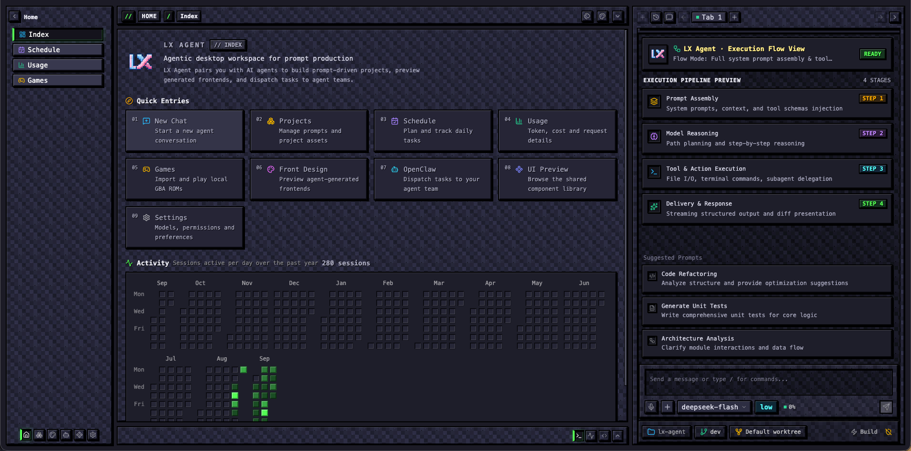
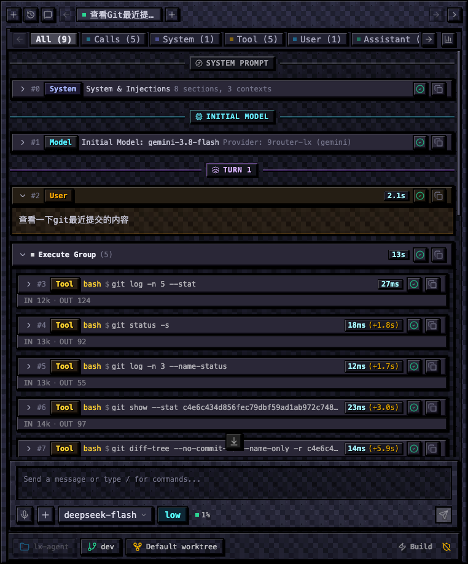
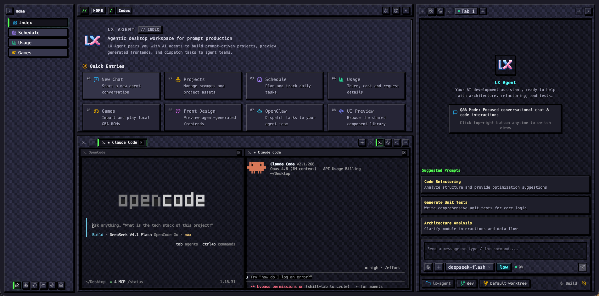
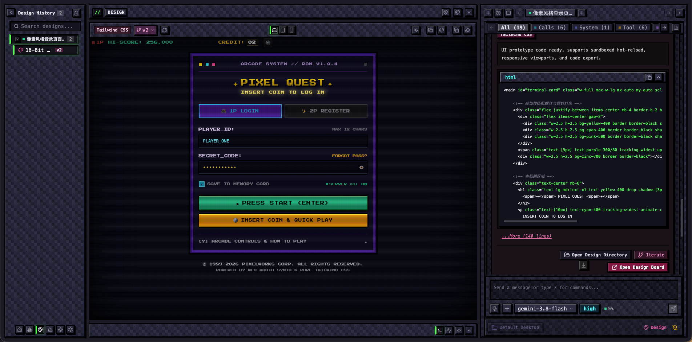
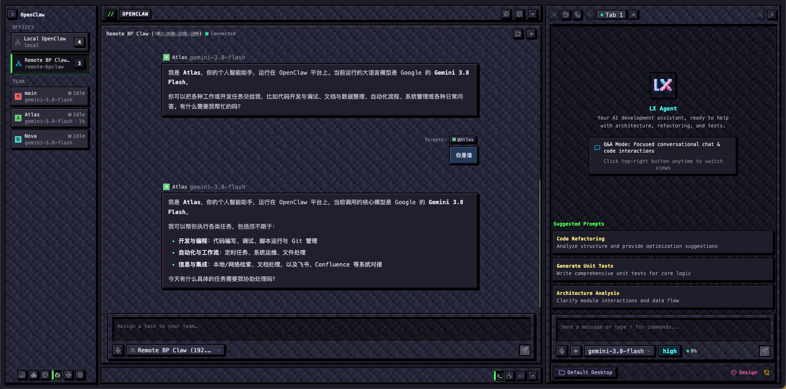
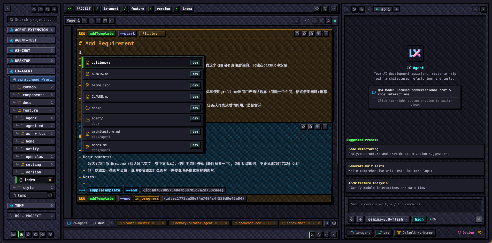
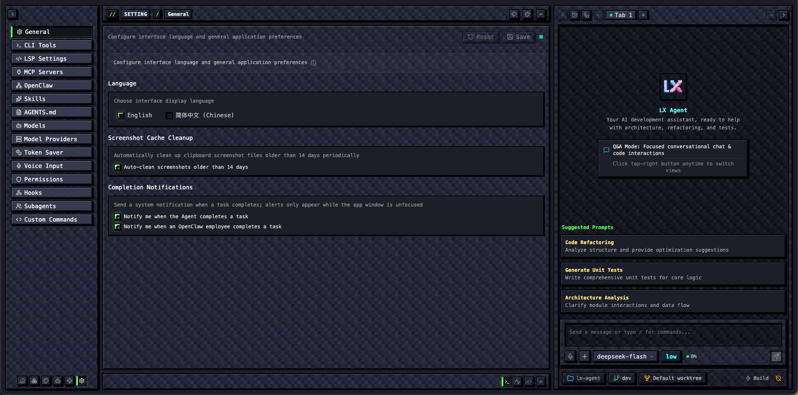

# LX Agent

**面向提示词生产的本地优先桌面工作台 —— 无需后端、无需账号，数据不离开本机。**

**语言：** [English](./README.md) | **简体中文**

## 这是什么

LX Agent 是一个 Electron 桌面应用，让你与具备编码能力的 Agent 结对生产提示词驱动的项目。Agent 的完整闭环 —— 模型调用、工具执行、进程管理、权限门禁与会话状态 —— 全部运行在主进程并落在本地 SQLite 中，窗口只是纯 UI。API Key 由你自己提供，因此没有需要部署的服务，也没有需要信任的中间方。

它面向把提示词当源码管理的人：草稿在同一个工作台里被规划、审查、执行与留档，而且 Agent 能真正读写你磁盘上的文件。

## 功能

| 模块 | 说明 |
| :--- | :--- |
| **Agent 运行时** | 基于 Anthropic、OpenAI、Google 或任意 OpenAI 兼容端点的流式多轮对话，支持按任务选择模型、空闲看门狗与中断续跑。 |
| **协作模式** | `Shift + Tab` 在 `build → plan → review → design` 间循环。Plan / Review / Design 的回答会从流中解析为交互卡片（实施方案、审查发现、前端设计画布），并可一键转回执行。 |
| **工具能力** | 文件 `read` / `write` / `edit` 与原子化跨文件补丁、`glob` / `grep` / `find` 检索、PTY 驱动的统一执行器（含后台作业）、网页抓取与搜索、图片查看、待办清单，以及写入后的 LSP 诊断反馈。 |
| **安全门禁** | 四模式权限门禁、三档沙箱策略、Guardian 风险评审、重复工具调用防护与多级审批，任何落盘操作都先过关。 |
| **上下文治理** | 自动压缩与上下文剪枝，叠加 Token Saver（确定性工具输出压缩 + 可选风格注入），让长会话成本可控。 |
| **子代理与记忆** | 带角色治理的子代理池用于并行任务，配合跨会话持久化的记忆管理器（`MEMORY.md` 与主题笔记）。 |
| **MCP / Skills / Hooks** | 接入 stdio MCP 服务、可复用 `SKILL.md` 技能与生命周期钩子，内置预设一键安装。 |
| **会话** | 最多 8 个并行 Agent 标签页、插话与追加上限队列、SQLite 持久化历史、从任意用户轮分叉会话，以及独立 HTML 导出。 |
| **项目** | 将提示词、素材与文件组织进项目与文件夹，并对引用路径做快速文件检索。 |
| **Markdown 工作区** | 基于 CodeMirror 的编辑器，支持变量命令、模板预设与实时渲染预览。 |
| **Front Design** | Agent 输出的设计稿在隔离的预览协议中实时渲染，迭代在原地发生，而不是靠截图往返。 |
| **OpenClaw** | 通过 WebSocket 接入单个或多个 Gateway：一条消息可扇出给多个 Agent 并合流展示，也可用 `@claw:<instance>/<agent>` 跨页派发任务。 |
| **终端与 Git** | 基于真实 PTY 的 xterm 终端，以及工作区内的仓库状态与快照。 |
| **用量与日程** | 按模型、Provider 与会话统计 Token、成本与请求明细；日程规划与全年会话活跃度热力图。 |
| **主题与多语言** | 可切换的 **default** 与 **pixel** 双主题，完整的中英双语界面。 |
| **桌面增强** | Groq Whisper 语音输入、Agent 完成时的系统通知、内置像素小游戏与本地 GBA ROM、Claude Code / Codex / Gemini CLI / OpenCode 的 CLI 管理器，以及基于 GitHub Releases 的应用内更新检查。 |

## 界面截图

### Agent 会话与执行流

| 执行流视图（逐轮 Token 与工具耗时） | 集成终端（OpenCode / Claude Code） |
| :---: | :---: |
|  |  |

### 设计与协作

| Front Design 画布 | OpenClaw 多实例工作区 |
| :---: | :---: |
|  |  |

### 项目与 Markdown

### 像素主题

## 技术栈

| 层次 | 选型 |
| :--- | :--- |
| 应用外壳 | Electron 39、electron-vite、electron-builder |
| 界面 | React 19、TypeScript、Tailwind CSS 4、lucide-react、Recharts |
| 编辑器与终端 | CodeMirror 6、xterm.js、Mermaid、highlight.js |
| Agent 内核 | Vercel AI SDK 6、Zod 校验、自研 Turn 状态机 |
| 存储 | SQLite（better-sqlite3），仅向前迁移 |
| 集成 | Model Context Protocol SDK、OpenClaw Gateway Client、LSP JSON-RPC |

## 文档

架构与运行时设计文档位于 [`docs/`](./docs)：

- [`docs/agent/architecture.md`](./docs/agent/architecture.md) —— 进程模型、Turn 状态机、消息流与存储
- [`docs/agent/runtime.md`](./docs/agent/runtime.md) —— 执行引擎、上下文治理、子代理与记忆
- [`docs/agent/tools.md`](./docs/agent/tools.md) —— 内置工具与提示词装配
- [`docs/agent/permissions.md`](./docs/agent/permissions.md) —— 权限模式、沙箱档位与审批
- [`docs/agent/modes.md`](./docs/agent/modes.md) —— Plan / Review / Design 协议与交互卡片
- [`docs/agent/openclaw.md`](./docs/agent/openclaw.md) —— Gateway 接入与任务委派
- [`docs/standards/`](./docs/standards) —— 本仓库遵循的工程与 UI 规范

## 许可证

基于 [MIT 许可证](./LICENSE) 发布。© 2026 yonah-lin111。
