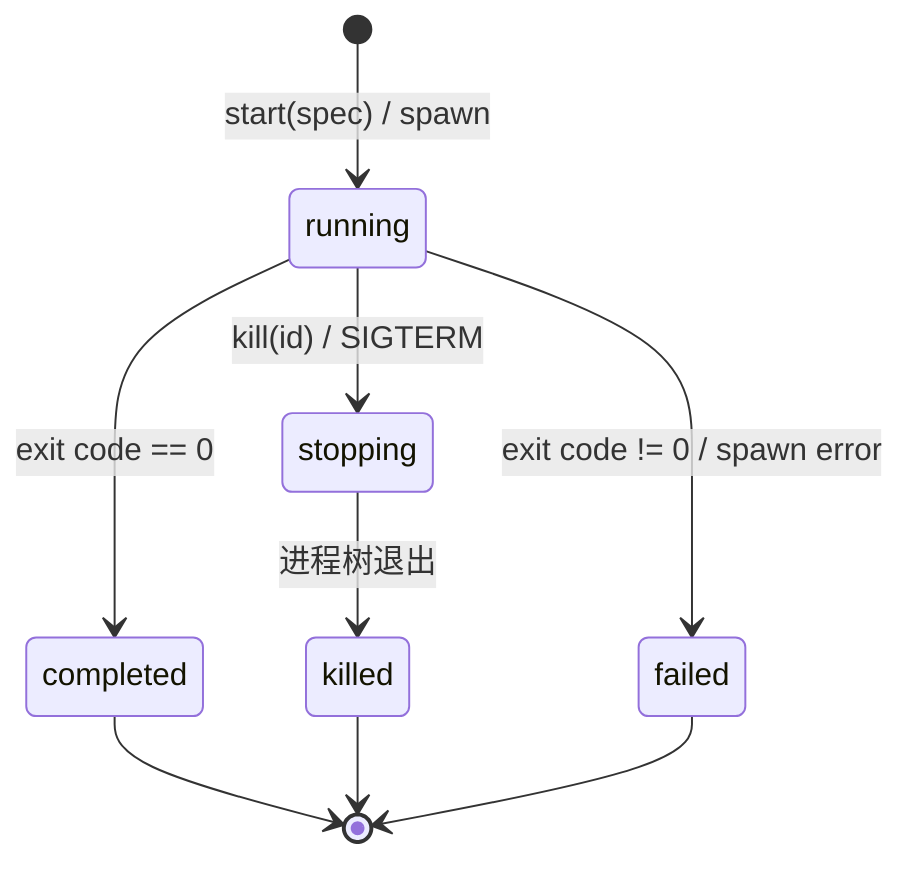

# Agent 与 Harness 继续实施任务文档（v12：后台长任务运行系统与作业注册表 JobRegistry + UI 进程监控抽屉）

本文是"继续实行 agent 功能和 harness"的**任务文档 v12**。v1–v11 已全部落地合并入 `dev`（v11 落地了 Spill 大输出落盘引用机制与写后 LSP 自动诊断闭环）；本轮依据参考项目 [deepseek-harness-master]（`packages/jobs` 的通用长任务注册表协议与 `packages/jobs/tool-jobs` 的模型控制与有界完成唤醒机制）与 [pi-main]（`core/bash-executor.ts` 的流式子进程管理与输出流控），经架构分析与 Grill Me 边界质问确认，确定本轮范围 = **后台长任务运行系统与作业注册表（JobRegistry + `bash(background: true)` + `job_output` / `job_list` / `job_kill` + 双通道有界唤醒 + UI 进程监控抽屉）（唯一）**，并明确定义 **v13：全局代码索引与混合语义检索 (Codebase Memory Graph)** 作为后续路线图。

参考既有文档：核心架构见 [design.md](./design.md)，扩展体系见 [extensions.md](./extensions.md)，Harness 演进与信任模型见 [harness.md](./harness.md)，SQLite 落盘见 [database.md](./database.md)，上一轮见 [TASKS-v11.md](./TASKS-v11.md)。

---

## 1. 背景与范围决策

### 现状分析（代码与架构核验）

1. **单次阻塞超时模型无法支撑长耗时指令**：
   - 现状：`src/main/agent/tools/bash.ts` 采用单次同步超时（默认 120s）执行模型，命令必须在同一步骤内运行结束。
   - 缺陷：当 Agent 需要启动开发服务器（如 `npm run dev`、`vite`）、运行耗时编译构建、监控日志或执行长测试套件时，命令会挂起或超时失败，阻塞整个 Agent 主循环，Agent 无法在后台任务运行期间继续执行其他分析或修改步骤。
2. **缺乏标准化的后台任务管控与输出消费语义**：
   - 现状：无后台任务状态注册表，无多任务并发治理，无流式增量读取与消费光标机制。
   - 缺陷：模型无法主动查询后台任务是否仍存活、无法非阻塞拉取最新增量输出，更无法在不需要时安全终止后台进程树。
3. **缺少进程实时监控与可视化干预能力**：
   - 现状：Renderer 进程无后台任务的全局感知，用户无法直观了解当前会话启动了哪些后台进程、消耗多长时间，也无法手动查看实时日志或强制 Kill 异常进程。

### 范围决策（Grill Me 确认）

| # | 能力 | 结论 |
|---|------|------|
| **J** | **通用任务注册表（`JobRegistry` 会话隔离 + 状态机 + 消费式输出游标 + Spill 落盘）** | **本轮做（主）** |
| **T** | **模型端任务管控工具集（`bash(background: true)` + `job_output` + `job_list` + `job_kill`）** | **本轮做（主）** |
| **W** | **双通道流控与有界唤醒（Turn 内 In-step 注入 + Idle 下最多 3 次唤醒防死循环）** | **本轮做（主）** |
| **U** | **Renderer 全局状态指示器与进程监控抽屉（`AgentJobDrawer` + 实时日志 + 手动 Kill）** | **本轮做（主）** |
| P | `node-pty` 原生伪终端与 ANSI 序列模拟 | 不做（采用原生 `child_process` detached 进程组，免除原生二进制编译负担） |
| M | 全局代码语义与调用图索引 (Codebase Memory Graph) | 列入 v13 路线图 |

---

## 2. 核心架构与数据流设计

### 2.1 数据结构契约（`src/shared/contracts/agent.ts`）

```ts
// 任务唯一标识（会话内自增：bash-1, bash-2 等）
export type JobId = string

// 任务类型与生命周期状态
export type JobKind = "bash" | "subagent"
export type JobStatus = "running" | "stopping" | "completed" | "killed" | "failed"

// 任务快照（面向 UI 与模型工具只读展示）
export interface JobSnapshot {
  id: JobId
  kind: JobKind
  label: string
  status: JobStatus
  detail?: string
  startedAt: number
  finishedAt?: number
  pid?: number
  sessionId: string
}

// 任务读取结果
export interface JobReadResult {
  text: string
  job: JobSnapshot
  hasMore: boolean
}
```

### 2.2 JobRegistry 核心状态机与流式缓冲区



- **隔离机制**：以 `sessionId` 为边界隔离任务注册表。会话删除（`deleteSession`）或切换工作区时，自动级联清理（SIGTERM 终止所属存活进程并清理 Spill 缓存）。
- **输出消费光标（Consuming Cursor）**：
  - 维护双缓冲策略：内存保留最近 64KB 的环形文本缓冲；
  - 超出阈值时，自动将流式输出实时写入 Spill 文件：`~/.lx/spill/<sessionId>/jobs/<jobId>.log`；
  - `job_output` 调用时仅消费自上次读取以来的新增输出增量，读取后移动光标；已终结任务（Settled）支持幂等读取最终结果。
- **并发治理**：限制每个 Session 最多并发运行 10 个后台任务（`maxConcurrentJobsPerOwner = 10`），超限拒绝启动并返回明确错误。

### 2.3 双通道完成通知与有界唤醒机制 (Completion Delivery & Wakeup)

```mermaid
sequenceDiagram
    participant P as Background Child Process
    participant R as JobRegistry
    participant Loop as AgentLoop
    participant Model as LLM / StreamFn

    P-->>R: Process Exited (code 0 / error)
    R->>R: 更新 JobSnapshot 状态为 completed / failed

    alt Agent 处于繁忙状态 (Turn 执行中)
        R->>Loop: 注入当前 Turn 的 next-step inbox
        Loop->>Model: 作为下一步上下文消息无缝交付 (1 步消化多个完成事件)
    else Agent 处于空闲状态 (等待用户交互)
        alt 连续唤醒轮数 < maxConsecutiveWakes (3)
            R->>Loop: 触发 AgentLoopContinue 唤醒
            Loop->>Model: 注入完成通知: background job <id> (<kind>: <label>) finished [status: ...]. Read its output with job_output.
        else 连续唤醒超限 (>= 3 次)
            R->>R: 降级为静默待领状态 (等待用户下一条消息带入，防死循环)
        end
    end
```

---

## 3. 模型端工具集契约

### 3.1 `bash` 工具扩展参数

```ts
const bashSchema = z.object({
  command: z.string().describe("要执行的 shell 命令"),
  timeout: z.number().describe("超时秒数（同步执行时有效，默认 120 秒）").optional(),
  background: z.boolean().describe("是否在后台运行长耗时命令（如开发服务、编译、监听进程）。为 true 时立即返回任务 ID，不阻塞主流程。").optional(),
})
```
- **后台启动响应格式**：
  ```text
  Background job bash-1 (bash: npm run dev) started with PID 89421.
  Use 'job_output' with job_id='bash-1' to inspect logs, or 'job_kill' to stop it.
  ```

### 3.2 专属管理工具集

1. **`job_output`**：
   - 入参：`{ job_id: string, wait?: boolean, timeout_ms?: number }`
   - 行为：非阻塞返回新增增量日志；若 `wait: true`，在 `timeout_ms`（默认 10000ms，上限 60000ms）内等待新日志输出或进程结束；输出以 `[status: <running|completed|failed|killed>]` 结尾。
2. **`job_list`**：
   - 入参：`{}`
   - 行为：返回当前会话所有后台任务列表及概览：`<id> [<status>] (PID: <pid>) — <label> (running for 42s)`。
3. **`job_kill`**：
   - 入参：`{ job_id: string, reason?: string }`
   - 行为：向进程树发送 `SIGTERM`（超时强杀 `SIGKILL`），返回终止请求确认与最新状态。

---

## 4. 实现计划与代码改动清单

### Main 进程改动

1. **`src/main/agent/jobs/jobRegistry.ts`**（新）：
   - `LocalJobRegistry` 单例，管理 `JobId` 生成、子进程生命周期、输出缓冲区、Spill 持久化与事件分发；
   - 暴露 `startJob`、`readOutput`、`killJob`、`listJobs`、`getJob`、`onJobSettled` 核心 API。
2. **`src/main/agent/tools/bash.ts`**：
   - 接入 `background: boolean` 入参逻辑，根据参数分流至 `jobRegistry.startJob` 或传统同步执行分支。
3. **`src/main/agent/tools/jobTools.ts`**（新）：
   - 实现 `createJobOutputTool`、`createJobListTool`、`createJobKillTool`。
4. **`src/main/agent/assembly.ts` & `src/main/agent/agentRunner.ts`**：
   - 在装配阶段注册 `job_output` / `job_list` / `job_kill` 工具；
   - 接入 `jobRegistry.onJobSettled` 监听器，实现 Turn 内注入与有界唤醒（`maxConsecutiveWakes = 3`）；
   - 在 `deleteSession` 时级联调用 `jobRegistry.cleanSessionJobs(sessionId)`。
5. **IPC 通道（`src/shared/ipc/agentChannels.ts` & 主进程处理）**：
   - 新增 `agent:listJobs`、`agent:killJob`、`agent:readJobOutput` invoke 接口；
   - 新增 `job_started`、`job_output_chunk`、`job_settled` 事件推送。

### Renderer 进程改动

1. **`src/renderer/src/features/agent/components/JobStatusButton.tsx`**（新）：
   - 状态栏右侧展示运行中任务计数徽标与转动动画；点击展开/收起后台进程抽屉。
2. **`src/renderer/src/features/agent/components/AgentJobDrawer.tsx`**（新）：
   - 底部/右侧抽屉式面板，展示当前会话的任务列表、状态徽标、耗时统计、实时流式日志查看器与手动 Kill / 重试按钮。
3. **`src/renderer/src/features/agent/components/AgentToolCallBlock.tsx`**：
   - 针对 `bash`（后台模式）、`job_output`、`job_kill` 优化专属紧凑卡片渲染与快速跳转抽屉交互。
4. **`src/renderer/src/features/agent/hooks/useAgentJobs.ts`**（新）：
   - 封装任务状态订阅、实时输出增量拉取与 IPC 操作。

---

## 5. 后续路线图规划：v13（全局代码索引与混合语义检索）

> [!NOTE]
> 本节仅作为架构路线图记录，不在 v12 任务中执行。

### 5.1 背景与目标
随着项目规模扩大，纯基于文件路径匹配的 `find` 和基于单行文本的 `grep` 在复杂跨文件架构理解上存在局限。v13 将引入本地代码图谱（Codebase Memory Graph）与轻量 AST 符号索引，提供符号级语义检索与跨层调用链分析能力。

---

## 6. 实施规范与验证

1. **Git 工作区隔离**：
   - 用户确认本任务后，在 `.worktrees/` 下新建工作区：`[时间戳]-v12-background-jobs`；
   - 严禁直接在主仓库修改代码；所有改动完成后需向用户询问是否合并到 `dev`。
2. **精确校验**：
   - `pnpm typecheck`：验证主进程、共享契约与渲染层类型无破损；
   - Vitest 单测覆盖：
     - `test/main/agent/jobs/jobRegistry.test.ts`：测试后台进程创建、输出消费光标、Spill 落盘、超时强杀与会话级级联销毁；
     - `test/main/agent/tools/jobTools.test.ts`：测试 `job_output`、`job_list`、`job_kill` 工具执行与边界返回；
     - `test/main/agent/core/agentLoopWakeup.test.ts`：测试 Turn 内注入与有界唤醒（`maxConsecutiveWakes` 限制）。
3. **交付与合并**：
   - 任务完成后按规范输出总结，并向用户确认是否合并到 `dev`。
