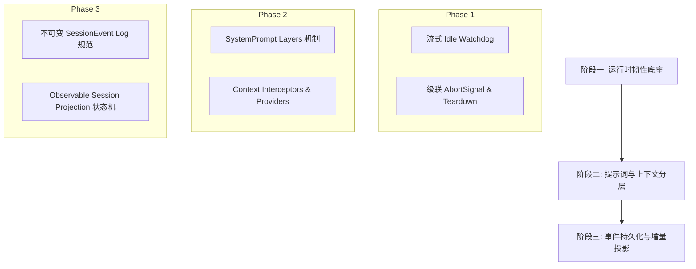

# Agent 与 Harness 继续实施任务文档（v13：运行时韧性看门狗、动态提示词分层与会话事件投影重构）

本文是"继续实行 agent 功能和 harness"的**任务文档 v13**。v1–v12 已全部落地合并入 `dev`（v12 落地了后台长任务运行系统与作业注册表 JobRegistry + UI 进程监控抽屉）；本轮依据参考项目 [deepseek-harness-master]（`packages/llm/llm-pi-ai` 的 `idleWatchdog`、`packages/core/system-prompt` 的分层层叠模型、`packages/client/runtime` 的 Session Event 增量投影状态机）与 [pi-main]（`core/agent.ts` 的级联中止控制与流式管道），经架构分析与 Grill Me 边界质问确认，确定本轮范围 = **三大核心运行时与数据流演进（分阶段设计与分步落地）**。

参考既有文档：核心架构见 [design.md](./design.md)，扩展体系见 [extensions.md](./extensions.md)，Harness 演进与信任模型见 [harness.md](./harness.md)，SQLite 落盘见 [database.md](./database.md)，上一轮见 [TASKS-v12.md](./TASKS-v12.md)。

---

## 1. 背景与核心问题分析

### 现状分析（代码与架构核验）

1. **流式网络/进程假死缺少 Idle Watchdog 守卫**：
   - 现状：`src/main/agent/stream/aiSdkStreamFn.ts` 与 `src/main/agent/core/agent-loop.ts` 依赖统一全局或单次 chunk 事件。当底层连接发生静默假死（TCP 半开、中间代理断开但未触发 close/error）时，流式循环会无限期挂起。
   - 缺陷：缺乏像 `deepseek-harness` 中 `idleWatchdog` 这种“自上一个 chunk 产生起计时”的看门狗机制；且在中断时未能级联调用底层迭代器的 `return()` 和下游子任务/工具的 `dispose()`。
2. **System Prompt 与 Context 注入缺乏模块化分层 (Layered System Prompt)**：
   - 现状：`src/main/agent/assembly.ts` 采用扁平字符串拼接（`DEFAULT_SYSTEM_PROMPT` + `skills` + `instructions` + `mcp`），所有上下文在一处写死。
   - 缺陷：缺乏动态 Scope（项目级、会话级、Turn 级、运行时扩展级）的分层注入、优先级覆盖与动态变更监听能力，后续新增插件与上下文拦截器难以扩展。
3. **Session 状态管理非事件驱动投影 (Event Sourcing & Projection)**：
   - 现状：消息展示列表直接依赖 `AgentEvent` 的部分局部拼装与全量轮询，缺少严密的不可变 Event Log 及其向 UI / 内存状态的增量单向投影（Incremental Projection）。
   - 缺陷：压缩（Compaction）、撤销（Undo）、分叉（Fork）与重放（Replay）时容易发生本地内存状态与 SQLite 数据不一致。

---

## 2. 演进路线与分层交付策略（Grill Me 确认）

为确保系统稳定性，避免一次性重构导致状态机混乱，严格采用**分层推进、逐级交付**策略：



| 阶段 | 核心模块 | 目标与关键设计 | 借鉴来源 | 优先级 |
|------|---------|---------------|---------|--------|
| **阶段一** | **运行时韧性与流式看门狗** | 1. 引入 `idleWatchdog` 流式空闲超时熔断（自适应不同 Provider 首 token 与 chunk 间隔）。<br>2. 规范化级联 `AbortController` / `Signal.any()`，确保中止时安全触发迭代器 `return()` 与工具资源释放。 | `deepseek-harness` (packages/llm/llm-pi-ai) + `pi-main` | **P0（优先实施）** |
| **阶段二** | **动态分层提示词系统** | 1. 构建 `SystemPromptManager` 支持基础层、环境层、工具层、技能层及动态 Turn 拦截层。<br>2. 支持基于 Scope 的变量注入与可取消订阅（Cordis Effect 风格）。 | `deepseek-harness` (packages/core/system-prompt) | **P1（后续推进）** |
| **阶段三** | **事件驱动状态机与增量投影** | 1. 严格规范化不可变 `SessionEvent` 序列表结构。<br>2. 实现纯函数 `fold/project` 状态投影层，解耦 UI 渲染视图与持久化底层，增强 Undo/Fork/Compaction 确定性。 | `deepseek-harness` (packages/client/runtime) | **P2（架构演进）** |

---

## 3. 阶段一：运行时韧性与流式看门狗设计方案

### 3.1 `IdleWatchdog` 机制设计

```typescript
// src/main/agent/stream/idleWatchdog.ts
export interface WatchdogOptions {
  timeoutMs: number
  errorMessage?: string
}

export class IdleWatchdog implements Disposable {
  private timer: NodeJS.Timeout | null = null
  private readonly controller = new AbortController()

  constructor(private readonly options: WatchdogOptions) {
    this.reset()
  }

  get signal(): AbortSignal {
    return this.controller.signal
  }

  /** 每接收到一个 chunk 时重置超时计数器 */
  feed(): void {
    this.reset()
  }

  private reset(): void {
    if (this.timer) clearTimeout(this.timer)
    this.timer = setTimeout(() => {
      this.controller.abort(new Error(this.options.errorMessage || `Stream idle timeout after ${this.options.timeoutMs}ms`))
    }, this.options.timeoutMs)
  }

  [Symbol.dispose](): void {
    if (this.timer) {
      clearTimeout(this.timer)
      this.timer = null
    }
  }
}
```

### 3.2 级联中止与迭代器资源回收

在 `aiSdkStreamFn.ts` 与 `agent-loop.ts` 中组合用户主动 AbortSignal 与 Watchdog 信号：

```typescript
const combinedSignal = AbortSignal.any([userSignal, watchdog.signal])
```

在 `finally` 块中确保异步迭代器被显式关闭，防止悬挂 socket 或未完成的 promise 泄漏：
```typescript
try {
  for await (const chunk of stream) {
    watchdog.feed()
    yield chunk
  }
} finally {
  watchdog[Symbol.dispose]()
  // 确保底层 stream 资源被 return 释放
}
```

---

## 4. 阶段二与阶段三架构展望（待后续实施）

### 4.1 阶段二：提示词分层（`SystemPromptLayers`）
- 抽象 `SystemPromptLayer` 接口，定义 `order`、`scope`、`provider(ctx)`。
- 支持在工具调用前后由插件动态注入临时 instructions（如 LSP 诊断结果自动附加到下一步提示）。

### 4.2 阶段三：Session 增量投影（`SessionProjection`）
- 将 `agentSessionService` 改造为严格的 Append-Only Event Log 存储。
- Renderer 端 `ChatMessage[]` 通过 `reduce(events, applyEvent)` 统一派生，消除边缘分支更新遗漏。

---

## 5. 任务落地验收标准

1. **阶段一验收**：
   - 模拟网络假死/断流场景，Watchdog 能在设定阈值内精确触发 `TIMEOUT` 异常并通知 Renderer。
   - 用户主动取消（Stop）时，子进程、后台任务及流式迭代器必须 100% 立即释放，无后台挂起现象。
   - 所有现有单测（`agent-loop.test.ts`、`tools.test.ts`）保持 100% 通过。
