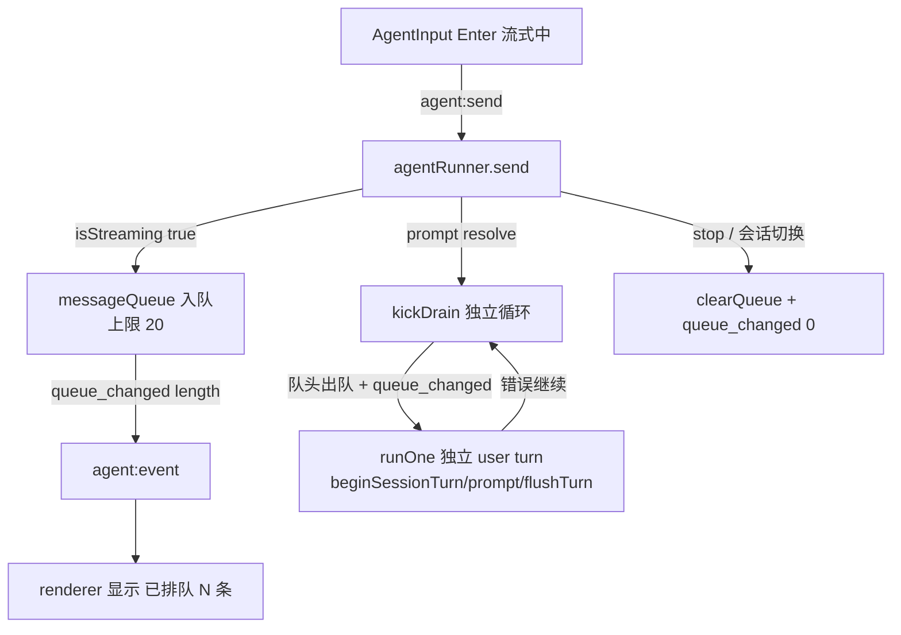

# Agent 与 Harness 继续实施任务文档（v7 一轮：消息队列 / 流式排队）

本文是"继续实行 agent 功能和 harness"的**任务文档 v7**。v1–v6 已全部落地（v6 LSP 集成含懒安装 + 状态栏按钮已合入 `dev`）；本轮依据参考项目 [opencode-dev]（`packages/core/src/session/input.ts` + `run-coordinator.ts` 的 `delivery: steer/queue` + `admitted_seq/promoted_seq` 队列模型）与 [pi-main] 的分析，确定本轮范围 = **消息队列（流式排队）（唯一）**，含明确不做项与实施规范。代码执行前需用户确认本文 §6 决策清单。

参考的既有文档：核心架构见 [design.md](./design.md)，扩展体系见 [extensions.md](./extensions.md)，Harness 演进与信任模型见 [harness.md](./harness.md)，SQLite 落盘见 [database.md](./database.md)，上一轮见 [TASKS-v6.md](./TASKS-v6.md)。

## 1. 背景与范围决策

现状（已由代码核验）：

- **流式中发送被静默拦截**：`AgentInput.tsx:393`/`:400` 在 `isStreaming` 时 `return`，用户输入无任何反馈即丢失；`send()` 入口（`agentRunner.ts:454`）`if (agent.state.isStreaming) return { ok:false, error: "正在处理中…" }`——busy 拒绝，消息必须等 run 结束后重发。
- **队列基础设施已存在**：`core/agent.ts:144` `PendingMessageQueue` + `steer()`/`followUp()` + `getSteeringMessages`/`getFollowUpMessages` hooks；`agent-loop.ts:187` 每轮 turn 边界 drain steer 队列。但 `Agent` 层已具备的队列仅在 `continue()` 的续写指令（`agentRunner.ts:548` `agent.steer`）用到一个用例，IPC/UI 未暴露（harness.md §5.4 明确列为留口位点）。
- **AgentEvent 事件流**：`shared/contracts/agent.ts:316` 联合类型，`mcp_status_changed`/`session_title`/`todo_updated`/`compaction_summary` 等独立事件均走 `agent:event`，renderer 按 type 分发、未知类型忽略——新增 `queue_changed` 事件无缝。
- **send 返回契约**：`AgentSendResult = { ok:true; sessionId? } | { ok:false; error }`；扩展 `queued`/`queueLength` 不破坏既有调用方。

参考实现要点（opencode）：

- `input.ts` + `sql.ts` `SessionInputTable`：`delivery` 分 `steer`（运行中插话）与 `queue`（排队消息），`admitted_seq`/`promoted_seq` 排序；`run-coordinator.ts` 按 session 串行 drain，`wake()` 合并唤醒。
- `runner/llm.ts` `run` 循环：先 promote steer → 内层 `runTurn` 连续执行 → 再 promote queue。
- 本项目取舍：**只做 `queue`（deferred）语义**；`steer`（运行中插话打断）语义留作后续独立功能（见 §5）。

**范围决策（已确认）**：

| # | 能力 | 结论 |
|---|------|------|
| Q | 消息队列（流式中发送排队：入队 + 当前 run 结束后自动逐条发送） | **本轮做（唯一）** |
| E | run 恢复（resume，pi harness v3） | **不做**（触发条件未到，维持） |
| S | 会话全文搜索（pi FTS5） | **不做**（维持） |
| P | plan 模式 / refs 多分支树 UI | **不做**（维持） |
| M | MCP remote / skill 附带工具 / `/` 面板补全 / **steer 打断语义** | **不做**（维持；steer 留口见 §5） |

## 2. 消息队列（main：deferred queue）

**目标**：流式中用户发送的消息进 runner 队列（内存态，FIFO），当前 run 的 `agent.prompt()` resolve 后由独立异步循环逐条作为**独立新 turn** 自动发送（各自 `beginSessionTurn`/`flushTurn` 落库），经既有事件流呈现；renderer 展示「已排队 N 条」计数。

### 2.1 决策记录

| # | 决策 | 结论 |
|---|------|------|
| 1 | delivery 语义 | **deferred queue**：消息入队，当前 run 结束后逐条作为独立 user turn 自动发送（对齐 opencode `queue` delivery）。不做 `steer` 折叠进当前 run（存在 line 187→agent_end 晚到丢失窗口，需双机制，弃用） |
| 2 | 停止（abort） | **清空队列**；toast 提示已丢弃条数。stop = 终止一切生成，干净可预期 |
| 3 | 模型错误 | 单轮错误只结束该轮（错误逐轮独立暴露），**队列继续 drain**；用户主动终止（stop）才清空 |
| 4 | 会话上下文切换 | 新建/切换/恢复/fork/删除会话/worktree 切换 → **清空队列**（队列强绑定当前会话上下文，内存态未落库，变更即弃） |
| 5 | busy 改造 | `isStreaming` 为 true 时 `send()` **入队**返回 `{ ok:true, queued:true, queueLength }`；权限请求挂起等边界状态**保留拒绝**（权限面板独占键盘，发送本不可达） |
| 6 | 上限 | **20 条**；超限返回 `{ ok:false, error }` 明确报错，不覆盖、不静默丢 |
| 7 | drain 驱动 | `prompt()` resolve 后 `send()`/`continue()` 末尾 kick 独立异步 drain 循环（`draining` 标志防重入）；**不在 `agent_end` 事件内直接调 send**（彼时 `isStreaming` 仍 true 会撞 busy） |
| 8 | 计数传输 | 新增 **`queue_changed { length }`** 事件（入队/每条出队/清空时推送）；renderer 订阅维护权威计数，不自行推算 |
| 9 | 持久化 | 排队消息**内存态、不落库**；被 drain 的 turn 走正常 `beginSessionTurn`/`flushTurn` 落库（作为普通 user turn） |

### 2.2 实现要点

- **`agentRunner.ts` 改造**：
  - 提取私有 `runOne(text): Promise<AgentSendResult>`：现有 `send()` 主体（`ensureReady`/`isStreaming` 检查/`beginSessionTurn`/`_expandSkillCommand`/`prompt`/overflow 压缩重试/`compactIfNeeded`）。
  - 公开 `send()`：校验输入非空 → `ensureReady` → `isStreaming` 时入队（上限检查 + 推送 `queue_changed` + 返回 `{ok, queued, queueLength}`）→ 否则 `await runOne(text)` → `kickDrain()` → 返回 runOne 结果。
  - 新增 `messageQueue: string[]`、`MAX_QUEUE = 20`、`draining: boolean`、`emitQueueChanged()`。
  - `kickDrain()`：`draining` 防重入；`while (queue.length > 0)` 取队头 → 推送 `queue_changed` → `await runOne(text)`（错误继续，不中断循环）→ 每轮后检查队列是否被清空（会话切换守卫），空则 break。
  - `clearQueue()`：清空 + 推送 `queue_changed{0}`。调用点：`abort()`（Q3）、`restoreMessages`（新建对话/撤销）、`restoreSession`、`deleteSession`、`forkSession`、`switchWorktree`（Q5）。
  - `continue()` 末尾同样 `kickDrain()`（续写 run 结束后若有排队消息则续发）。
- **契约**：`AgentSendResult` 加 `queued?: boolean`、`queueLength?: number`（`shared/contracts/agent.ts`）；queued 变体同时携带 `sessionId`（流式中必有会话，且保持既有调用方 `result.sessionId` 窄化不破坏）；`AgentEvent` 加 `| { type: "queue_changed"; length: number; messages: string[] }`（`messages` 为队列原文，供输入区排队提示条 tooltip 展示）。**无新 invoke channel**（复用 `agent:send` + `agent:event`）。
- **preload / agentHandlers**：send 返回类型透传（handler 逻辑不变）。

## 3. renderer：排队计数与发送流

### 3.1 决策记录

| # | 决策 | 结论 |
|---|------|------|
| 1 | 呈现 | 入队成功**清空输入框** + 输入区上方展示「已排队 N 条」计数；每条消息在**被 drain、其 turn 开始时**作为普通 user 气泡入时间线（无 pending 气泡态） |
| 2 | 计数 | 订阅 `queue_changed` 维护 `queuedCount` 与队列原文 `queuedMessages`；stop/会话切换后 main 推 `{0, []}` 自动归零 |
| 3 | 发送流 | `AgentInput` 去掉 `isStreaming` 拦截（`AgentInput.tsx:393`/`:400`），按 Enter 在流式中触发 `sendMessage` → 上层入队；发送按钮流式中仍为「停止」（排队发送走 Enter 快捷键） |
| 4 | 反馈 | `send()` 返回 `queued` 时 toast「已排队」（或计数即时刷新）；返回 error（如超限）toast 报错，输入框不清空 |
| 5 | 队列提示条 tooltip | 排队提示条 hover 用项目 **`LxTooltip`** 展示各条排队问题（编号列表，`multiline`，超高内滚），不吞掉提示条本身 |
| 6 | drain 不触发滚动 | 队列 drain 自动发送的 user 消息标记 `isQueuedDrain`，`AgentMessageList` 的"用户发送→平滑滚动到底"对该类消息跳过；用户主动发送仍滚动。判定：`queue_changed` **计数递减**时置 `drainIncoming`，下一条 user `message_start` 消费并标记 |

### 3.2 实现要点

- **`useAgentChat.ts`**：新增 `queuedCount`/`queuedMessages` state；订阅 `queue_changed` 更新；`sendMessage` 改造——`agentApi.send` 返回 `{queued:true}` 时清空输入框（与 `setInputText("")`），空闲时维持现状。`queue_changed` 计数递减时置 `drainIncomingRef`，下一条 user `message_start` 消费并打 `isQueuedDrain` 标记。
- **`AgentInput.tsx`**：接收 `queuedCount`/`queuedMessages` prop；`AgentInput.tsx:393` 仅保留 `!inputText.trim()` 检查、去掉 `|| isStreaming`；输入区上方新增「已排队 N 条」块（位置对齐 TodoDock/PermissionPanel，组件形态实现时定），外包 `LxTooltip`（hover 展示各条排队问题）。
- **`AgentMessageList.tsx`**：`messages` 追加的新 user 消息全为 `isQueuedDrain` 时不触发平滑滚动到底。
- **`AgentPage.tsx`**：透传 `queuedCount`/`queuedMessages` 到 `AgentInput`。
- 完成检查：无遗留 `isStreaming` 发送拦截旧逻辑、无重复 DTO。

## 4. 数据流

## 5. 明确不做项及说明

| 项 | 说明 |
|----|------|
| **steer 打断语义** | 「运行中插话」优先打断当前生成（opencode `steer` delivery）不做；`Agent` 层 `steer()` 已具备，本轮仅用于既有 `continue()` 续写，留口后续独立功能 |
| **排队消息持久化** | 内存态，进程退出/会话变更即弃；drain 后的 turn 正常落库 |
| **run 恢复（resume）** | 维持 v2–v6 决定，触发条件未到 |
| **FTS5 会话全文搜索** | 维持 |
| **plan 模式 / refs 多分支树 UI** | 维持 |
| **MCP remote / skill 附带工具 / `/` 面板补全** | 维持 |
| **排队消息跨会话随行** | 队列绑定当前会话，切换即清（§2.1 #4） |
| **队列限流/背压、持久化恢复** | 上限 20 已足；不做更复杂调度 |

## 6. 决策清单（全部已确认）

- 范围 = 消息队列（唯一）；排除 steer/E/S/P/M（§1/§5）。
- delivery = deferred queue（run 结束逐条自动发送）；不用 steer 折叠（§2.1 #1）。
- stop 清空队列；模型错误继续 drain；会话上下文切换清空（§2.1 #2–4）。
- busy 改造 = 流式中入队返回 `{ok, queued, queueLength}`；权限挂起等边界保留拒绝（§2.1 #5）。
- 上限 20，超限报错不覆盖（§2.1 #6）。
- drain 在 `prompt()` resolve 后 kick 独立循环；`draining` 防重入（§2.1 #7）。
- 新 `queue_changed {length}` 事件，复用 `agent:event`；无新 invoke channel（§2.1 #8）。
- renderer：入队清空输入框 + 计数；drain 时入时间线；`AgentInput` 去 `isStreaming` 拦截（§3.1）。

无待确认项。

## 7. 实施规范与验证

- **工作区**：确认后在 `.worktrees` 新建 worktree（命名 `时间戳-v7-message-queue`），在 worktree 内执行全部代码改动；完成 + 自测后询问用户是否合并回 `dev`。
- **契约**：`queue_changed` 事件 + `AgentSendResult` 扩展（channel 常量/preload/main handler 同步）；无新 channel。
- **精确校验**（仅受影响范围）：`pnpm typecheck` + Biome format 受影响文件；补 vitest 单测：
  - `test/main/agent/runner/` 或既有 runner 测试：入队（流式中 send 返回 `queued`）/ 上限拒绝 / drain 顺序（FIFO）/ stop 清空 / 会话切换清空 / 模型错误继续 drain / `draining` 防重入。
  - `test/shared/`：`AgentSendResult`/`AgentEvent` 类型契约（如既有契约测试）。
- 完成检查：无遗留旧导入、无重复 DTO、无重复 channel、无用目录；`AgentInput` 无残留 `isStreaming` 发送拦截。
