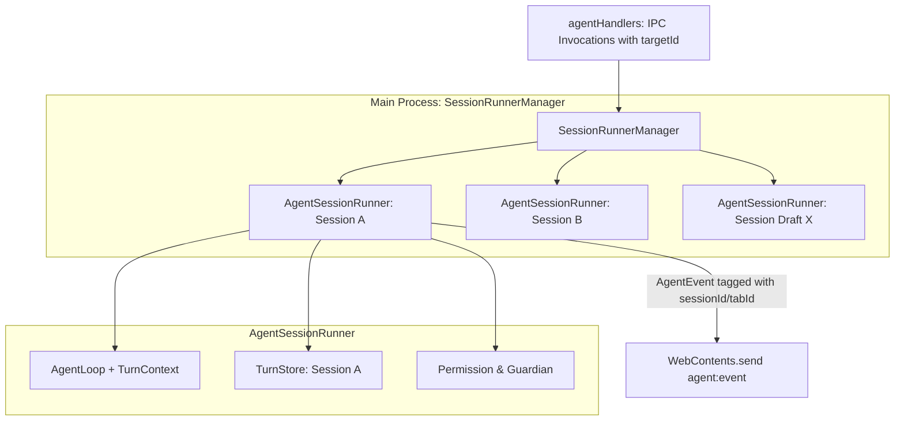

# Agent 多标签页（Multi-Tab）管理与并发架构设计方案

本文档定义 LX Agent 右侧栏多标签页（Multi-Tab）管理系统的完整技术规范、核心数据结构、主进程多会话并发改造方案及分阶段任务清单。

---

## 1. 架构目标与设计原则

1. **数据结构优先**：确立清晰的 Tab 状态机、会话与 Tab 映射关系、以及事件与会话路由拓扑。
2. **完全隔离性**：每个 Tab 对应一个独立的 `AgentPage` 视图及对话上下文，互不干扰；一个底层 `sessionId` 全局只能被一个 Tab 绑定。
3. **真多会话并发（Full Concurrency）**：主进程 `AgentRunner` 重构为多实例管理器（`SessionRunnerManager`），支持多个 Agent 会话在后台同时执行、流式输出与调用工具。
4. **克制优雅的 UI/UX**：在 `RightSidebar` 最左侧集成垂直 Tab 导轨，底部常驻添加按钮，支持关闭、状态感知（运行脉冲）、历史互斥定位与本地持久化。

---

## 2. 核心数据结构与状态拓扑

### 2.1 Tab 状态模型 (`AgentTab`)

```typescript
// @src/renderer/src/features/agent/types/tab.ts

export interface AgentTab {
  /** Tab 唯一标识（UUID，客户端生成） */
  id: string
  /** 绑定的会话 ID（未落库的新会话草稿态为 null） */
  sessionId: string | null
  /** 自定义或缓存的标题（缺省时使用会话标题或"新对话"） */
  title?: string
  /** 草稿态绑定的工作区与项目上下文 */
  draftContext?: {
    projectId?: string
    cwd?: string
  }
  /** 创建时间戳 */
  createdAt: number
}

export interface AgentTabState {
  /** 开启的 Tab 列表（按顺序排列，上限 8 个） */
  tabs: AgentTab[]
  /** 当前激活的 Tab ID */
  activeTabId: string
}
```

### 2.2 状态存储与管理 (`agentTabStore`)

```typescript
// @src/renderer/src/features/agent/hooks/agentTabStore.ts

export const agentTabStore = {
  getTabs: (): AgentTab[] => tabs,
  getActiveTabId: (): string => activeTabId,
  getActiveTab: (): AgentTab | undefined => tabs.find(t => t.id === activeTabId),
  
  /** 创建新 Tab（若已达上限则提示并早退） */
  createTab(initialSessionId?: string, draftContext?: { projectId?: string; cwd?: string }): string,
  
  /** 关闭 Tab（至少保留 1 个；若处于流式中先触发 abort） */
  closeTab(tabId: string): void,
  
  /** 切换激活 Tab */
  switchTab(tabId: string): void,
  
  /** 更新 Tab 绑定的 sessionId（新会话落库时回填） */
  setTabSessionId(tabId: string, sessionId: string | null): void,
  
  /** 检查会话是否已在某个 Tab 中打开，返回 tabId */
  findTabBySessionId(sessionId: string): string | undefined,
  
  /** 订阅状态变更 */
  subscribe(listener: () => void): () => void,
}
```

### 2.3 会话与 Tab 映射约束 (1:1 Mutex)

```mermaid
flowchart TD
    ClickHistory[用户在 Tab B 点击历史会话 S] --> Check{S 是否已被某个 Tab 占用?}
    Check -- 是 (Tab A 已打开 S) --> Focus[自动切换激活 Tab A]
    Focus --> Toast[Toast 提示: 已切换至对应标签页]
    Check -- 否 (S 未被任何 Tab 打开) --> Bind[当前 Tab B 绑定会话 S]
    Bind --> Restore[执行 restoreSession(S)]
```

---

## 3. 主进程并发改造与事件路由

### 3.1 主进程会话管理器 (`SessionRunnerManager`)

原单例 `AgentRunner` 重构为 `SessionRunnerManager`，持有活跃会话的实例池：



### 3.2 IPC 事件协议增强

所有下发给 Renderer 的 `AgentEvent` 统一携带路由标识：

```typescript
// @shared/contracts/agent.ts
export type AgentEvent =
  | { type: "agent_start"; sessionId: string; tabId?: string }
  | { type: "agent_end"; sessionId: string; tabId?: string; messages: AgentMessage[] }
  | { type: "message_start"; sessionId: string; tabId?: string; message: AgentMessage }
  | { type: "message_update"; sessionId: string; tabId?: string; message: AgentMessage; assistantMessageEvent: AssistantMessageEvent }
  | { type: "message_end"; sessionId: string; tabId?: string; message: AgentMessage }
  | { type: "tool_execution_start"; sessionId: string; tabId?: string; toolCallId: string; toolName: string; args: unknown }
  | { type: "tool_execution_update"; sessionId: string; tabId?: string; toolCallId: string; toolName: string; args: unknown; partialResult: unknown }
  | { type: "tool_execution_end"; sessionId: string; tabId?: string; toolCallId: string; toolName: string; result: unknown; isError: boolean; durationMs?: number }
  | { type: "context_usage"; sessionId: string; tokens: number; contextWindow: number }
  | { type: "todo_updated"; sessionId: string; todos: TodoList }
  | { type: "queue_changed"; sessionId: string; length: number; messages: string[] }
  // ... 其余事件均附带 sessionId 或 tabId 路由字段
```

### 3.3 IPC 请求契约扩展

`send`, `abort`, `continue`, `compact`, `switchModel`, `switchWorktree`, `switchProject`, `permissionRespond`, `questionRespond` 统一在调用时传递目标 `sessionId` 或 `tabId`：

```typescript
// 示例：
agentApi.send(text, selection, sendContext, options, targetSessionId?: string, targetTabId?: string)
agentApi.abort(targetSessionId?: string, targetTabId?: string)
```

---

## 4. UI 视觉与交互规范

### 4.1 `RightSidebar` 布局结构

```text
+-------------------------------------------------------------------------------+
| RightSidebar                                                                  |
| +------------+--------------------------------------------------------------+ |
| | Tab Rail   | Header (NewChat | History | ViewMode | Lsp | Mcp | Collapse)  | |
| | (w: 36px)  +--------------------------------------------------------------+ |
| |            | Content Area (AgentPage Container)                           | |
| | [Tab 1] *  |                                                              | |
| | [Tab 2]    |  - Tab 1 AgentPage (visible / hidden)                        | |
| | [Tab 3]    |  - Tab 2 AgentPage (visible / hidden)                        | |
| |            |  - Tab 3 AgentPage (visible / hidden)                        | |
| |            |                                                              | |
| |            |                                                              | |
| |            |                                                              | |
| |            |                                                              | |
| | [+] AddTab |                                                              | |
| +------------+--------------------------------------------------------------+ |
+-------------------------------------------------------------------------------+
* 注：Tab 处于流式生成中时展示状态脉冲点（pulse dot）
```

### 4.2 细节规范
1. **多主题适配**：Tab 导轨背景使用 `var(--color-theme-secondary-bg)` / `#212121`，边框使用 `border-white/5`。
2. **持久与保活**：各 Tab 的 `AgentPage` 在切换时不进行 unmount，而是使用 CSS `hidden` 控制显示，保证后台流式生成、滚动位置和草稿输入不丢失。
3. **关闭交互**：鼠标 hover Tab 项时展示 `x` 关闭按钮；若当前仅剩 1 个 Tab 则隐藏关闭按钮；若正在生成中关闭，弹出确认并调用 `abort`。
4. **多语言**：所有 Tab 操作、Tooltip 及拦截文案接入 i18n（`rightSidebar.tabs.*`）。

---

## 5. 实施任务清单与执行顺序

### Phase 1: 契约与主进程并发重构
- [ ] **Task 1.1**: 更新 `@shared/contracts/agent.ts` 与 `@shared/ipc/agentChannels.ts`，为 `AgentEvent` 及 IPC 方法扩充 `sessionId` / `tabId` 路由参数。
- [ ] **Task 1.2**: 在 `src/main/agent/` 中重构 `AgentRunner` 为 `SessionRunnerManager`，支持多 `AgentSessionRunner` 实例并发调度与隔离。
- [ ] **Task 1.3**: 更新 `src/main/ipc/agentHandlers.ts` 与 `src/preload/api/agent.ts`，打通带会话路由参数的 IPC 调用及精准事件分发。

### Phase 2: Renderer 状态机与 Hook 改造
- [ ] **Task 2.1**: 新建 `src/renderer/src/features/agent/hooks/agentTabStore.ts`，实现 Tab 增删改查、1:1 会话互斥检查与 localStorage 持久化。
- [ ] **Task 2.2**: 改造 `useAgentChat.ts`，从全局单例改为实例级绑定（根据 `tabId` 和 `sessionId` 过滤事件并操作对应后端实例）。
- [ ] **Task 2.3**: 改造 `sessionListStore.ts`，支持多 Tab 并发查询与各 Tab 会话绑定隔离。

### Phase 3: UI 组件与集成
- [ ] **Task 3.1**: 新建垂直 Tab 导轨组件 `src/renderer/src/features/agent/components/AgentTabRail.tsx`，实现 Tab 项列表、运行状态指示、关闭按钮及底部 `+` 添加按钮。
- [ ] **Task 3.2**: 改造 `src/renderer/src/components/layout/RightSidebar.tsx`，左侧集成 `AgentTabRail`，内容区使用 Multi-Tab 保活渲染。
- [ ] **Task 3.3**: 补充 i18n 词条（中/英），完善 Tooltip 与无障碍属性。

### Phase 4: 验证与测试
- [ ] **Task 4.1**: 编写 `agentTabStore` 单元测试，覆盖 1:1 互斥、上限限制、关闭与持久化。
- [ ] **Task 4.2**: 编写并发流式测试，验证多 Tab 同时发送消息、独立中止与工具调用无数据串扰。
- [ ] **Task 4.3**: 执行 Biome 代码风格检查与 TypeScript 类型检查。
