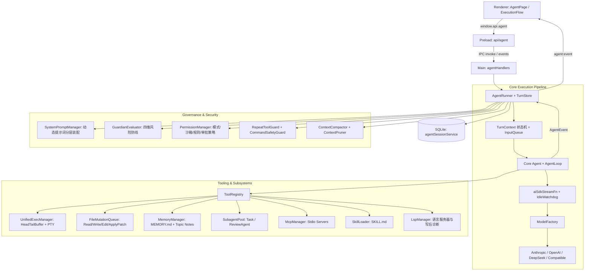

# Agent 架构总览

LX Agent 的 Agent 能力（对话 + 工具 + 协作）运行于 Electron main 进程：LLM 调用、工具执行、进程管理、安全沙箱与会话状态全部在 main；renderer 纯 UI，经 IPC 订阅事件流并派发指令。底层基于 Vercel AI SDK 适配自定义状态机循环，数据校验体系全面基于 Zod。

文档分工：
- [architecture.md](./architecture.md)（本篇）：整体分层架构、进程模型、核心契约与消息流
- [runtime.md](./runtime.md)：Turn 状态机、Unified Exec 执行引擎、上下文治理、记忆与后台作业
- [tools.md](./tools.md)：内置工具全集（文件/检索/补丁/记忆/MCP/Skill/协作）与扩展规范
- [permissions.md](./permissions.md)：模式状态机（Default/Plan）、三档沙箱策略、Guardian 防护网与多级审批
- [database.md](./database.md)：SQLite 数据模型、Session Entry 事务落盘与版本回退

---

## 1. 架构与数据流



### 1.1 一次对话的完整数据流

1. **输入与排队**：Renderer 发起 `sendMessage(text, options)` → Main `AgentRunner.send()` 捕获。若当前会话处于流式运行状态，消息按 FIFO 规则进入 `InputQueue`（上限 20 条），或通过 `/steer` 转换为即时插话。
2. **环境切片与装配**：`TurnContext` 冻结当前 Turn 的 `cwd`、`is_worktree`、`git_branch`、模式（`default`/`plan`）、沙箱策略等不可变快照；`SystemPromptManager` 执行 8 层自适应动态拼装。
3. **驱动循环 (Agent Loop)**：
   - 构造 `LlmMessage` 列表，执行上下文修剪（`ContextPruner`）与记忆/任务状态注入（`transformContext`）。
   - 调用 `aiSdkStreamFn` 发起流式推理，由 `IdleWatchdog`（默认 30s）监控防止网络半开假死。
   - 检测到 Tool Call：依次通过 `CommandSafetyGuard`、`GuardianEvaluator`、`PermissionManager`（模式/沙箱/白名单/审批）安全门控。
   - 安全放行后通过 `UnifiedExecManager` 或 `FileMutationQueue` 调度执行，结果格式化回灌模型。
4. **单事务结算与广播**：Turn 结束时调用 `turnStore.flushTurn()` 单事务落库；广播 `turn_end`、`agent_end`；触发 `InputQueue.drain()` 消费下一条排队输入；异步执行 Token 估算与按需压缩。

---

## 2. 模块拓扑结构

```text
src/main/agent/
├── core/                  # 状态机与底层循环引擎
│   ├── types.ts           #   AgentTool, StreamFn, Context, AgentState
│   ├── agent.ts           #   Agent 状态机 (prompt/continue/steer/abort/reset)
│   ├── agent-loop.ts      #   低层工具调用与事件分发循环
│   ├── turnContext.ts     #   Turn 级不可变环境切片
│   ├── timeReminder.ts    #   Turn 级周期动态时间感知 (<current_time>)
│   └── event-stream.ts    #   流式事件流基础基类
├── stream/                # LLM 模型与流式适配
│   ├── aiSdkStreamFn.ts   #   Vercel AI SDK 适配器
│   ├── modelFactory.ts    #   多 Provider/Model 装配与缓存
│   ├── toModelMessages.ts #   消息与工具定义转换
│   └── idleWatchdog.ts    #   流式空闲看门狗
├── shell/                 # 统一进程与终端执行引擎
│   ├── unifiedExecManager.ts # UnifiedExecManager (生命周期/PID/标准输入)
│   ├── headTailBuffer.ts     # HeadTailBuffer 对称截断缓冲区 (50/50 分配)
│   └── persistentShell.ts    # 基于 node-pty 的持久化会话
├── subagent/              # 多 Agent 协作与特化代理池
│   ├── subagentPool.ts    #   SubagentPool (会话续接、隔离生命周期)
│   └── reviewAgent.ts     #   专精代码审查子代理 (Rubric 评估体系)
├── guard/                 # 安全防护网与死循环守卫
│   ├── guardianEvaluator.ts  # Guardian 四维安全规则引擎
│   ├── commandSafetyGuard.ts # 高危 Shell 命令语法树拆解与拦截
│   └── repeatToolGuard.ts    # 工具重复调用死循环熔断
├── permissions/           # 权限信任与多级审批体系
│   ├── permissionManager.ts  # 模式/沙箱/规则/会话白名单调度
│   └── rule.ts               # Tool(arg) 规则解析引擎
├── prompts/               # 动态提示词与自适应装配
│   ├── systemPromptManager.ts# 分层装配引擎 (Sections, Contexts, Variables)
│   ├── modelAdapters.ts      # 模型自适应规则 (Codex, Claude, Generic)
│   └── promptTemplateLoader.ts # Slash 命令 Markdown 模板加载器
├── memories/              # 分层记忆系统
│   └── memoryManager.ts   #   MEMORY.md 索引与 Topic Notes 管理
├── tools/                 # 内置工具全集 (清单详见 tools.md)
├── lsp/                   # 语言服务器客户端与写后自动诊断
├── jobs/                  # 后台作业注册表 (JobRegistry)
├── spill/                 # 大文本落盘引用管理器 (SpillManager)
├── compaction/            # 历史工具输出内存修剪 (ContextPruner)
├── compaction.ts          # 结构化压缩与溢出自愈算法
├── contextCompactor.ts    # 压缩调度编排器
├── export/                # 会话导出器 (Markdown / JSONL / 单文件 HTML)
├── agentRunner.ts         # 会话调度、装配、排队与 IPC 门面
└── turnStore.ts           # 事务级会话落盘与状态投影
```

---

## 3. 核心消息模型 (`src/shared/contracts/agent.ts`)

```typescript
type ContentBlock = TextContent | ThinkingContent | ToolCall | ImageContent
type StopReason = "pending" | "stop" | "length" | "toolUse" | "error" | "aborted"

interface UserMessage {
  role: "user"
  content: string | (TextContent | ImageContent)[]
  timestamp: number
  isSteer?: boolean
  isQueuedDrain?: boolean
}

interface AssistantMessage {
  role: "assistant"
  content: (TextContent | ThinkingContent | ToolCall)[]
  provider: string
  model: string
  usage: Usage
  stopReason: StopReason
  errorMessage?: string
  timestamp: number
  citations?: MemoryCitation[] // 记忆引用索引挂载
}

interface ToolResultMessage {
  role: "toolResult"
  toolCallId: string
  toolName: string
  content: (TextContent | ImageContent)[]
  isError: boolean
  timestamp: number
  durationMs?: number           // 工具执行耗时 (ms)
  diff?: AgentDiff              // 文件写操作行级结构化 Diff
  subagent?: SubagentData       // 子代理运行完整快照
  lsp?: LspToolDetails          // LSP 诊断或跳转细节
}

type CompactionSummaryMessage = {
  role: "compactionSummary"
  summary: string
  tokensBefore: number
  timestamp: number
}

type TodoStateMessage = {
  role: "todoState"
  todos: TodoList
}

type AgentMessage =
  | UserMessage
  | AssistantMessage
  | ToolResultMessage
  | CompactionSummaryMessage
  | TodoStateMessage
```

---

## 4. AgentEvent 事件流体系

主进程通过唯一的 `agent:event` IPC 通道向下游 Renderer 广播强类型事件：

| 分类 | 事件名称 | 负载说明 |
| :--- | :--- | :--- |
| **生命周期** | `agent_start` / `agent_end` | 会话轮次启动 / 终止，携带完整 `messages` |
| **消息增量** | `message_start` / `message_update` / `message_end` | 助手流式文本、思考块及 ToolCall 实时增量 |
| **工具执行** | `tool_execution_start` / `_update` / `_end` | 工具 ID、名称、参数、耗时 `durationMs` 及结果 |
| **安全审批** | `permission_request` / `question_request` | 权限提升弹窗、多级审批选项或模型主动提问 |
| **模式状态** | `mode_changed` / `sandbox_changed` | 会话模式（`default`/`plan`）或沙箱策略切换 |
| **队列与任务** | `queue_changed` / `todo_updated` | 输入排队长度/列表、`todowrite` 任务清单变动 |
| **后台作业** | `job_started` / `job_output_chunk` / `job_settled` | 后台 Bash 进程状态与输出流 |
| **治理与用量** | `compaction_start` / `_summary` / `_failed` / `context_usage` | 上下文压缩事件、Token 统计与窗口容量 |

---

## 5. IPC 契约清单 (`src/shared/ipc/agentChannels.ts`)

| 分组 | Channel 名称 | 核心职责 |
| :--- | :--- | :--- |
| **对话流** | `send` / `continue` / `abort` / `compact` / `undoCompaction` | 会话发送、续写、打断及手动压缩 |
| **会话管理** | `listSessions` / `restoreSession` / `renameSession` / `deleteSession` / `deleteMessageTurn` / `forkSession` / `switchWorktree` | 会话 CRUD、分支切割、历史轮次删除、Worktree 切换 |
| **协作模式** | `setCollaborationMode` / `setSandboxPolicy` / `setApprovalPolicy` | 模式与安全策略切换 |
| **交互回传** | `permissionResponse` / `questionResponse` | 审批决策回传（Once/Session/Prefix/Deny）与提问答复 |
| **状态查询** | `getMcpStatus` / `getLspStatus` / `getContextUsage` / `getPromptAssembly` | 服务状态、用量与提示词装配快照审查 |
| **作业管理** | `listJobs` / `killJob` / `removeJob` / `clearSettledJobs` / `readJobOutput` | 后台长时进程管控 |
| **导出集成** | `exportSession` / `copySession` / `openFileAt` / `showItemInFolder` | 会话格式化导出与本地文件跳转 |

---

## 6. Renderer 架构与 ExecutionFlow 体系

Renderer 采用 **Feature-First** 模块化设计（`src/renderer/src/features/agent/`）：

1. **输入与交互区 (`AgentInput`)**：Markdown 编辑、`@` 引用文件、`/` Slash 模板补全、多级 Esc 梯次打断、排队状态气泡。
2. **消息流渲染 (`AgentMessageList`)**：Block 级折叠聚合（普通工具组、文件 Diff 组、思考折叠、子代理链路、记忆引用气泡）。
3. **全景执行面板 (`AgentExecutionFlowList`)**：
   - 将底层消息流与 `PromptAssembly` 统一投影为标准执行步骤序列（System / User / Assistant / Thinking / Tool / Subagent / Compaction）。
   - 专用渲染分发器：`FlowToolBash`（命令高亮、退出码、终端窗格）、`FlowToolFileOps`（行级 Diff 统计）、`FlowToolSearch`（搜索命中概览）。
   - 聚合 Telemetry 指标：单步耗时 `durationMs`、Token 明细与缓存命中状态。
