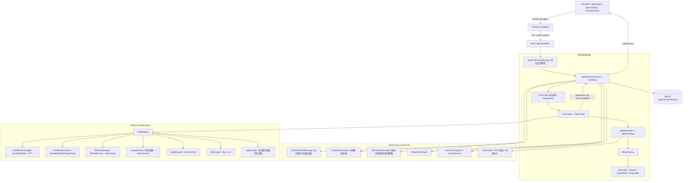

# Agent 架构总览

LX Agent 的 Agent 能力（对话 + 工具 + 协作）运行于 Electron main 进程：LLM 调用、工具执行、进程管理、安全沙箱与会话状态全部在 main；renderer 纯 UI，经 IPC 订阅事件流并派发指令。底层基于 Vercel AI SDK 适配自定义状态机循环，数据校验体系全面基于 Zod。

文档分工：

- [architecture.md](./architecture.md)（本篇）：整体分层架构、进程模型、并发模型、核心契约、消息流与 SQLite 存储
- [runtime.md](./runtime.md)：Turn 状态机、Unified Exec 执行引擎、上下文治理、Token Saver、子代理池与角色治理、记忆与后台作业
- [tools.md](./tools.md)：内置工具全集（文件/检索/补丁/记忆/MCP/Skill/图片查看）与提示词装配规范、生命周期钩子
- [permissions.md](./permissions.md)：五模式硬门禁、三档沙箱策略、Guardian 防护网与多级审批
- [modes.md](./modes.md)：Plan / Review / Design 三模式的输出协议、解析契约与交互卡片（含 Front Design 画布）
- [openclaw.md](./openclaw.md)：OpenClaw Gateway 接入的页面、会话扇出与跨页委派

---

## 1. 架构与数据流



### 1.1 一次对话的完整数据流

1. **输入与路由**：Renderer 发起 `sendMessage(text, options)`，经 `AgentSendContext` 携带 `sessionId` / `tabId` → Main `agentHandlers` → `SessionRunnerManager.getOrCreateRunner()` 按 `sess:<id>` / `tab:<id>` 键取到对应 `AgentSessionRunner`。若该会话正在流式运行，消息默认进入 FIFO `InputQueue`（上限 20 条），或通过 `delivery: "steer"` 转换为即时插话。
2. **环境切片与装配**：`TurnContext` 冻结当前 Turn 的 `cwd`、`is_worktree`、`git_branch`、协作模式（`build`/`plan`/`review`/`design`/`minimal`）、沙箱策略等不可变快照；`SystemPromptManager` 按 order 分层动态拼装（见 tools.md §3）。
3. **驱动循环 (Agent Loop)**：
   - 构造 `LlmMessage` 列表，执行上下文修剪（`ContextPruner`）与记忆/任务状态注入（`transformContext`）。
   - 调用 `aiSdkStreamFn` 发起流式推理，由 `IdleWatchdog`（默认 60s）监控防止网络半开假死；出站请求副本按 Token Saver 配置压缩与风格注入（见 runtime.md §4.6），落库与 UI 保持原始内容。
   - 检测到 Tool Call：依次通过 `CommandSafetyGuard`、`GuardianEvaluator`、`PermissionManager`（模式/沙箱/白名单/审批）安全门控。
   - 安全放行后通过 `UnifiedExecManager` 或 `FileMutationQueue` 调度执行，结果格式化回灌模型。
4. **单事务结算与广播**：Turn 结束时调用 `turnStore.flushTurn()` 单事务落库；广播 `turn_end`、`agent_end`；触发 `InputQueue.drain()` 消费下一条排队输入；异步执行 Token 估算与按需压缩。

### 1.2 多会话并发模型

- `SessionRunnerManager`（`agentRunner.ts`，单例 `agentRunner`）持有活跃会话的 `AgentSessionRunner` 实例池，同一时刻多个会话可并行流式输出与调用工具。
- 实例键：有 `sessionId` 用 `sess:<sessionId>`，仅草稿用 `tab:<tabId>`，无参数回退 `default`。新会话首条消息落库后，runner 从 `tab:` 键重挂到 `sess:` 键（旧 tab 键保留映射）。
- 所有 `AgentEvent` 与 IPC 调用均携带可选 `sessionId` / `tabId`，renderer 据此将事件路由到对应 Tab 实例；无路由字段时回退当前活跃实例。

---

## 2. 模块拓扑结构

```text
src/main/agent/
├── core/                  # 状态机与底层循环引擎
│   ├── types.ts           #   AgentTool, StreamFn, Context, AgentState
│   ├── agent.ts           #   Agent 状态机 (prompt/continue/steer/abort/reset)
│   ├── agent-loop.ts      #   低层工具调用与事件分发循环
│   ├── turnContext.ts     #   Turn 级不可变环境切片
│   ├── timeReminder.ts    #   Turn 级周期动态时间感知 (<current_time>)
│   ├── event-stream.ts    #   流式事件流基础基类
│   ├── stream-fn.ts       #   StreamFn 契约
│   ├── validate.ts        #   工具参数统一前置校验
│   └── worldState.ts      #   会话级世界状态投影
├── stream/                # LLM 模型与流式适配
│   ├── aiSdkStreamFn.ts   #   Vercel AI SDK 适配器 + Token Saver 出站转换
│   ├── modelFactory.ts    #   多 Provider/Model 装配与缓存
│   ├── modelCapabilities.ts # 视觉能力判定 (modelSupportsImageInput)
│   ├── toModelMessages.ts #   消息与工具定义转换
│   └── idleWatchdog.ts    #   流式空闲看门狗 (默认 60s)
├── shell/                 # 统一进程与终端执行引擎
│   ├── unifiedExecManager.ts # UnifiedExecManager (生命周期/PID/标准输入)
│   ├── headTailBuffer.ts     # HeadTailBuffer 对称截断缓冲区 (1 MiB, 50/50)
│   └── persistentShell.ts    # 基于 node-pty 的持久化会话
├── subagent/              # 多 Agent 协作与特化代理池
│   ├── subagentPool.ts    #   SubagentPool (会话续接、隔离生命周期)
│   ├── agentRoles.ts      #   内置角色目录与用户角色合并解析 (explorer/worker)
│   ├── subagentConfig.ts  #   agent.subagents 配置解析与校验
│   ├── subagentRunner.ts  #   单次子代理执行内核 (Agent 创建/快照/hook/重试/输出有界化)
│   ├── toolPermissions.ts #   角色权限 → 子代理工具集过滤 (四组求交，永不提权)
│   └── subagentRuntime.ts #   会话级子代理并发槽位治理 (顶层 FIFO 排队 / 嵌套快返)
├── guard/                 # 安全防护网与死循环守卫
│   ├── guardianEvaluator.ts   # Guardian 四维安全规则引擎
│   ├── commandSafetyGuard.ts  # 高危 Shell 命令语法树拆解与拦截
│   └── repeatToolGuard.ts     # 工具重复调用死循环熔断 (3/5/7)
├── permissions/           # 权限信任与多级审批体系
│   ├── permissionManager.ts  # 模式/沙箱/规则/会话白名单调度
│   └── rule.ts               # Tool(arg) 规则解析引擎与工具分级
├── hooks/                 # 用户级生命周期钩子引擎 (配置/子进程/解析/派发，详见 tools.md §7)
├── prompts/               # 动态提示词与自适应装配
│   ├── systemPromptManager.ts# 分层装配引擎 (Sections, Contexts, Variables, Interceptors)
│   ├── modelAdapters.ts      # 模型自适应规则 (按模型家族注入)
│   ├── promptTemplateLoader.ts # Slash 命令 Markdown 模板加载器
│   └── personalities/        # 人格提示词 (pragmatic / friendly)
├── memories/              # XML 记忆系统
│   └── memoryManager.ts   #   memory.xml 读写、截断与提示词组装
├── tools/                 # 内置工具全集 (清单详见 tools.md §2)
│   └── registry.ts        #   ToolRegistry (注册/激活集/cwd 绑定)
├── skills/                # SkillLoader 扫描与 read_skill 工具
├── mcp/                   # Stdio MCP 连接池与 JSON Schema→Zod 映射
├── lsp/                   # 语言服务器客户端与写后自动诊断
├── jobs/                  # 后台作业注册表 (JobRegistry)
├── spill/                 # 大文本落盘引用管理器 (SpillManager)
├── compaction/            # 历史工具输出内存修剪 (ContextPruner)
├── compaction.ts          # 结构化压缩与溢出自愈算法
├── contextCompactor.ts    # 压缩调度编排器
├── tokenSaver/            # 出站请求治理 (RTK 压缩 / Caveman / Ponytail)
├── export/                # 会话导出器 (Markdown / JSONL / 单文件 HTML)
├── question/              # 模型提问的挂起-应答管理
├── instructionLoader.ts   # AGENTS.md 级联加载
├── titleGenerator.ts      # 会话标题生成
├── suggestedQuestionsGenerator.ts # 后续建议问题生成
├── usageRecorder.ts       # 用量日志采集与事件广播
├── assembly.ts            # 工具注册表装配与默认 cwd 解析
├── sessionRunner.ts       # AgentSessionRunner 主体
├── sessionRunner.types.ts / sessionRunnerInput.ts / sessionRunnerLifecycle.ts
├── sessionRunnerQueue.ts  #   InputQueue 排队与 drain
├── sessionRunnerSessionData.ts / sessionRunnerToolHooks.ts / sessionRunnerTurns.ts
├── sessionRunnerAgentFactory.ts # 会话 Agent 构建（模型/工具/提示词装配）
├── agentRunner.ts         # SessionRunnerManager: 多会话管理器 (单例 agentRunner)
└── turnStore.ts           # 事务级会话落盘与状态投影
```

---

## 3. 核心消息模型 (`src/shared/contracts/agent/messages.ts`)

```typescript
type ContentBlock = TextContent | ThinkingContent | ToolCall | ImageContent
type StopReason = "pending" | "stop" | "length" | "toolUse" | "error" | "aborted"

interface UserMessage {
  role: "user"
  content: string | (TextContent | ImageContent)[]
  timestamp: number
  isSteer?: boolean          // 即时插话消息
  command?: UserMessageCommand // Prompt 模板 / Skill / Slash 命令来源
  files?: AttachedFileMeta[]
}

interface AssistantMessage {
  role: "assistant"
  content: (TextContent | ThinkingContent | ToolCall)[]
  provider: string
  model: string
  usage: Usage
  stopReason: StopReason
  errorMessage?: string
  tokenSaver?: TokenSaverRun  // Token Saver 本轮生效记录（执行流底栏标注）
  timestamp: number
}

interface ToolResultMessage {
  role: "toolResult"
  toolCallId: string
  toolName: string
  content: (TextContent | ImageContent)[]
  isError: boolean
  timestamp: number
  durationMs?: number           // 工具执行耗时 (ms)
  diff?: AgentDiff              // 文件写操作行级结构化 Diff
  subagent?: SubagentData       // 子代理运行完整快照
  image?: ViewImageDetails      // view_image 图片元信息
  lsp?: LspToolDetails          // LSP 诊断或跳转细节
}

// 非交互消息
type CompactionSummaryMessage = { role: "compactionSummary"; summary: string; tokensBefore: number; manual: boolean; model?: string; usage?: CompactionUsage; summaryTokens?: number; timestamp: number }
type UndoSummaryMessage       = { role: "undoSummary"; id?: string; undoPayload?: AgentUndoSummaryPayload; timestamp: number }
type TodoStateMessage         = { role: "todoState"; todos: TodoList; timestamp: number } // transformContext 专用，不落库
type ModelSwitchMessage       = { role: "modelSwitch"; provider: string; model: string; variant?: string; family: string; instructions?: string; isInitial?: boolean; timestamp: number }

type AgentMessage =
  | UserMessage
  | AssistantMessage
  | ToolResultMessage
  | CompactionSummaryMessage
  | UndoSummaryMessage
  | TodoStateMessage
  | ModelSwitchMessage
```

---

## 4. AgentEvent 事件流体系

主进程通过唯一的 `agent:event` IPC 通道向下游 Renderer 广播强类型事件，所有事件均带可选 `sessionId` / `tabId` 路由字段：

| 分类 | 事件名称 | 负载说明 |
| :--- | :--- | :--- |
| **生命周期** | `agent_start` / `agent_end` | 会话轮次启动 / 终止，`agent_end` 携带完整 `messages` |
| **Turn** | `turn_start` / `turn_end` | 单轮起止，`turn_end` 携带最终消息与工具结果 |
| **消息增量** | `message_start` / `message_update` / `message_end` | 助手流式文本、思考块及 ToolCall 实时增量 |
| **工具执行** | `tool_execution_start` / `_update` / `_end` | 工具 ID、名称、参数、耗时 `durationMs` 及结果 |
| **模型** | `model_switch` | 会话内模型切换 / 初始模型条目 |
| **模式状态** | `collaboration_mode_changed` | 五态协作模式切换 |
| **会话标题** | `session_title` | AI 生成的会话标题更新 |
| **安全审批** | `permission_request` / `question_request` | 权限提升弹窗、多级审批选项或模型主动提问 |
| **队列与任务** | `queue_changed` / `todo_updated` | 输入排队长度/列表、`todowrite` 任务清单变动 |
| **MCP 状态** | `mcp_status_changed` | 已连接 MCP server 列表与工具数 |
| **后台作业** | `job_started` / `job_output_chunk` / `job_settled` | 后台 Bash 进程状态与输出流 |
| **治理与用量** | `compaction_start` / `compaction_summary` / `compaction_failed` / `context_usage` | 压缩生命周期、Token 统计与窗口容量 |

---

## 5. IPC 契约清单 (`src/shared/ipc/agentChannels.ts`)

| 分组 | Channel 名称 | 核心职责 |
| :--- | :--- | :--- |
| **对话流** | `send` / `continue` / `abort` / `compact` / `undoCompaction` | 会话发送、续写、打断及手动压缩 |
| **会话管理** | `listSessions` / `restoreSession` / `renameSession` / `deleteSession` / `deleteMessageTurn` / `forkSession` / `restore` / `getDefaultPath` | 会话 CRUD、分支切割、历史轮次删除与默认路径 |
| **协作与工作区** | `setCollaborationMode` / `switchWorktree` / `switchProject` / `switchModel` | 模式切换、Worktree / 项目 / 模型切换 |
| **交互回传** | `permissionResponse` / `questionResponse` | 审批决策回传（允许一次/会话/永久/拒绝/允许全部）与提问答复 |
| **状态查询** | `getMcpStatus` / `getLspStatus` / `installLspServers` / `getContextUsage` / `getPromptAssembly` | 服务状态、用量与提示词装配快照审查 |
| **模板与技能** | `listPromptTemplates` / `listSkills` / `getSkillContent` / `suggestedQuestions` | Slash 模板、Skill 列表与建议问题 |
| **作业管理** | `listJobs` / `killJob` / `removeJob` / `clearSettledJobs` / `readJobOutput` | 后台长时进程管控 |
| **导出集成** | `exportSession` / `copySession` / `openFileAt` / `showItemInFolder` | 会话格式化导出与本地文件跳转 |
| **前端设计** | `compileTailwind` / `saveFrontDesign` / `openDesignDir` | Tailwind JIT 编译、设计三件套落盘与目录打开 |
| **下行事件** | `event` | 主进程 → Renderer 的唯一事件广播通道 |

---

## 6. 多标签页（Multi-Tab）体系

Renderer 侧 `agentTabStore`（`features/agent/hooks/agentTabStore.ts`）管理多标签状态，`AgentTabBar` 横向标签栏位于 `RightSidebar` 顶部（视图切换按钮之间）：

1. **Tab 状态模型**：`{ id, sessionId: string | null, title?, turnCount?, draftBinding?, createdAt }`；草稿 Tab 的 `sessionId` 为 `null`，首条消息落库后回填。
2. **上限与保底**：最多 8 个 Tab（`MAX_TABS`），至少保留 1 个；关闭流式中的 Tab 先 `agentApi.abort()`。
3. **1:1 会话互斥**：一个 `sessionId` 全局只能被一个 Tab 绑定；历史面板打开已被占用的会话时切换到宿主 Tab，`createTab(initialSessionId)` 命中已有绑定则直接激活而非新建。
4. **保活渲染**：多 `AgentPage` 实例常驻 DOM，仅用 CSS `hidden` 切换显隐，保证后台流式、滚动位置与草稿不丢失。
5. **状态感知**：`streamingMap` 维护各 Tab 流式状态，标签项展示运行脉冲点与状态 Tooltip（标题、轮数、模型、项目）。
6. **纯内存**：Tab 列表不持久化（启动时清理旧版 localStorage key），每次启动生成一个默认草稿 Tab。
7. **输入联动**：`registerInputSetter` 注册各 Tab 输入框设值器，`insertPromptToActiveTab()` 支撑「点选微调 / 一键迭代」等跨组件回填。

---

## 7. Renderer 架构与 ExecutionFlow 体系

Renderer 采用 **Feature-First** 模块化设计（`src/renderer/src/features/agent/`）：

1. **输入与交互区 (`AgentInput`)**：Markdown 编辑、`@` 综合提及（文件 / Skill / 子代理角色 / 设计卡片）、`$` Skill 面板、`/` Slash 模板补全、多级 Esc 梯次打断、排队状态气泡。
2. **消息流渲染 (`AgentMessageList`)**：Block 级折叠聚合（普通工具组、文件 Diff 组、思考折叠、子代理链路），结构化卡片（`ProposedPlanCard` / `ReviewFindingsCard` / `FrontDesignCard`）与 `AgentViewImageBlock` 图片块。
3. **全景执行面板 (`AgentExecutionFlowList`)**：
   - 将底层消息流与 `PromptAssembly` 统一投影为标准执行步骤序列（`system` / `user` / `assistant` / `thinking` / `tool` / `subagent` / `compaction` / `undo` / `modelSwitch` / `error` / `proposedPlan` / `reviewFindings` / `frontDesign`）。
   - 专用渲染分发器：`FlowToolBash`（命令高亮、退出码、终端窗格）、`FlowToolFileOps`（行级 Diff 统计）、`FlowToolSearch`（搜索命中概览）、`FlowToolViewImage`（缩略图与元信息）。
   - 聚合 Telemetry 指标：单步耗时 `durationMs`、Token 明细、缓存命中状态与 Token Saver 生效标注。
4. **状态栏 (`AgentStatusBar`)**：协作模式按钮（五态循环 + 点击列表定向切换）、权限请求面板与沙箱盾牌（`PermissionStatusButton`）、后台作业状态与 `AgentContextUsagePill` 容量指示。
5. **面板 (`panels/`)**：`AgentHistoryPanel` 会话历史、`AgentSubagentPanel` 子代理时间轴、`AgentJobsMonitorView` 作业监控。

---

## 8. Agent 数据存储（SQLite）

存储框架为 `src/main/db/migrations/` 迁移器（`Migration = { version, name, up }`，启动时按 version 顺序应用；已应用迁移不可修改，schema 变更只新增迁移文件）。Agent 四表由 `0001_init` 建立，`0008_remove_agent_session_project_item_id` 移除 `agent_session.project_item_id` 并重建索引。SQL 操作集中在 `src/main/services/agentSessionService.ts`，写入编排由 main 进程单写者 better-sqlite3 同步执行。

会话树（`agent_session_entry`）存完整会话上下文，是恢复/续接的**真相源**；`agent_call` 是工具调用的派生查询视图（审计/统计）；`agent_snapshot` 服务于删轮回滚。

### 8.1 设计决策

| # | 决策 | 结论 |
|---|------|------|
| 1 | 存储形态 | 混合：entry 树为真相源 + `agent_call` 独立视图表 |
| 2 | session 归属 | 全局会话，不按页面分桶；归属（project_id/page）建会话时绑定，仅作项目 tag 客户端筛选依据 |
| 3 | 调用记录 | 统一 `agent_call` + `kind` 四分类（builtin/mcp/subagent/skill）；子代理嵌套经 `parent_call_id` 同表自关联 |
| 4 | 能力快照 | 激活能力集随会话以 `active_capabilities` entry 冻结；配置文件（~/.lx/config/）仅作新建会话的默认装配源 |
| 5 | id 规范 | `id INTEGER PRIMARY KEY` + `external_id TEXT UNIQUE`（uuid 业务键）+ `created_at/updated_at`；FK 引用 external_id |
| 6 | 空会话不入库 | 新建对话仅内存态；首次发消息才 INSERT 会话行——空会话天然不可恢复 |
| 7 | 写入者 | main 单写者同步事务；每 turn 一个事务 |
| 8 | 多会话并发 | 每个会话由独立 `AgentSessionRunner` 持有内存状态，落库仍经同一写者串行提交，无跨会话事务 |

### 8.2 表结构

**agent_session —— 会话元数据**

| 列 | 说明 |
|----|------|
| external_id | uuid 业务键 |
| project_id / page | 归属：绑定所属项目或独立页面路由（二者互斥；`project_item_id` 已由 0008 迁移移除） |
| title | 默认 'new chat'，AI 总结 ≤40 字符 |
| cwd | 工具执行目录（项目目录，回退桌面路径） |
| created_at / updated_at | updated_at = 最后一次活跃（追加 entry 同事务 touch），历史列表按其倒序 |

索引：`(page, updated_at DESC)`、`(project_id, updated_at DESC)`。级联：随 `project` 删除。

**agent_session_entry —— 会话上下文树（真相源）**

| 列 | 说明 |
|----|------|
| session_id | → agent_session.external_id，CASCADE |
| seq | 会话内单调递增；UNIQUE(session_id, seq)；删轮保留空洞，nextSeq 取 MAX+1 |
| parent_id | 自引用树父（fork 重映射；多分支留口，v1 线性恒 NULL） |
| type / payload | 类型 + JSON 负载 |

entry type 约定：

| type | payload | 说明 |
|------|---------|------|
| `message` | `AgentMessage` 原样 | user / assistant（含 toolCall blocks）/ toolResult（含 diff?、subagent?、image? 快照）/ modelSwitch 等；恢复续接的输入 |
| `active_capabilities` | `{ tools, mcp, skills }` | 能力快照，仅在能力集实际变化时追加；首条在创建事务内写入 |
| `todo` | `TodoList` | 追加型整表替换；恢复读最后一条；随轮删除回退 |
| `compaction` | `{ summary, firstKeptSeq, tokensBefore, ... }` | 压缩边界；独立边界不随轮删除 |

**agent_call —— 工具调用记录（查询/审计视图）**

关键列：`session_id`、`entry_id`（触发该调用的 message entry，真相源↔视图互跳）、`parent_call_id`（自引用，子代理 provenance）、`kind`（CHECK：builtin/mcp/subagent/skill）、`name`（MCP 记前缀全名）、`mcp_server`（fullName→server 反查）、`status`（running/success/error/aborted）、`args/result`（截断 JSON）、`details`、`duration_ms`。

- **kind 分类**（按工具名判定）：`task`→subagent、`read_skill`→skill、∈已连接 MCP 全名→mcp（填 mcp_server）、其余 builtin。
- **subagent provenance**：子代理内部每次调用写同一张表同 session_id，`parent_call_id` 指向父 task 调用行的 external_id、`entry_id` 恒 null；任意深度成立，递归 CTE 查子树。
- 索引：session+started_at、kind、name、parent_call_id、entry_id。

**agent_snapshot —— git 快照（删轮回滚）**

`session_id` + `user_message_timestamp` 定位一轮；`hash_start/hash_end`（write-tree 哈希）+ `files_changed`（diff --name-only JSON）。仅 cwd 为 git 仓库时写入；删除最后一轮时按 files_changed 选择性回滚（见 runtime.md §7）；fork 时复制 ≤切割点时间戳的行到新会话。

### 8.3 写入时机（turnStore.ts 编排）

```
send() 新会话 ──► createSessionIfNeeded：INSERT agent_session + 首条 active_capabilities entry（同事务）
                     └─ 触发标题生成（fire-and-forget）
beginTurn     ──► 缓冲本轮输入（binding/cwd/title/capabilities）
run 中        ──► tool_execution_start 缓冲 PendingCall（预生成 external_id 供子调用引用）
                   tool_execution_end 更新 status/result/duration
agent_end     ──► flushTurn 单事务：
                   ① 按 seq 追加本轮 message entries
                   ② INSERT 全部 agent_call 行（含子代理 child calls，parent_call_id 关联）
                   ③ pendingTodo 非空则追加 todo entry
                   ④ touchSession 同步 updated_at
压缩完成      ──► 独立事务追加 compaction entry
```

截断策略：`entry.payload` 存**完整**消息（恢复需要全量上下文）；`agent_call.args/result` 为查询视图，复用 truncate 常量截断（2000 行 / 50KB / 单行 500），全文在 payload 内。spill 文件（`~/.lx/spill/`）不入库，随会话删除级联清理。

### 8.4 读取路径

- **历史列表**：全量 `ORDER BY updated_at DESC`，无归属过滤。
- **restoreSession**：entries 按 seq 升序重建 messages（损坏 entry 跳过）→ 最近 active_capabilities → MCP/skill 按当前配置重载 → compaction 边界与最后一条 todo 一并恢复。
- **fork**：复制 `seq < forkSeq` 的 entries（保持原 seq、重映射 parent_id/external_id）+ snapshots，同一事务（见 runtime.md §7）。
- **deleteMessageTurn**：区间删 entries + entry_id 关联的 calls，compaction 边界除外；删除后重读最后 todo 同步内存。

### 8.5 演进路线

| 方向 | 触发条件 | 留口位点 |
|------|----------|----------|
| 会话全文搜索 | 历史面板标题搜索不够用用时 | entries 结构支持 FTS5 影子表增量维护 |
| 项目删除保留会话审计 | 出现"删项目留会话"诉求 | 改软删/归档，评估 CASCADE 影响 |

---

## 9. 配置文件布局（`~/.lx/config/`）

设置由 `src/main/services/settingsService/` 统一读写，物理上按领域拆分为多个 JSON 文件，每个文件为「顶层 key 包装」结构。

### 9.1 文件与顶层 key 映射

| 文件 | 顶层 key | 说明 |
|------|----------|------|
| `config/ai.json` | `ai`、`bailian` | Provider / 模型选择 / webSearch / compaction / streamIdleTimeoutMs；`bailian` 为兼容旧 provider 别名 |
| `config/agent.json` | `agent` | `mcp` / `permissions` / `skills` / `lsp` / `subagents` / `hooks` |
| `config/openclaw.json` | `openclaw` | OpenClaw 实例与默认选择 |
| `config/app.json` | `ui`、`cli`、`voice`、`tokenSaver` | 客户端级设置 |
| `config/extra.json` | 其余未知 key | 兜底保留，任何读写不得丢弃未知顶层 key |

### 9.2 读写语义

- **合并读**：`readRawConfig` 合并全部布局文件为一个配置树；同名顶层 key 冲突时按固定文件顺序后者覆盖并告警。
- **按域写**：`updateRawConfig` 对变更函数结果做顶层 key 脏检测，只原子重写发生变化的 key 所属文件（临时文件 + rename），其余文件不动。
- **故障隔离**：单个文件 JSON 损坏时告警、按空对象读取并改名为 `<file>.corrupt` 保留现场，其余域不受影响。

### 9.3 旧文件迁移与备份

- 首次读取配置时懒迁移：旧 `~/.lx/config.json` 先拆分写入 `config.tmp/`，再整体改名为 `config/`（同文件系统原子改名，崩溃后重跑幂等），成功后旧文件改名为 `config.json.bak`。
- 迁移后代码只认 `config/` 目录，不回读旧文件；损坏的旧文件保持原样并跳过迁移，仅告警一次。
- 迁移失败或需要回滚时可手工将 `config.json.bak` 改回 `config.json` 并删除 `config/` 目录。

