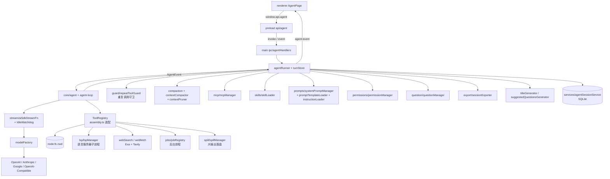

# Agent 架构总览

LX Agent 的 Agent 能力（对话 + 工具）运行于 main 进程：LLM 调用、工具执行、会话状态全部在 main；renderer 纯 UI，经 IPC 订阅事件流。实现对齐 [pi-main](https://github.com/earendil-works/pi) `packages/agent` 规范（Agent / AgentLoop / AgentTool / AgentEvent），底层接入 Vercel AI SDK（项目既有依赖），schema 体系用 zod。

五篇文档分工：[architecture.md](./architecture.md)（本篇）、[tools.md](./tools.md)（工具与扩展体系）、[runtime.md](./runtime.md)（会话生命周期与运行时治理）、[permissions.md](./permissions.md)（权限信任模型）、[database.md](./database.md)（SQLite 存储）。

## 1. 架构总览



数据流（一次对话）：

1. renderer `sendMessage(text, options)` → `window.api.agent.send(...)`（invoke）→ main `agentRunner.send()`。
2. `send()`：输入非空校验 → 流式中入队（queue）或 steer → `mcpManager.ensureConnected()` → 新会话冻结归属/cwd/能力 → `ensureReady()` 装配 → `/skill:` 与模板命令展开 → `beginTurn` 缓冲落盘输入 → 新会话建行 + 触发标题生成 → `agent.prompt(expanded)`。
3. `agent-loop` 驱动：单步 LLM 生成（经 streamFn 适配器，IdleWatchdog 防假死）→ toolCall 校验参数 → repeatToolGuard 守卫 → `beforeToolCall` 权限门控 → 执行工具 → toolResult 回灌 → 循环至模型停。
4. 全程经 `agent.subscribe()` 订阅 `AgentEvent`，runner 经 `agent:event` 推送到 renderer；turn 结束 `flushTurn` 单事务落库；随后执行队列 drain 与按需压缩（见 runtime.md）。

## 2. 模块结构

```text
src/main/agent/
  core/                  # 移植自 pi packages/agent 的 agent-core（zod 版）
    types.ts             #   StreamFn / Context / AgentLoopConfig / AgentTool / AgentState
    agent.ts             #   Agent 状态机：prompt/continue/steer/followUp/abort/reset/订阅
    agent-loop.ts        #   低层循环 runAgentLoop / runAgentLoopContinue
    stream-fn.ts         #   getDefaultStreamFn / setDefaultStreamFn
    event-stream.ts      #   EventStream / AssistantMessageEventStream 基类
    validate.ts          #   validateToolArguments（zod safeParse）+ findTool
  stream/
    aiSdkStreamFn.ts     # AI SDK → StreamFn 适配器（单步生成，集成 IdleWatchdog）
    modelFactory.ts      # settings 配置 → provider/model 装配 + LanguageModel 缓存
    toModelMessages.ts   # LlmMessage → AI SDK ModelMessage；AgentTool → SDK tool
    idleWatchdog.ts      # 流式空闲看门狗（默认 30s 无 chunk 即 abort）
  tools/                 # 内置工具实现（清单见 tools.md）
  assembly.ts            # 会话装配：ALL_TOOL_NAMES、createRegistry、系统提示词拼装、resolveCwd
  permissions/           # 权限信任模型（见 permissions.md）
  mcp/                   # MCP stdio 接入：mcpManager + jsonSchemaToZod
  skills/                # Skill 加载器 + read_skill 工具
  prompts/               # promptTemplateLoader（/命令模板）+ systemPromptManager（分层装配）
  question/              # questionManager：模型提问挂起/回答回传
  lsp/                   # 语言服务器客户端/生命周期/懒安装 + feedback.ts（写后诊断）
  jobs/                  # jobRegistry：后台长任务注册表
  spill/                 # spillManager：工具大输出落盘引用
  guard/                 # repeatToolGuard：重复工具调用守卫
  compaction/            # contextPruner：历史工具输出修剪
  compaction.ts          # 压缩边界/token 估计/切割点/摘要生成/overflow 判定
  contextCompactor.ts    # ContextCompactor：压缩编排
  export/                # sessionExporter（md/jsonl/剪贴板）+ htmlTemplate（单文件 HTML）
  instructionLoader.ts   # user + 项目 AGENTS.md / CLAUDE.md 注入
  agentRunner.ts         # 会话级 runner：装配、事件转发、队列/steer、fork/删轮、导出调度
  turnStore.ts           # 会话落盘缓冲与投影：beginTurn/flushTurn 事务、pendingCalls、快照
  titleGenerator.ts      # 会话标题 AI 总结
  suggestedQuestionsGenerator.ts
src/shared/
  contracts/agent.ts     # 消息模型 + AgentEvent + 各类请求/响应 DTO
  contracts/sessionProjection.ts  # 事件 → 会话状态的纯函数投影
  ipc/agentChannels.ts   # AGENT_CHANNELS（33 个 channel）
src/main/ipc/agentHandlers.ts     # IPC 薄转发 + 输入边界校验
src/preload/api/agent.ts          # window.api.agent 白名单 API
src/renderer/src/features/agent/  # feature-first UI（见 §6）
```

依赖方向：`main/agent` 为独立能力层，可被 `main/ipc` 复用；`shared/contracts` 只放无副作用类型；renderer 不直接触达 main 内部模块。

## 3. 消息模型（shared/contracts/agent.ts）

```ts
type ContentBlock = TextContent | ThinkingContent | ToolCall | ImageContent
type StopReason = "pending" | "stop" | "length" | "toolUse" | "error" | "aborted"

type UserMessage       = { role: "user"; content: string | (TextContent | ImageContent)[]; timestamp: number }
type AssistantMessage  = { role: "assistant"; content: (TextContent | ThinkingContent | ToolCall)[];
                           provider: string; model: string; usage: Usage;
                           stopReason: StopReason; errorMessage?: string; timestamp: number }
type ToolResultMessage = { role: "toolResult"; toolCallId: string; toolName: string;
                           content: (TextContent | ImageContent)[]; isError: boolean;
                           diff?: AgentDiff; subagent?: SubagentData; timestamp: number }

// 上下文注入型消息（不落库为普通对话，经 transformContext 注入 / 压缩可见块）
type CompactionSummaryMessage = { role: "compactionSummary"; summary; tokensBefore; timestamp }
type TodoStateMessage         = { role: "todoState"; todos: TodoList }

type AgentMessage = UserMessage | AssistantMessage | ToolResultMessage
                 | CompactionSummaryMessage | TodoStateMessage
```

要点：

- `AssistantMessage.usage = { input, output, totalTokens }`（空消息用 `EMPTY_USAGE`）；`provider/model` 供渲染标识。
- `ToolResultMessage.diff?`：edit/write 产出的结构化 diff（行级变更 + 词级高亮 + 统计），渲染折叠展示并随 entry 落库。
- `ToolResultMessage.subagent?`：task 工具的子代理运行快照（内部消息时间轴/steps/usage），随 entry 落库，恢复后子代理面板可复现。
- `AgentMessage` 保持纯 JSON 可序列化（无函数、无 class 实例），可直接落 `agent_session_entry.payload`。
- renderer 侧另有 blocks 视图模型 `{ id, role, blocks: BlockView[], isStreaming?, isSteer?, isQueuedDrain? }`，由 `useAgentChat` 订阅事件流驱动。

## 4. AgentEvent 事件流

main → renderer 的唯一流式负载，经 `agent:event` 推送；renderer 按 type 分发、未知类型忽略（向后兼容）。

| 分组 | 事件 |
|------|------|
| 循环核心 | `agent_start`、`agent_end { messages }`、`turn_start`、`turn_end { message, toolResults }` |
| 消息流 | `message_start / message_update / message_end { message }`（update 携带 `assistantMessageEvent` 流式增量） |
| 工具执行 | `tool_execution_start / _update / _end { toolCallId, toolName, ... }` |
| 会话元信息 | `mcp_status_changed { servers }`、`session_title { sessionId, title \| null }`、`context_usage { tokens, contextWindow }` |
| 交互挂起 | `permission_request { request }`、`question_request { request }` |
| 上下文治理 | `compaction_summary`、`compaction_start { compactionId, manual, model? }`、`compaction_failed` |
| 输入队列 | `queue_changed { length, messages }`、todo 更新 `todo_updated { todos }` |
| 后台作业 | `job_started { job }`、`job_output_chunk { jobId, chunk }`、`job_settled { job }` |

`assistantMessageEvent` 增量：`start / text_* / thinking_* / toolcall_* / done / error`，均携带合成中的 `partial` AssistantMessage。

## 5. IPC 契约（AGENT_CHANNELS，33 个）

invoke 由 renderer 发起，main handler 做边界校验（非法输入抛 `INVALID_*` 或返回错误）；推送统一走 `agent:event`。

| 分组 | channel |
|------|---------|
| 对话流 | `send`、`continue`、`abort`、`restore`、`compact`、`undoCompaction`、`suggestedQuestions` |
| 会话管理 | `listSessions`、`restoreSession`、`renameSession`、`deleteSession`、`deleteMessageTurn`、`forkSession`、`switchWorktree` |
| MCP / LSP | `getMcpStatus`、`getLspStatus`、`installLspServers` |
| 交互回传 | `permissionResponse`、`questionResponse` |
| 提示词 | `listPromptTemplates`、`getPromptAssembly`、`getDefaultPath` |
| 文件跳转 | `openFileAt`（系统编辑器打开并定位行）、`showItemInFolder` |
| 导出 | `exportSession`、`copySession` |
| 后台作业 | `listJobs`、`killJob`、`removeJob`、`clearSettledJobs`、`readJobOutput` |
| 上下文用量 | `getContextUsage` |
| 事件推送 | `event`（webContents.send，唯一 push 通道） |

约定：权限/提问请求不单独占 push channel，作为事件经 `agent:event` 下发，配对 invoke 回传；新增能力优先扩展现有契约形状（union 变体、可选字段），避免破坏 preload 白名单。

## 6. Renderer 结构（features/agent，feature-first）

```text
components/
  AgentInput/            # 输入区：markdown 编辑、@ 文件提及、/ 命令面板、排队提示、Esc 分级打断
  AgentMessageList/      # 消息列表：分组渲染、吸顶（useMessagePin）、滚动按钮
  blocks/                # 消息块：执行组折叠、diff、thinking、skill/mcp/websearch/subagent/todo/question/lsp/compaction
  panels/                # ChatHistoryPanel（历史）、AgentSubagentPanel（子代理弹层）、AgentJobsMonitorView（作业监控）
  status-bar/            # AgentStatusBar + Job/Permission/Todo 状态按钮
  AgentExecutionFlowList/# 执行流程全景面板（快照 + 步骤投影）
hooks/                   # useAgentChat / useAgentJobs / useMcpStatus / useLspStatus / sessionListStore /
                         # agentViewStore / useMessagePin / usePromptHistory / useSuggestedQuestions
utils.ts / types.ts / messageGrouping.ts / executionFlow.ts / constants.ts
```

- 消息渲染按 blocks 分组：text 打字机（`LxMarkdownPreview`，mermaid 自动成图）、thinking 折叠、普通工具进执行组、写工具独立 diff 组、skill/mcp/web_search/subagent/todowrite/question/lsp 独立块。
- 子代理面板与主列表共用同一套分组逻辑（`messageGrouping.ts`）；用户消息吸顶 hook 两处复用。
- 历史面板全量会话列表 + 项目 tag 客户端筛选 + pending 标题 pulse。

## 7. 演进路线

| 方向 | 触发条件 | 留口位点 |
|------|----------|----------|
| run 恢复（崩溃续跑） | 出现长任务中断续跑的真实场景 | `flushTurn` 单事务已是安全点；entry 树可承载操作日志 |
| steer/followUp 完整暴露 | 多窗口/外部触发需求 | `Agent.steer()/followUp()/PendingMessageQueue` 已具备，IPC 仅暴露 steer |
| Session Projection 完全体 | Undo/Fork/Compaction 出现状态不一致 | `contracts/sessionProjection.ts` 纯函数投影 + `turnStore.ts` 已就位 |
