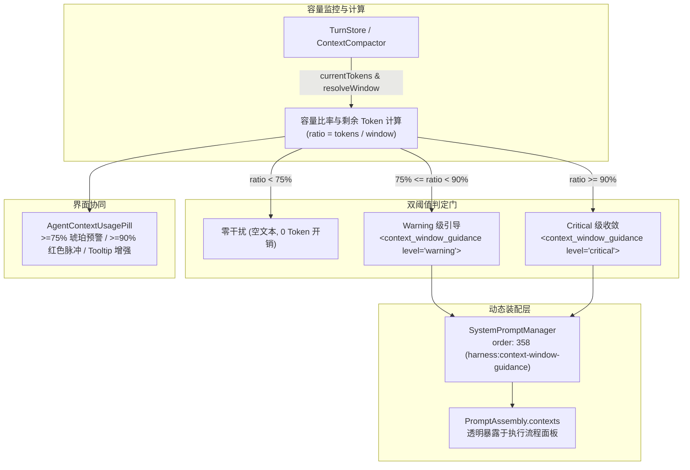

# Context Window Guidance & Token Budget Reminder Harness 设计方案

## 1. 架构背景与设计目标

参考 OpenAI Codex (`codex-rs`) 核心架构中的上下文动态治理机制（`context_window_guidance.rs` 与 `token_budget_context.rs`）：
在长任务编码过程中，当会话历史激增、上下文占用逼近模型上限时，缺乏容量感知的模型极易发生：
1. 盲目调用 `read` 或 `grep` 进行全量大文件读取，瞬间导致上下文溢出（Context Overflow）；
2. 输出过度冗长，耗尽单次回复 Token 预算或导致截断；
3. 无法在到达极端上限前主动指导用户使用 `/compact` 压缩。

为此，在 LX Agent 的分层 Harness 体系中引入 **动态上下文容量感知与自适应告警 Harness (Context Window Guidance Harness)**。



---

## 2. 核心数据结构与协议定义

### 2.1 上下文 Guidance 数据结构与常量 (`src/shared/contracts/agent.ts`)

```typescript
// 上下文容量告警级别定义
export type ContextGuidanceLevel = "warning" | "critical"

// 上下文容量引导快照
export interface ContextWindowGuidanceInfo {
  level: ContextGuidanceLevel
  usedTokens: number
  totalTokens: number
  remainingTokens: number
  usagePercent: number
  guidanceText: string
}
```

### 2.2 XML Fragment 协议定义 (`<context_window_guidance>`)

在系统提示词装配时，以独立的 Contextual User Fragment 动态注入，规范如下：

- **Soft 阶段（75% ~ 90%）**：
  ```xml
  <context_window_guidance level="warning">
  Current context window usage: 78% (approx. 44,000 tokens remaining out of 200,000).
  Guidance: You are approaching the context limit. Refrain from dumping large files or redundant grep outputs. Prefer surgical symbol lookups using lsp or focused grep. If continuing a long task, consider completing the current sub-goal cleanly.
  </context_window_guidance>
  ```

- **Critical 阶段（>= 90%）**：
  ```xml
  <context_window_guidance level="critical">
  Current context window usage: 93% (approx. 14,000 tokens remaining out of 200,000).
  CRITICAL: You are near the maximum context capacity. Keep response concise, finish immediate edits, and recommend the user run `/compact` to summarize history before further broad inquiries.
  </context_window_guidance>
  ```

---

## 3. 详细设计与实现路径

### 3.1 `SystemPromptManager` 注入 Context (`src/main/agent/prompts/systemPromptManager.ts`)

在 `PROMPT_ORDERS` 中新增 `CONTEXT_WINDOW_GUIDANCE = 358`：
```typescript
export const PROMPT_ORDERS = {
  // ...
  ENVIRONMENT: 350,
  CURRENT_TIME: 355,
  CONTEXT_WINDOW_GUIDANCE: 358,
  SANDBOX_POLICY: 360,
  COLLABORATION_MODE: 380,
} as const
```

在 `createDefaultSystemPromptManager` 中注册：
```typescript
manager.registerContext({
  name: PROMPT_SECTION_NAMES.CONTEXT_WINDOW_GUIDANCE,
  order: PROMPT_ORDERS.CONTEXT_WINDOW_GUIDANCE,
  text: (ctx) => {
    const usage = ctx.contextUsage
    if (!usage || !usage.contextWindow || usage.contextWindow <= 0) return ""
    const ratio = usage.tokens / usage.contextWindow
    if (ratio < 0.75) return ""

    const remaining = Math.max(0, usage.contextWindow - usage.tokens)
    const percent = Math.min(100, Math.round(ratio * 100))
    const isCritical = ratio >= 0.9

    if (isCritical) {
      return [
        `<context_window_guidance level="critical">`,
        `Current context window usage: ${percent}% (approx. ${remaining.toLocaleString()} tokens remaining out of ${usage.contextWindow.toLocaleString()}).`,
        `CRITICAL: You are near the maximum context capacity. Keep response concise, finish immediate edits, and recommend the user run /compact to summarize history before further broad inquiries.`,
        `</context_window_guidance>`,
      ].join("\n")
    }

    return [
      `<context_window_guidance level="warning">`,
      `Current context window usage: ${percent}% (approx. ${remaining.toLocaleString()} tokens remaining out of ${usage.contextWindow.toLocaleString()}).`,
      `Guidance: You are approaching the context limit. Refrain from dumping large files or redundant grep outputs. Prefer surgical symbol lookups. If continuing a long task, consider completing the current sub-goal cleanly.`,
      `</context_window_guidance>`,
    ].join("\n")
  },
})
```

### 3.2 `sessionRunner.ts` 与 `assembly.ts` 接入

- 在 `buildSystemPromptSync` 与 `assemble` 的 `AssembleContext` 中，带入 `contextUsage`:
  ```typescript
  const contextUsage = this.compactor.getUsage()
  ```
- 保证每次 LLM 轮次装配和更新系统提示词时均能实时拿到最新估计的 Token 容量与模型 Window。

### 3.3 UI 呈现与执行流程面板透明化

- **执行流程面板 (`AgentExecutionFlowList`)**：
  在上下文栏目中自动列出 `harness:context-window-guidance`，当激活时展示标签与完整 Guidance 内容。
- **状态栏与输入框 (`AgentContextUsagePill`)**：
  - 维持当前优雅无干扰的设计；
  - 当 `percent >= 90%` 时小圆点高亮红色且加上轻微脉冲（pulse），Tooltip 提示引导使用 `/compact`。

---

## 4. 架构原则与极简防劣化（Linus Taste）

1. **零性能开销**：容量数据直接来自已有的 `ContextCompactor.getUsage()`（内存估算），无任何多余异步 IO。
2. **零上下文污染**：比率低于 75% 时返回空串，不增加任何冗余 Token。
3. **分段解耦**：作为纯正的 Context Provider 接入，不修改 Agent 核心循环状态机，不硬编码业务分支。
