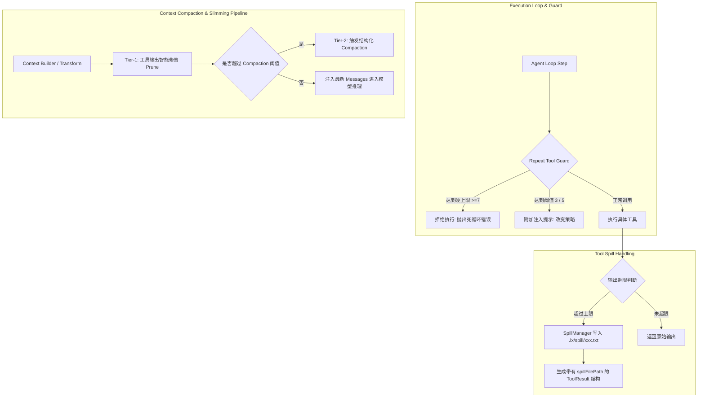

# Agent 上下文瘦身、溢出管理与死循环守卫设计方案 (v14)

## 1. 背景与目标

在桌面端 Agent 交互中，随着多轮对话进行，主要面临两大核心问题：
1. **上下文过度膨胀与 Token 浪费**：早期步骤中产生的大量 `read`、`grep`、`find` 等工具调用输出持续占用上下文窗口，严重推高 LLM 推理延迟和费用，并在 Compaction 阶段对模型总结能力造成噪音干扰。
2. **工具死循环与参数重复调用**：模型在遇到无法解决的问题或路径错误时，容易陷入重复调用同一工具、传入完全相同参数的死循环，造成无限循环消耗 Token。
3. **大输出溢出（Spill）的用户感知与可操作性弱**：当前溢出到磁盘的临时文件仅在文本中作为文字路径出现，用户在桌面端缺乏一键定位/打开和查看的友好交互。

本项目参考 **oh-my-pi**（`session-maintenance` 的两级输出修剪策略）与 **deepseek-harness**（`dsh-repeat-tool-reminder` 的规范化参数哈希链与逐级渐进注入提示机制），为 `lx-agent` 设计轻量、高内聚、符合 Electron 架构的完整解决方案。

---

## 2. 核心架构设计

---

## 3. 详细子系统设计

### 3.1 Tier-1 工具输出智能修剪（Context Slimming / Prune）

- **触发时机**：在 `transformContext` 阶段，在判断是否进行结构化摘要压缩之前执行。
- **修剪策略**：
  - 保留最新的 $N$ 条（例如最后 6 个 Turn）消息的完整工具输出。
  - 对于较早历史中超过指定行数/长度阈值（如 > 20 行或 > 500 字符）的只读类工具（`read`, `grep`, `find`, `ls`, `webfetch`）输出，就地替换为轻量占位文本：
    `[Historical output of tool "${toolName}" pruned (${lineCount} lines / ${charCount} chars). Refer to latest tool outputs.]`
  - 严格不修改 SQLite 数据库中持久化的原始消息记录，仅在内存构造送往 LLM 的上下文字符串时变换（非破坏性视图变换）。

### 3.2 重复工具调用守卫（Repeat Tool Guard）

- **数据结构**：
  - 规范化参数序列化：对参数对象的 key 进行深度排序（Canonical JSON），计算 `(toolName, canonicalArgs)` 作为调用指纹。
  - 维护每个 Session 的调用链记录：`lastFingerprint`, `consecutiveCount`。
  - 排除白名单工具（如 `todowrite`, `question` 等不计入连续重复链）。
- **逐级干预阶梯**：
  - **阈值 3（初次预警）**：在当次工具结果后附加软性警告提示（Injected Prompt），提示模型不要重复相同参数，请检查上一次输出或换用其他方案。
  - **阈值 5（强化警告）**：详细列出连续重复次数、工具名、规范化参数摘要，严厉要求中断当前尝试。
  - **阈值 7（硬拦截）**：直接阻止当次工具执行，返回错误：`"Execution blocked: Repeated tool call exceeded safety limit (7 consecutive calls with identical arguments)."`。

### 3.3 工具溢出（Spill）的前端交互与文件打开

- **IPC 通信**：
  - 在 `src/main/agent/` 和 preload 中增加/复用原生文件操作 channel：`window.electron.ipcRenderer.invoke('shell:showItemInFolder', filePath)` 或 `openPath`。
- **Renderer UI 呈现**：
  - 优化 `AgentToolCallBlock.tsx`：当检测到工具输出包含溢出文件或元数据中携带 `spillFilePath` 时，渲染醒目的「打开溢出文件 / 在文件管理器中显示」按钮。
  - 国际化适配：在 `zh.ts` 和 `en.ts` 中补充相关多语言词条（如 `agent.openSpillFile`, `agent.toolRepeatedWarning` 等）。

---

## 4. 边界与设计规范遵守

1. **三进程架构清晰**：核心守卫与修剪纯函数保留在 Main 进程，Renderer 仅负责状态订阅与视觉展现。
2. **纯函数与不可变性**：上下文修剪纯粹作为 `transformContext` 管道中间件，不污染 DB 中的原始会话。
3. **Taste & 极简**：不引入庞大外部依赖，全部通过 TypeScript 原生实现与清晰的数据结构驱动。
