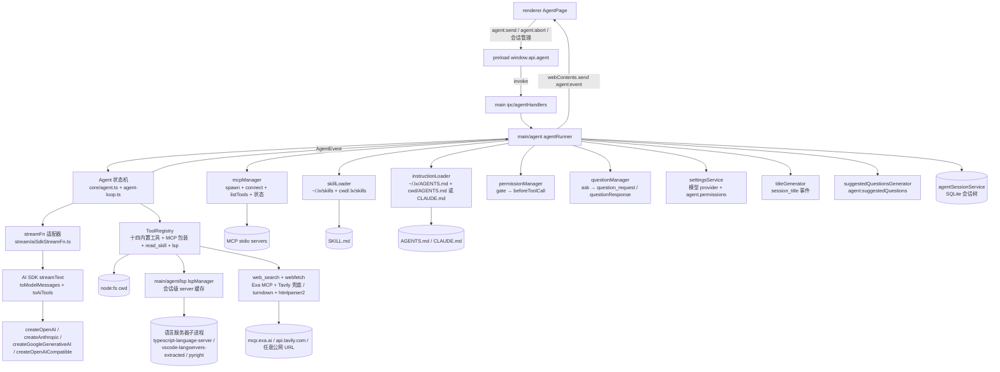

# Agent 能力设计

本文记录 LX Agent Agent 能力（对话 + 工具）的设计决策与架构约定。设计对齐参考项目 [pi-main](https://github.com/earendil-works/pi) 的 `packages/agent` 规范（Agent / AgentLoop / AgentTool / AgentEvent），底层接入 Vercel AI SDK（项目既有依赖）。实现已全部落地：核心运行于 main 进程，renderer 纯 UI，经 IPC 订阅事件流。

扩展体系（内置工具 / MCP / Skill / 联网搜索）见 [extensions.md](./extensions.md)，Harness 演进与信任模型见 [harness.md](./harness.md)，SQLite 落盘见 [database.md](./database.md)。

## 1. 对齐决策记录

| # | 决策 | 结论 |
|---|------|------|
| 1 | Agent 核心运行位置 | **main 进程**：LLM 调用、工具执行、会话状态全部在 main；renderer 纯 UI，经 IPC 订阅事件流 |
| 2 | 实现路径 | **移植 pi agent-core**（`types.ts` / `agent.ts` / `agent-loop.ts` / `stream-fn.ts` / `event-stream.ts` / `validate.ts`），schema 体系由 typebox 换为 **zod**；LLM 调用经 **AI SDK streamFn 适配器**注入；harness 不搬代码，仅留口（见 [harness.md](./harness.md)） |
| 3 | 工具权限 | 会话绑定**激活项目目录**为 cwd；路径类工具统一经 `resolveToCwd` 只允许 cwd 内路径（越界拒绝）；内置工具全集（`read`/`ls`/`grep`/`find`/`write`/`edit`/`bash`/`time`/`web_search`）；写工具经 file-mutation-queue 串行化，bash 超时 + cwd 限制 + 进程树清理 |
| 3.1 | 工具范围演进 | v1 曾定"首版纯只读"；已升级为**全内置工具集**（含写工具），只读约束取消；安全边界见 [harness.md](./harness.md) 信任模型 |
| 3.2 | 联网搜索 | `web_search` 复用 memory-curator-agent 方案：**Exa 优先、Tavily 兜底**，Key 配于 `~/.lx/config.json` 的 `ai.webSearch`，无 Key 保留匿名直连；详见 [extensions.md](./extensions.md) §5 |
| 3.3 | 页面能力限制 | **已移除**：所有会话一律**全量能力**（内置九工具 + 全部已连接 MCP + 全部可用 skill）；`config.json` 的 `agent.pages` 配置废弃（见 [database.md](./database.md) §3） |
| 4 | 会话历史 | **全局会话 + SQLite 落盘**：不按页面/项目分桶；会话归属（项目 + cwd）**建会话时冻结**、导航不改变既有会话；历史面板全量列出 + 项目 tag 客户端筛选；应用启动恢复全局最近活跃会话 |
| 5 | 模型装配 | main 内 `modelFactory` 按 settings 配置装配四种 provider，LanguageModel 按 `provider:id` 缓存（settings 保存时 `invalidateModelCache`）；首版默认 `defaultModel`，`send` 支持 `selection` 覆盖；apiKey 缺失返回明确 error |
| 6 | IPC 契约 | `invoke` 发起 + main 经 `webContents.send` 推送流式事件；事件负载复用 `AgentEvent`；共 **12 个 channel**（见 §7） |
| 7 | UI 边界 | 数据层 + 渲染层同步升级：blocks 消息模型渲染（text 打字机 / 执行组折叠 / 写工具独立 diff 组 / Skill / MCP / 联网搜索独立展示块 / 建议问题）；`AgentPage.tsx` 组装逻辑不变 |
| 8 | 标题生成 | 新建会话发送首条消息即触发 AI 标题总结（`titleSummary` 模型，异步 fire-and-forget，失败静默）；见 §10 |
| 9 | 文档 | 四篇：`design.md` + `extensions.md` + `harness.md` + `database.md` |

## 2. 架构总览



数据流（一次对话）：

1. renderer `sendMessage(text)` → `window.api.agent.send(text, selection?, context?)`（invoke）→ main `agentRunner.send()`。
2. `send()` 内：`mcpManager.ensureConnected()`（幂等）→ 新会话 `freezeNewSession(context)` 冻结归属/cwd/能力 → `ensureReady()` 装配 Agent → 显式 `/skill:` 展开 → `beginSessionTurn()` 缓冲落盘输入 → 新建会话先建会话行 + 触发标题生成 → `agent.prompt(expanded)`。
3. `agent-loop` 驱动：LLM 单步生成（经 streamFn 适配器）→ 有 toolCall 则校验参数、`beforeToolCall` 门控、执行工具、把 toolResult 写回上下文 → 循环至模型停或 `shouldStopAfterTurn`。
4. 全程经 `agent.subscribe()` 订阅 `AgentEvent`，runner 转发为 IPC 事件推送到 renderer；`agent_end` 时 `flushTurn()` 一个事务落库。

## 3. 模块结构

```text
src/main/agent/                  # 仅主进程可运行的 Agent 能力
  core/                          # 移植自 pi packages/agent 的 agent-core
    types.ts                     # StreamFn / Context / AgentLoopConfig / AgentTool / AgentState /
                                 # LlmMessage / 各 hook 上下文类型（zod 版）；re-export 消息模型
    agent.ts                     # Agent 状态机：prompt/continue/steer/followUp/abort/reset/事件
    agent-loop.ts                # 低层循环：请求→工具→续轮（runAgentLoop / runAgentLoopContinue）
    stream-fn.ts                 # getDefaultStreamFn / setDefaultStreamFn
    event-stream.ts              # EventStream / AssistantMessageEventStream 基类（pi-ai 子集）
    validate.ts                  # validateToolArguments（zod safeParse）+ findTool
  stream/
    aiSdkStreamFn.ts             # AI SDK → StreamFn 适配器（核心桥接，单步生成）
    modelFactory.ts              # settings 配置 → AI SDK provider/model 装配 + LanguageModel 缓存
    toModelMessages.ts           # LlmMessage → AI SDK ModelMessage + toAiTools（AgentTool → SDK tool）
  tools/
    registry.ts                  # ToolRegistry：注册、激活、cwd 绑定、名字冲突检测
    path-utils.ts                # resolveToCwd/pathExists：路径安全解析（`..` 逃逸/越界拒绝）
    truncate.ts                  # DEFAULT_MAX_LINES/BYTES/GREP_MAX_LINE_LENGTH + 截断工具
    file-mutation-queue.ts       # withFileMutationQueue：同文件写串行化（edit/write 内部使用）
    search.ts                    # walkFiles/globToRegExp/readFileText（grep/find 纯 Node 降级共享）
    diff.ts                      # generateStructuredDiff：行级 + 词级高亮可视化 diff（edit/write 产物）
    read.ts / ls.ts / grep.ts / find.ts / write.ts / edit.ts / bash.ts / time.ts / todowrite.ts
    webSearch.ts                 # createWebSearchTool（Exa 优先 / Tavily 兜底）
    webfetch.ts                  # createWebFetchTool（URL 原文抓取，turndown + htmlparser2）
    question.ts                  # createQuestionTool（执行中向用户提问）
  question/
    questionManager.ts           # ask/respond/clearSession（挂起提问，question_request 推送）
  mcp/                           # MCP 工具接入（见 extensions.md §6）
    mcpManager.ts                # server 生命周期：spawn stdio / connect / listTools / 状态 / 断开
    jsonSchemaToZod.ts           # MCP JSON Schema → zod（无损受限，兜底宽松 schema）
  skills/                        # Skill 接入（见 extensions.md §7）
    skillLoader.ts               # 双来源加载 / 校验 / 冲突 user 优先 / 缓存 / formatSkillsForPrompt
    readSkillTool.ts             # read_skill(name) 工具：查表读正文，不收路径参数
  permissions/                   # 信任模型（见 harness.md §3）
    permissionManager.ts         # gate/evaluate/respond/会话记忆（挂 beforeToolCall）
    rule.ts                      # parseRule/matchRule + 门控集/豁免集
  instructionLoader.ts           # 指令文件加载（user + 项目 AGENTS.md/CLAUDE.md）+ formatInstructions
  agentRunner.ts                 # 会话级装配：Agent + 工具 + 事件转发 + 落盘缓冲 + 标题触发
  titleGenerator.ts              # generateSessionTitle / generateTemplateTitle（纯生成，不进事件流）
  suggestedQuestionsGenerator.ts # generateSuggestedQuestions（建议问题）
src/shared/
  contracts/agent.ts             # 消息模型（ContentBlock/AgentMessage/AgentDiff）+ AgentEvent +
                                 # PermissionRequest/Response + 会话/能力 DTO（跨进程负载）
  ipc/agentChannels.ts           # AGENT_CHANNELS（12 channel）
src/main/ipc/agentHandlers.ts    # IPC 薄转发 + 输入边界校验（standards：main IPC 不含业务规则）
src/preload/
  api/agent.ts                   # window.api.agent 白名单 API
src/renderer/src/features/agent/ # renderer：AgentPage + useAgentChat + blocks 渲染组件 + 历史面板
```

依赖方向遵循 `project-directory-structure.md`：`main/agent` 为独立能力层，可被 `main/ipc` 与未来 harness 复用；`shared/contracts` 只放无副作用类型。

## 4. 消息模型

消息模型定义在 `src/shared/contracts/agent.ts`（跨进程 DTO，早期规划落于 `core/messages.ts` 的内容已并入此处），`core/types.ts` 再 re-export 供 main 使用。去除对 `@earendil-works/pi-ai` 的依赖：

```ts
// Content blocks
type ContentBlock = TextContent | ThinkingContent | ToolCall | ImageContent
// TextContent:    { type: "text"; text: string }
// ThinkingContent:{ type: "thinking"; thinking: string }
// ToolCall:       { type: "toolCall"; id: string; name: string; arguments: Record<string, unknown> }
// ImageContent:   { type: "image"; data: string; mimeType: string }

type StopReason = "pending" | "stop" | "length" | "toolUse" | "error" | "aborted"

// 三种 LLM 消息
type UserMessage       = { role: "user";       content: string | (TextContent | ImageContent)[];
                           timestamp: number }
type AssistantMessage  = { role: "assistant";  content: (TextContent | ThinkingContent | ToolCall)[];
                           provider: string; model: string; usage: Usage;
                           stopReason: StopReason; errorMessage?: string; timestamp: number }
type ToolResultMessage = { role: "toolResult"; toolCallId: string; toolName: string;
                           content: (TextContent | ImageContent)[]; isError: boolean;
                           diff?: AgentDiff; timestamp: number }

type AgentMessage = UserMessage | AssistantMessage | ToolResultMessage
```

说明：

- **`AssistantMessage` 携带 `provider`/`model`**（渲染模型标识）与 `usage: { input, output, totalTokens }`（token 消耗，空消息用 `EMPTY_USAGE`）。
- **`ToolResultMessage.diff?`**：edit/write 工具产出的结构化 diff（`AgentDiff`：行级变更 + 单行替换词级高亮 + 截断标记 + 全量统计），供渲染折叠展示与落库。
- `StopReason` 含 `"pending"`（流式中的空助手消息 stopReason）。
- `id` 字段为 renderer 渲染所需，由 IPC 事件侧补充（main 消息无 id，renderer 按事件序号/时间戳生成），不污染 LLM 消息模型。
- `Model` 本地化：`{ provider: string; id: string }`，不再承载 pi-ai 的 catalog 字段。

## 5. AgentEvent 事件流

移植 pi `AgentEvent`，作为 main → renderer 的唯一流式负载（经 IPC 序列化）。事件类型定义在 `shared/contracts/agent.ts`：

```ts
type AgentEvent =
  | { type: "agent_start" }
  | { type: "agent_end"; messages: AgentMessage[] }
  | { type: "turn_start" }
  | { type: "turn_end"; message: AgentMessage; toolResults: ToolResultMessage[] }
  | { type: "message_start"; message: AgentMessage }
  | { type: "message_update"; message: AgentMessage; assistantMessageEvent: AssistantMessageEvent }
  | { type: "message_end"; message: AgentMessage }
  | { type: "tool_execution_start"; toolCallId: string; toolName: string; args: unknown }
  | { type: "tool_execution_update"; toolCallId: string; toolName: string; args: unknown; partialResult: unknown }
  | { type: "tool_execution_end"; toolCallId: string; toolName: string; result: unknown; isError: boolean }
  | { type: "mcp_status_changed"; servers: McpServerStatusItem[] }       // MCP 连接状态变更
  | { type: "session_title"; sessionId: string; title: string | null }   // 标题生成：null=pending
  | { type: "permission_request"; request: PermissionRequest }           // 权限确认请求
  | { type: "question_request"; request: QuestionRequest }               // 模型提问请求
```

`assistantMessageEvent`（流式增量，适配器产出）：`start` / `text_start|delta|end` / `thinking_start|delta|end` / `toolcall_start|delta|end` / `done` / `error`，均携带 `partial`（合成中的 AssistantMessage）。

renderer 订阅规则：

- `message_update` 只更新"正在流式生成"的那条 assistant 消息（按 `turn` 内最后一条 assistant 定位）。
- `tool_execution_start/end` 驱动 toolCall 行的状态（运行中 / 完成 / 错误）。
- `agent_end` 结束本次 run，清空 isStreaming。
- `mcp_status_changed` / `session_title` / `permission_request` / `question_request` 为独立事件，renderer 按 type 分发（未知类型忽略，向后兼容）。

## 6. StreamFn 契约与 AI SDK 适配器

### StreamFn（移植 pi）

```ts
type StreamFn = (
  model: Model,                            // { provider: string; id: string }
  context: Context,                        // systemPrompt + LlmMessage[] + tools
  options?: SimpleStreamOptions,           // apiKey / signal / reasoning / sessionId
) => AssistantMessageEventStream | Promise<AssistantMessageEventStream>

// 契约：不得 throw；失败编码进事件流（error 事件 + stopReason: "error" | "aborted" 的最终消息）
```

### 消息转换分层

AI SDK 适配只做**单步生成**（`stopWhen: stepCountIs(1)`），工具由 `agent-loop` 执行后回灌——工具循环语义完全对齐 pi。消息转换分两层：

| 层 | 函数 | 职责 |
|----|------|------|
| `convertToLlm`（AgentLoopConfig 必填） | `AgentMessage[] → LlmMessage[]` | provider 无关的本地协议消息（`LlmMessage`：user/assistant/toolResult） |
| `toModelMessages`（`stream/toModelMessages.ts`） | `LlmMessage[] → AI SDK ModelMessage` | tool-result part 的 output 为 `{ type: "text", value }`；tool-call part 参数字段为 `input`；isError 不映射（错误已编码在内容文本） |
| `toAiTools`（同文件） | `AgentTool[] → AI SDK tool 定义` | `tool({ description, inputSchema })`，**不提供 execute**（执行权在 loop） |

### AI SDK 适配器（`stream/aiSdkStreamFn.ts`）

事件映射表：

| AI SDK fullStream part | AssistantMessageEvent |
|------------------------|------------------------|
| `start` | `start`（合成 partial 空消息，stopReason pending） |
| `text-start` / `text-delta` | `text_start` / `text_delta` |
| `reasoning-start` / `reasoning-delta` | `thinking_start` / `thinking_delta` |
| `tool-call` (toolCallId/toolName/input) | `toolcall_end`（合成完整 ToolCall block） |
| `finish` (finishReason + totalUsage) | `done`（合成 AssistantMessage，stopReason 映射 + usage） |
| `error` / 迭代抛错 | `error`（stopReason: "error"） |
| `abort` / AbortController | `error`（stopReason: "aborted"） |
| 流提前结束（无 finish） | `error`（stopReason: aborted \| error） |

stopReason 映射：`stop → stop`、`length → length`、`tool-calls → toolUse`、`error | content-filter → error`、abort → `aborted`、其余 → `stop`。

实现要点：

- apiKey 缺失或 provider 构造失败：`resolveLanguageModel` 抛错，适配器捕获并产出 `error` 事件（文案含配置指引），不向调用方 throw。
- usage 从 `part.totalUsage` 提取 `inputTokens/outputTokens/totalTokens`。

### modelFactory

按 `settingsService.getModelProviderSettings()` 的 provider `type` 装配（`Model` 本地类型），LanguageModel 按 `provider:id` 缓存（`invalidateModelCache()` 在 settings 保存后调用）：

| type | 构造 |
|------|------|
| openai | `createOpenAI({ apiKey, baseURL }).chat(modelId)` |
| anthropic | `createAnthropic({ apiKey }).chat(modelId)` |
| google | `createGoogleGenerativeAI({ apiKey }).chat(modelId)` |
| openai-compatible | `createOpenAICompatible({ name, baseURL, apiKey }).languageModel(modelId)` |

默认模型 = settings `defaultModel`（`resolveDefaultModel`）；`send(selection)` 可覆盖（`resolveModelSelection`）。provider/模型不存在或 apiKey 缺失返回 `{ error }`。

## 7. IPC 契约

`src/shared/ipc/agentChannels.ts` —— 共 13 个 channel：

```ts
AGENT_CHANNELS = {
  send:              "agent:send",              // invoke: (text, selection?, context?) → { ok, sessionId? } | { ok: false, error }
  abort:             "agent:abort",             // invoke: () → void
  restore:           "agent:restore",           // invoke: (messages: AgentMessage[]) 恢复上下文；空 = 脱离会话
  listSessions:      "agent:listSessions",      // invoke: () → AgentSessionSummary[]（全量）
  restoreSession:    "agent:restoreSession",    // invoke: (sessionId) → AgentRestoredSession
  renameSession:     "agent:renameSession",     // invoke: (sessionId, title) 标题 ≤40 字符
  deleteSession:     "agent:deleteSession",     // invoke: (sessionId)
  deleteMessageTurn: "agent:deleteMessageTurn", // invoke: (sessionId, userMessageTimestamp) 删一轮
  getMcpStatus:      "agent:getMcpStatus",      // invoke: () → McpServerStatusItem[]
  suggestedQuestions:"agent:suggestedQuestions",// invoke: (messages, excluded?) → string[]
  permissionResponse:"agent:permissionResponse",// invoke: (PermissionResponse) → { ok }
  questionResponse:  "agent:questionResponse",  // invoke: (QuestionResponse) → { ok }
  event:             "agent:event",             // main → renderer: webContents.send(AGENT_CHANNELS.event, AgentEvent)
}
```

- main 持有会话级 agent runner 单例（当前激活会话）；`agent:send` 时若上一 run 未结束返回 `{ ok: false, error: "busy" }`。
- 事件推送绑定到发起窗口的 `webContents`；renderer 侧 `ipcRenderer.on(AGENT_CHANNELS.event)` 订阅。
- `agent:abort` → `agent.abort()`（AbortController 传播至 streamText 与工具 signal）。
- 权限确认请求不单独占 channel，作为 `permission_request` 事件经 `agent:event` 推送；`permissionResponse` handler 校验 `requestId` 存在（未知/过期返回 `{ ok: false }`）。模型提问同理：`question_request` 事件 + `questionResponse` invoke（answers 或 dismissed）。
- `agentHandlers` 对所有 IPC 输入做边界校验（`isValidAgentMessage` / `isValidModelSelection` / `isValidSendContext` / `isValidSuggestedQuestionContext` / `isValidPermissionResponse` / `isValidQuestionResponse`），非法输入返回错误或抛 `INVALID_*`。

## 8. 工具模型

```ts
interface AgentTool<TParams extends z.ZodType = z.ZodType, TDetails = unknown> {
  name: string                        // 模型调用名，注册表唯一
  label: string                       // UI 展示名
  description: string
  inputSchema: TParams                // zod v4
  prepareArguments?: (args: unknown) => unknown   // 兼容旧格式参数（edit 使用）
  execute(toolCallId, params, signal?, onUpdate?): Promise<AgentToolResult<TDetails>>
  executionMode?: "sequential" | "parallel"       // 默认 parallel
}
type AgentToolResult<TDetails> = { content: (TextContent | ImageContent)[]; details?: TDetails; terminate?: boolean }
```

- 参数校验在 loop 内 `validateToolArguments`（zod `safeParse`），失败产出 error toolResult（模型可自行纠错重发）。
- `execute` 抛错 → error toolResult，不中断 run。
- `terminate: true` 提前终止工具循环；`details` 仅 UI/落库用，不进模型上下文。
- ToolRegistry：`register`（重名拒绝）+ 当前激活集；cwd 在创建工具时注入（路径类工具闭包持有 root）。装配见 [extensions.md](./extensions.md) §2。

## 9. UI 契约

- `AgentMessage`（renderer 侧）为 blocks 视图模型：`{ id, role, blocks: BlockView[], isStreaming? }`，`BlockView = text | thinking | toolCall | toolResult | error`；由 `useAgentChat` 订阅 IPC 事件流驱动（`toChatMessage` 转换）。
- `AgentMessageItem`：user 消息现有气泡（编辑/折叠/吸顶/复制）；assistant 消息按 blocks 分组渲染——
  - **text** 走 `LxMarkdownPreview`（打字机保留）、**thinking** 折叠展示；
  - 普通工具调用合并进**执行组**（`AgentExecutionGroup`，read/ls/grep/find/bash 连续同名合并，toolResult 可折叠）；
  - **写工具**（edit/write）独立成 `write` 组，不参与折叠，下方展示 `AgentDiff` 可视化 diff；
  - **Skill**（`read_skill`）独立 `AgentSkillCallBlock`（violet、`Load_skill` 标签）；
  - **MCP** 调用 `AgentMcpCallBlock`（cyan，按 server 分组）；
  - **联网搜索** `AgentWebSearchBlock`（emerald，`[条件], [条件]`，全失败标注 `· Web search failed`）；
  - **子代理**（`task`）独立 `AgentSubagentBlock`（blue，展示名称/描述/统计/状态，点击打开面板）；
  - **任务清单**（`todowrite`）独立 `AgentTodoCallBlock`（orange，逐条展示清单）；
  - **模型提问**（`question`）独立 `AgentQuestionBlock`（sky，消息流内联作答：多问题 tab 切换 + 单选 `LxRadio` / 多选 `LxCheckbox` 竖直排列 + 自定义输入）；
  - 错误消息红色提示。
- **建议问题**：最后一条 AI 回答正常结束后展示 `SuggestedQuestions`（lime，可直接发送或回显输入框，`agent:suggestedQuestions` 异步生成）。
- `AgentPage.tsx` 组装逻辑不变；`ChatHistoryPanel`（右侧栏历史）全量列出所有会话，搜索 + 项目 tag（`All / Project / Current Project` 英文单选）+ `LxSelect` 选具体项目；标题生成中该会话标题位显示 pulse 占位。
- 空状态仍展示 `DEFAULT_PROMPT_CARDS`；`MOCK_RESPONSES` / `MOCK_CHAT_SESSIONS` 移除。

## 10. 标题生成与建议问题

### 10.1 会话标题 AI 总结

现状背景：会话标题由 `createTitle(text)` 取首条用户消息前 40 字符生成（`agentRunner`），标题质量差。目标：新建会话后异步用 AI 模型总结为简体中文短标题替换兜底值。

决策：

| # | 决策 | 结论 |
|---|------|------|
| 1 | 触发时机 | **新建会话发送消息时立即触发**（`send()` 建会话后 fire-and-forget），不等一轮输出完成、仅一次；第二轮及之后不触发 |
| 2 | 覆盖保护 | 不加列、无 `title_auto` 标记（renderer 无手动改名入口，无覆盖竞态）；loading 为纯视觉 pulse 占位 |
| 3 | 生成模型 | 复用配置 `ai.titleSummary`（缺省回落 `defaultModel`），经 `resolveModelSelection` + `resolveLanguageModel` 装配 |
| 4 | 调用方式 | **裸 AI SDK `streamText`**：单次生成、无工具、不进 Agent 事件流、不污染 `agent.state.messages`；`AbortSignal.timeout(10s)` 超时兜底 |
| 5 | 生成输入 | 首轮 **user 消息文本**（跳过 assistant / thinking / toolResult / image），拼为单个字符串 |
| 6 | prompt | 简体中文、一句话概括主题、**不超过 20 字**、无标点结尾 |
| 7 | 清理规则 | 去 `<think>...</think>` → 取第一行非空 → 40 字符截断兜底（对齐 `createTitle`） |
| 8 | 失败语义 | 静默：保留兜底标题；仍发 done 事件回填，清除 pulse，不重试 |
| 9 | 渲染通知 | 复用 `agent:event`，`session_title` 事件两态：`title: null`（pending → pulse）/ `title: string`（done → 真实标题） |
| 10 | 并发竞态 | 写库前校验 `currentSessionId === sessionId` 且会话存在；删除/新建/切会话不通过则丢弃 |

实现：

- `src/main/agent/titleGenerator.ts`：`generateSessionTitle(firstTurn)` → 返回 `string | null`（失败/无模型/无 key/超时不抛错）。另有 **`generateTemplateTitle(content)`**：为模板块内容生成标题（渲染侧回写「title: 」），非会话标题。
- `agentRunner.send()`：新建会话 `createSessionIfNeeded` 后立即 `generateTitle(sessionId, text)`——先推 pending 事件，生成成功后校验会话归属再 `renameSession`，最后推 done 事件（title 为最终落库值）。
- renderer：`sessionListStore` 维护 `pendingSessionIds` + `currentSessionTitle`；`ChatHistoryPanel` / 右侧栏标题位 pending 时展示 `animate-pulse` 占位。

### 10.2 建议问题（suggested questions）

最后一条 AI 回答正常结束后，异步生成后续问题建议：

- `src/main/agent/suggestedQuestionsGenerator.ts`：`generateSuggestedQuestions(messages, excluded?)` → `string[]`，经 `agent:suggestedQuestions` IPC 暴露。
- renderer：`AgentMessageItem` 的 `isLastAssistant` + 无错误 + 有文本输出时，`useSuggestedQuestions` 触发；`SuggestedQuestions` 组件展示，点击直接发送 / 回显输入框。
- 输入上下文 `SuggestedQuestionContextMessage[]`（user/assistant 文本）由 renderer 提供。

## 11. 错误处理

| 场景 | 行为 |
|------|------|
| 无 defaultModel / apiKey 缺失 / provider 未配置 | `agent:send` 返回 `{ ok: false, error }`；renderer toast 提示进入设置页配置 |
| provider 请求失败 / 网络错误 | 适配器产出 `error` 事件 → 消息列表出现错误消息（`errorMessage` 展示，stopReason error） |
| 工具执行异常 | error toolResult 回灌模型，模型自行重试或解释 |
| 参数校验失败 | error toolResult（含 zod 校验详情） |
| 流式中切会话 / 新建 / 恢复 | 先 `agent.abort()` + `discardPendingTurn()`，再重置上下文 |
| busy（上一 run 未结束） | send 返回拒绝，UI 保持停止按钮可用 |
| 权限请求挂起中 abort / 关窗 | 挂起请求按拒绝处理（fail-safe） |
| 首轮 prompt 失败且会话无消息落库 | 删除刚创建的空会话，释放 sessionId |
| 恢复会话不存在 / 输入非法 | `restoreSession` 抛 `SESSION_NOT_FOUND`；IPC 校验抛 `INVALID_*` |

## 12. 验证要求

- 移植核心（agent-loop 工具循环）补单元测试（vitest，`test/main/agent/`）。
- 全量 `pnpm typecheck` + Biome format 受影响文件。
- IPC 三层契约（channel 常量 / preload / main handler）同步更新。
