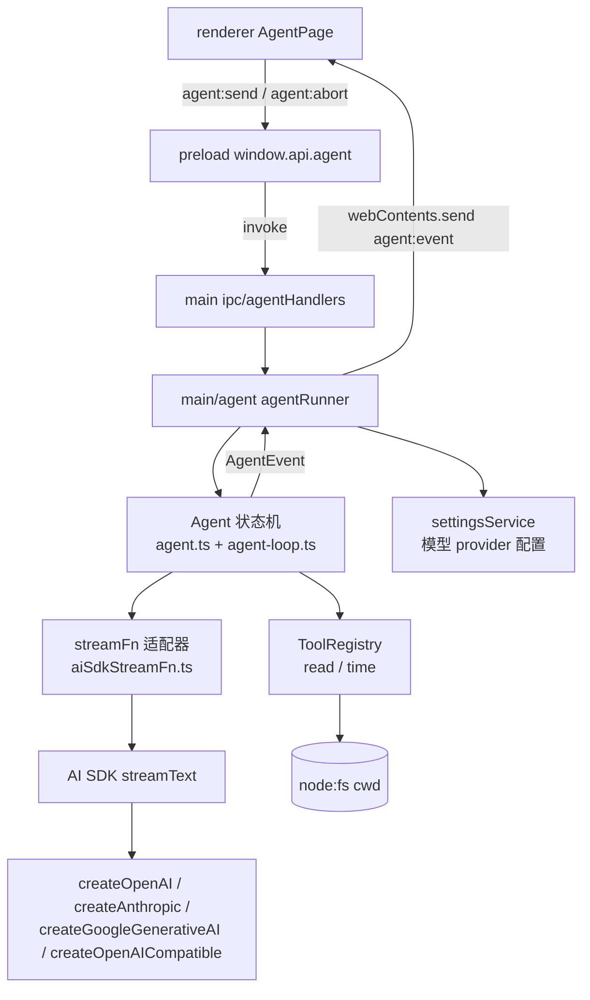

# Agent 能力设计

本文记录 LX Agent Agent 能力（对话 + 工具）的设计决策与架构约定。设计对齐参考项目 [pi-main](https://github.com/earendil-works/pi) 的 `packages/agent` 规范（Agent / AgentLoop / AgentTool / AgentEvent），底层接入 Vercel AI SDK（项目既有依赖）。

## 1. 对齐决策记录

| # | 决策 | 结论 |
|---|------|------|
| 1 | Agent 核心运行位置 | **main 进程**：LLM 调用、工具执行、会话状态全部在 main；renderer 纯 UI，经 IPC 订阅事件流 |
| 2 | 实现路径 | **移植 pi agent-core**（`types.ts` / `agent.ts` / `agent-loop.ts` / `stream-fn.ts`），schema 体系由 typebox 换为 **zod**；LLM 调用经 **AI SDK streamFn 适配器**注入；harness 不搬代码，仅留口（见 `harness.md`） |
| 3 | 工具权限 | 会话绑定**激活项目目录**为 cwd；`read` 工具只允许读取 cwd 内路径（越界拒绝）；首版纯只读（`read` + `time`），写工具留后续 |
| 4 | 会话历史 | 首版内存级 store，restore 会话后**全量上下文续接**（历史消息含 toolResult 进 LLM）；SQLite 落盘归 harness 阶段 |
| 5 | 模型装配 | main 内 `modelFactory` 按 settings 配置装配四种 provider；首版固定 `defaultModel`，预留 `setModel` 接口；apiKey 缺失返回明确 error 事件 |
| 6 | IPC 契约 | `invoke` 发起 + main 经 `webContents.send` 推送流式事件；事件负载直接复用 `AgentEvent`；`agent:abort` 单独 channel |
| 7 | UI 边界 | 数据层 + 渲染层同步升级：blocks 消息模型渲染（text 打字机 / toolCall 行 / 可折叠 toolResult）；`AgentPage.tsx` 组装逻辑不变 |
| 8 | 文档 | `design.md` + `harness.md` + `extensions.md` 三篇 |

## 2. 架构总览



数据流（一次对话）：

1. renderer `sendMessage(text)` → `window.api.agent.send(text)`（invoke）→ main 创建/复用 agent runner
2. runner 构造 `Agent`（systemPrompt + 激活工具 + 当前会话消息上下文）→ `agent.prompt()` 或 `agent.continue()`
3. `agent-loop` 驱动：LLM 生成（经 streamFn 适配器）→ 若有 toolCall 则校验参数、执行工具、把 toolResult 写回上下文 → 循环至模型停
4. 全程经 `agent.subscribe()` 订阅 `AgentEvent`，runner 转发为 IPC 事件推送到 renderer
5. renderer 按事件更新消息列表；`agent_end` 后恢复空闲

## 3. 模块结构

```text
src/main/agent/                  # 仅主进程可运行的 Agent 能力（standards 预留目录）
  core/                          # 移植自 pi packages/agent 的 agent-core
    types.ts                     # AgentMessage / AgentState / AgentTool / AgentEvent / hooks 类型（zod 版）
    agent.ts                     # Agent 状态机：prompt/continue/steer/followUp/abort/事件
    agent-loop.ts                # 低层循环：请求→工具→续轮，与 pi 语义一致
    stream-fn.ts                 # StreamFn 契约 + setDefaultStreamFn/getDefaultStreamFn
    event-stream.ts              # EventStream / AssistantMessageEventStream 基类（pi-ai 子集）
    messages.ts                  # Message 消息模型（pi-ai 子集：TextContent/ThinkingContent/ToolCall/...）
    validate.ts                  # validateToolArguments（typebox → zod）
  stream/
    aiSdkStreamFn.ts             # AI SDK → StreamFn 适配器（核心桥接）
    modelFactory.ts              # settings 配置 → AI SDK provider/model 装配
  tools/
    registry.ts                  # ToolRegistry：注册、激活、cwd 绑定、名字冲突检测
    read.ts                      # read 工具：cwd 内读取 + 截断
    time.ts                      # time 工具：当前时间
  agentRunner.ts                 # 会话级装配：Agent + 工具 + 事件转发 → IPC 事件的边界
src/shared/
  contracts/agent.ts             # 跨进程 DTO：AgentEvent 传输负载、send 请求类型
  ipc/agentChannels.ts           # agent:send / agent:abort / agent:event
src/main/ipc/agentHandlers.ts    # IPC 薄转发（standards：main IPC 不含业务规则）
src/preload/
  api/agent.ts                   # window.api.agent 白名单 API
src/renderer/src/features/agent/ # renderer 现状，仅升级数据层与渲染层
```

依赖方向遵循 `project-directory-structure.md`：`main/agent` 为独立能力层，可被 `main/ipc` 与未来 harness 复用；`shared/contracts` 只放无副作用类型。

## 4. 消息模型（pi-ai 子集，本地化）

移植 pi 的消息模型，去除对 `@earendil-works/pi-ai` 的依赖：

```ts
// Content blocks
type ContentBlock = TextContent | ThinkingContent | ToolCall | ImageContent
// TextContent: { type: "text"; text: string }
// ThinkingContent: { type: "thinking"; thinking: string }
// ToolCall: { type: "toolCall"; id: string; name: string; arguments: Record<string, unknown> }
// ImageContent: { type: "image"; data: string; mimeType: string }

// 三种 LLM 消息
type UserMessage       = { role: "user";       content: string | ContentBlock[]; timestamp: number }
type AssistantMessage  = { role: "assistant";  content: ContentBlock[]; stopReason: StopReason;
                           usage: Usage; errorMessage?: string; timestamp: number }
type ToolResultMessage = { role: "toolResult"; toolCallId: string; toolName: string;
                           content: (TextContent | ImageContent)[]; isError: boolean; timestamp: number }

type AgentMessage = UserMessage | AssistantMessage | ToolResultMessage
```

说明：

- `id` 字段为 renderer 渲染所需，由 IPC 事件侧补充（main 消息无 id，renderer 按事件序号/时间戳生成），不污染 LLM 消息模型。
- `Model` 类型本地化：`{ provider: string; id: string }`，不再承载 pi-ai 的 catalog 字段。
- `Usage` 保留（后续可展示 token 消耗）；首版可只填 totalTokens。

## 5. AgentEvent 事件流

移植 pi `AgentEvent`，作为 main → renderer 的唯一流式负载（经 IPC 序列化）：

```ts
type AgentEvent =
  | { type: "agent_start" }
  | { type: "agent_end"; messages: AgentMessage[] }
  | { type: "turn_start" }
  | { type: "turn_end"; message: AgentMessage; toolResults: ToolResultMessage[] }
  | { type: "message_start"; message: AgentMessage }
  | { type: "message_update"; message: AgentMessage; assistantMessageEvent: AssistantMessageEvent }
  | { type: "message_end"; message: AgentMessage }
  | { type: "tool_execution_start"; toolCallId: string; toolName: string; args: unknown }
  | { type: "tool_execution_update"; toolCallId: string; toolName: string; args: unknown; partialResult: unknown }
  | { type: "tool_execution_end"; toolCallId: string; toolName: string; result: unknown; isError: boolean }
```

`assistantMessageEvent`（流式增量，适配器产出）：`start` / `text_start` / `text_delta` / `text_end` / `thinking_*` / `toolcall_*` / `done` / `error`。

renderer 订阅规则：

- `message_update` 只更新"正在流式生成"的那条 assistant 消息（按 `turn` 内最后一条 assistant 定位）。
- `tool_execution_start/end` 驱动 toolCall 行的状态（运行中 / 完成）。
- `agent_end` 结束本次 run，清空 isStreaming。

## 6. StreamFn 契约与 AI SDK 适配器

### StreamFn（移植 pi）

```ts
type StreamFn = (
  model: Model,
  context: Context,                       // systemPrompt + messages(AgentMessage[]) + tools
  options?: SimpleStreamOptions,          // apiKey / signal / reasoning / sessionId
) => AssistantMessageEventStream | Promise<AssistantMessageEventStream>

// 契约：不得 throw；失败编码进事件流（error 事件 + stopReason: "error" | "aborted" 的最终消息）
```

### AI SDK 适配器（`stream/aiSdkStreamFn.ts`）

`agent-loop` 持有工具执行与 hooks，AI SDK 只负责**单步生成**（`stopWhen: stepCountIs(1)`），工具由 loop 执行后回灌——工具循环语义完全对齐 pi，AI SDK 仅作为 provider 桥接。

事件映射表：

| AI SDK fullStream part | pi AssistantMessageEvent |
|------------------------|--------------------------|
| `start` / `text-start` | `start` / `text_start`（合成 partial 消息） |
| `text-delta` (text) | `text_delta` |
| `reasoning-delta` (text) | `thinking_delta` |
| `tool-call` (toolCallId/toolName/input) | `toolcall_end`（合成完整 ToolCall block） |
| `finish` (finishReason) | `done`（合成 AssistantMessage，stopReason 映射） |
| `error` / 迭代抛错 | `error`（stopReason: "error"） |
| `abort` / AbortController | `error`（stopReason: "aborted"） |

stopReason 映射：`stop → stop`、`length → length`、`tool-calls → toolUse`、`error → error`、abort → `aborted`。

实现要点：

- tools 定义：`tool({ description, inputSchema: zodSchema })`，**不提供 execute**（执行权在 loop），v6 已验证合法。
- 消息转换：`convertToLlm`（AgentMessage → AI SDK ModelMessage）：user/assistant 内容块映射 text/thinking/tool-call；toolResult 映射 `{ role: "tool", content: [{ type: "tool-result", toolCallId, toolName, result }] }`（result 为 content 文本拼接后的字符串）。
- apiKey 缺失或 provider 构造失败：不在适配器抛错，产出 `error` 事件（文案含配置指引）。

### modelFactory

按 `settingsService.getModelProviderSettings()` 的 type 装配（`Model` 本地类型）：

| type | 构造 |
|------|------|
| openai | `createOpenAI({ apiKey, baseURL }).chat(modelId)` |
| anthropic | `createAnthropic({ apiKey }).chat(modelId)` |
| google | `createGoogleGenerativeAI({ apiKey }).chat(modelId)` |
| openai-compatible | `createOpenAICompatible({ name, baseURL, apiKey }).languageModel(modelId)` |

首版模型 = `defaultModel`（provider + model）。`Agent` 暴露 `setModel` 位点，UI 模型选择器后续接入。

## 7. IPC 契约

```ts
// shared/ipc/agentChannels.ts
AGENT_CHANNELS = {
  send: "agent:send",        // invoke: (text: string) => { ok: true } | { ok: false; error: string }
  abort: "agent:abort",      // invoke: () => void
  event: "agent:event",      // main → renderer: webContents.send(AGENT_CHANNELS.event, AgentEvent)
}
```

- main 持有会话级 agent runner 单例（当前激活会话），`agent:send` 时若上一 run 未结束返回 `{ ok: false, error: "busy" }`。
- 事件推送绑定到发起窗口的 `webContents`；renderer 侧 `ipcRenderer.on(AGENT_CHANNELS.event)` 订阅。
- `agent:abort` → `agent.abort()`（AbortController 传播至 streamText 与工具 signal）。

## 8. 工具模型

```ts
interface AgentTool<TParams extends z.ZodType> {
  name: string
  label: string                        // UI 展示名
  description: string
  inputSchema: TParams                 // zod v4
  execute(toolCallId: string, params: z.infer<TParams>,
          signal?: AbortSignal, onUpdate?: AgentToolUpdateCallback): Promise<AgentToolResult>
}
type AgentToolResult = { content: (TextContent | ImageContent)[]; details?: unknown }
```

- 参数校验在 loop 内 `validateToolArguments`（zod `safeParse`），校验失败产出 error toolResult（模型可自行纠错重发）。
- `execute` 抛错 → error toolResult，不中断 run。
- ToolRegistry：`register`（重名拒绝）+ 当前激活集。cwd 在创建工具时注入（read 工具闭包持有 root）。

内置工具：

| 工具 | 参数 | 说明 |
|------|------|------|
| `read` | `{ path: string }` | 读取 cwd 内文件内容，返回文本；越界（`..`/绝对路径逃逸）拒绝；超过 100KB 截断并注明 |
| `time` | `{}` | 返回当前 ISO 时间字符串，供模型感知时间上下文 |

## 9. UI 契约

- `AgentMessage`（renderer 侧）升级为 blocks 视图模型：`{ id, role, blocks: BlockView[], isStreaming? }`，`BlockView = text | thinking | toolCall(toolName, args, status) | toolResult(isError, 可折叠) | error`。
- `AgentMessageItem`：user 消息保持现有气泡；assistant 消息按 blocks 渲染——text 走 `LxMarkdownPreview`（现有打字机效果保留）、thinking 折叠展示、toolCall 单行（图标 + 工具名 + 参数摘要）、toolResult 可折叠、错误消息红色提示。
- `AgentPage.tsx` 组装不变（props 不变）；`useAgentChat` 重写为 IPC 订阅驱动。
- 空状态（无消息）仍展示 `DEFAULT_PROMPT_CARDS`；`MOCK_RESPONSES` / `MOCK_CHAT_SESSIONS` 移除（真实对话取代 mock）。

## 10. 错误处理

| 场景 | 行为 |
|------|------|
| 无 defaultModel 或 apiKey 缺失 | `agent:send` 返回 `{ ok: false, error }`，renderer toast 提示进入设置页配置 |
| provider 请求失败 / 网络错误 | streamFn 产出 `error` 事件 → 消息列表出现错误消息（`errorMessage` 展示） |
| 工具执行异常 | error toolResult 回灌模型，模型自行重试或解释 |
| 流式中切会话 / 新建 | 先 `agent:abort()`，再重置上下文 |
| busy（上一 run 未结束） | send 返回拒绝，UI 保持停止按钮可用 |

## 11. 验证要求

- 移植核心（agent-loop 工具循环）补单元测试（vitest，`test/main/agent/`）。
- 全量 `pnpm typecheck` + Biome format 受影响文件。
- IPC 三层契约（channel 常量 / preload / main handler）同步更新。
