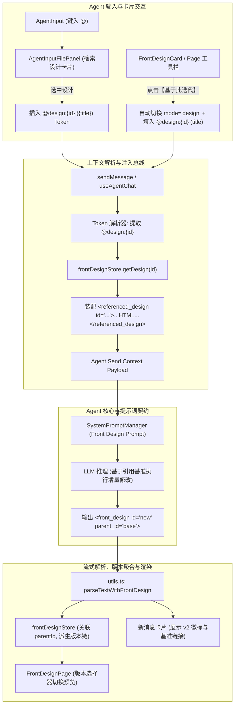

# Front Design Mode 二次修改与 @设计卡片提及方案

## 1. 架构目标与背景

在前期交付的 Front Design Mode 基础架构上（包括 `<front_design>` 标签流式捕获、沙箱 Iframe 热更新、三件套自动落盘与独立设计页面），为前端原型协同设计引入**增量迭代与跨轮次引用能力**。

核心目标包括：
1. **@ 提及设计卡片**：在 `AgentInput` 中输入 `@` 时，支持检索当前会话内历史生成的所有前端设计卡片，选中后以确定性 Token 格式（`@design:{id} ({title})`）插入文本。
2. **确定性上下文注入（Zero Tool-Call）**：消息发送时，前端自动解析被引用的 `designId`，从响应式存储提取完整 HTML 与模式，装配为结构化 `<referenced_design>` 注入 LLM 上下文，确保 Agent 在单轮交互中立即可见基准代码，杜绝多余的读盘 Tool Call。
3. **轻量版本派生链（Version Lineage）**：Agent 在二次修改时输出带有 `parent_id` 属性的 `<front_design>` 标签，前端存储将其组织为版本派生链（`v1 -> v2`），保障聊天流历史不可变，并在设计看板与卡片中提供直观的版本切换。
4. **一键快捷迭代闭环**：在 `FrontDesignCard` 与 `FrontDesignPage` 顶部工具栏提供快捷迭代入口，点击后自动切换协作模式至 `design`，填充 `@` 引用并聚焦输入框。



---

## 2. 核心数据结构与契约定义

### 2.1 引用 Token 语法与解析规则
输入框中的设计引用 Token 遵循如下确定性格式：
```text
@design:{id} ({title})
```
- 正则匹配：`/@design:([a-zA-Z0-9_-]+)(?:\s*\((.*?)\))?/g`
- 示例：`@design:design-17257123 (登录页原型) 请将主按钮改成渐变紫`

### 2.2 输入框 Mention 项扩展 (`src/renderer/src/features/agent/components/AgentInput/AgentInputCommandPanels.tsx`)
```typescript
export type AgentMentionItem =
  | { kind: "skill"; skill: SkillItem }
  | { kind: "file"; file: ProjectFileEntry }
  | { kind: "design"; design: FrontDesignItem }
```

### 2.3 设计存储项扩展 (`src/renderer/src/features/agent/hooks/frontDesignStore.ts`)
```typescript
export interface FrontDesignItem {
  id: string
  parentId?: string | null    // 指向被修改的基准设计 ID
  version?: number            // 派生版本号（根节点为 1，子节点为 2, 3...）
  title: string
  html: string
  updatedAt: number
  isStreaming?: boolean
  sessionId?: string | null
  mode?: "tailwindcss" | "css"
  designDir?: string
}

export interface FrontDesignTreeGroup {
  rootId: string
  rootTitle: string
  latestId: string
  versions: FrontDesignItem[]
}
```

### 2.4 上下文注入协议 (`<referenced_design>`)
在发送给 Agent 的上下文包装中，自动附带引用的基准设计完整信息：
```xml
<referenced_design id="design-17257123" title="登录页原型" mode="tailwindcss">
<!DOCTYPE html>
<html>
...
</html>
</referenced_design>
```

### 2.5 二次修改输出协议扩展 (`<front_design>`)
Agent 二次修改后，必须输出带有 `parent_id` 的标签：
```xml
<front_design id="design-17257124" parent_id="design-17257123" title="登录页原型 (渐变紫按钮)" mode="tailwindcss">
<!DOCTYPE html>
<html>
...
</html>
</front_design>
```

---

## 3. 核心机制与实现方案

### 3.1 输入框 `@` 提及与面板渲染
1. **数据源检索**：
   - 在 `useAgentInputPanels.ts` 中，当输入 `@` 触发 `activeMode === "file"` 时，从 `frontDesignStore` 获取属于当前会话的 `designs`。
   - 过滤与模糊匹配：按 `title` 与 `id` 进行关键词匹配，最新生成的排在前面。
2. **面板展示**：
   - 在 `AgentInputCommandPanels.tsx` 的 `AgentInputFilePanel` 中，设计项使用统一的粉色 Palette 图标高亮。
   - 展示标题、代码行数与模式标签（`Tailwind` / `CSS`），右侧标记 `Design` Tag。
3. **选中动作**：
   - 选中后插入 `@design:${item.design.id} (${item.design.title}) `，光标自动移至 Token 末尾。

### 3.2 发送端 Token 解析与上下文注入
1. **解析提取**：
   - 在 `useAgentChat.ts` 的 `sendMessage` 中，匹配输入文本中的 `@design:{id}`。
   - 若存在，从 `frontDesignStore` 获取对应的 `FrontDesignItem`。
2. **装配上下文**：
   - 将基准代码封装为 `<referenced_design>` 块并入发送载荷，或通过 `sendContext.referencedDesigns` 传递。
   - 保证 LLM 第一轮就拿到基准代码，实现零工具调用的单轮直接修改。

### 3.3 系统提示词强化 (`systemPromptManager.ts`)
在 `collaborationMode === "design"` 时，向系统提示词中追加关于二次修改的说明：
- 说明可能接收到 `<referenced_design id="..." title="...">` 标签，表示用户期望基于该原型修改；
- 严正约束：在输出 `<front_design>` 时，必须携带 `parent_id="{referenced_design.id}"`；
- 保留原有未修改的设计精华，仅针对用户需求实施外科手术式改动。

### 3.4 聊天卡片与设计看板 UI 联动
1. **FrontDesignCard (聊天卡片)**：
   - 保持对话历史不可变，每一轮均作为独立卡片留存。
   - 若存在 `parent_id`，卡片标题旁打上 `v{version}` 徽标，并展示可点击链接 `基于 {parentTitle} 迭代`。
   - 底部操作栏新增【基于此迭代】（`Iterate`）按钮，点击后自动设置协作模式为 `design`，填入 `@design:{id}` 并聚焦输入框。
2. **FrontDesignPage (设计看板)**：
   - 顶部工具栏增加版本切换下拉菜单（`[v2 (最新) ▾]`），支持用户切换同组不同版本原型并即时渲染对比。
   - 增加【在对话中迭代】按钮，直通当前激活原型的对话修改流。
3. **FrontDesignLeftSideBar (左侧栏)**：
   - 按照根节点聚合版本，直观展现原型的演进历史。

---

## 4. 国际化与设计规范
- 严格接入 `useTranslation` / `t`，更新 `zh.ts` 与 `en.ts`：
  - `frontDesign.mentionTag`: "原型设计" / "Design Prototype"
  - `frontDesign.iterateAction`: "基于此迭代" / "Iterate"
  - `frontDesign.iterateInChat`: "在对话中迭代修改" / "Iterate in Chat"
  - `frontDesign.versionBadge`: "v{version}"
  - `frontDesign.basedOn`: "基于 {parentTitle} 迭代" / "Based on {parentTitle}"
  - `frontDesign.versionSelector`: "选择版本" / "Select Version"
  - `frontDesign.modeSwitchedNotice`: "已自动切换为设计模式" / "Switched to Design Mode"
- 样式全面适配 CSS Token（`var(--color-theme-*)`），禁止硬编码颜色；
- 提示均使用 `LxTooltip`，禁止使用原生 `title`。
