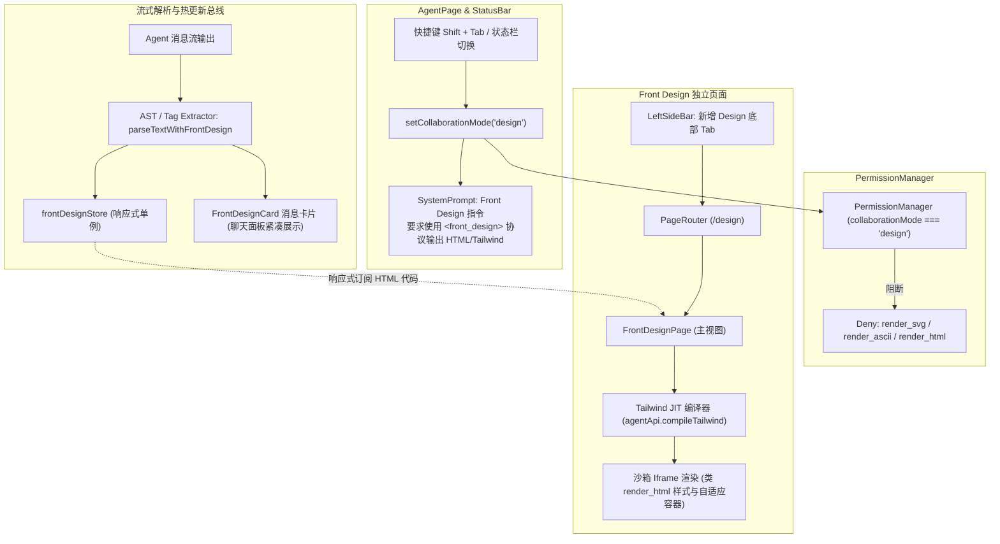

# Front Design Mode (<front_design>) 协议、热更新与协同设计方案

## 1. 架构目标与背景

为了在 LX Agent 中为前端工程师提供专门的前端原型设计与实时调优能力，建立 **Front Design Mode**。
在此模式下：
1. **模式流转**：通过 `Shift + Tab` 在 `build -> plan -> review -> design -> build` 之间循环切换，并与 `AgentStatusBar` 深度联动。
2. **工具降噪与安全**：严禁调用 3 个内联 render 工具（`render_svg`, `render_ascii`, `render_html`），避免在聊天流中堆叠割裂的内联 DOM 预览。
3. **确定性协议与热更新**：规范 Agent 输出 `<front_design>` 标签，前端流式解析器实时捕获代码并同步至全局响应式存储 `frontDesignStore`，无缝热更新驱动主工作区的 **Front Design 页面**（基于 Tailwind JIT 编译与沙箱 Iframe）。
4. **架构解耦**：保持 `PageContent` 作为纯净布局容器，由 `PageRouter`、`PAGE_ROUTES` 与 `PRIMARY_NAVIGATION_ITEMS` 负责页面导航与渲染。



---

## 2. 核心数据结构与契约定义

### 2.1 协作模式扩展 (`src/shared/contracts/agent.ts`)
```typescript
// 扩展协作模式为四态
export type CollaborationMode = "build" | "plan" | "review" | "design"

export const normalizeCollaborationMode = (mode?: string | null): CollaborationMode => {
  if (mode === "plan" || mode === "review" || mode === "build" || mode === "design") {
    return mode
  }
  return "build"
}
```

### 2.2 前端设计协议块结构 (`src/renderer/src/features/agent/types.ts`)
```typescript
export interface FrontDesignData {
  title?: string
  html: string
  raw: string
  isStreaming?: boolean
}

export type ChatBlock =
  | { kind: "text"; text: string; durationMs?: number }
  | { kind: "thinking"; text: string; durationMs?: number }
  | { kind: "proposedPlan"; plan: ProposedPlanData; durationMs?: number }
  | { kind: "reviewFindings"; findings: ReviewFindingsData; durationMs?: number }
  | { kind: "frontDesign"; design: FrontDesignData; durationMs?: number }
  | { kind: "toolCall"; ... }
  | { kind: "toolResult"; ... }
```

### 2.3 全局前端设计热更新存储 (`frontDesignStore.ts`)
```typescript
export interface FrontDesignState {
  title: string
  html: string
  updatedAt: number
  sessionId?: string | null
  isStreaming: boolean
}

// 提供响应式订阅 getDesignState(), setDesignCode(), subscribe()
```

---

## 3. 核心机制设计

### 3.1 权限拦截硬门禁 (`src/main/agent/permissions/permissionManager.ts`)
在 `collaborationMode === "design"` 时：
- `render_svg`, `render_ascii`, `render_html` 强制返回 `deny`。
- 其他读取与分析工具保持可用，支持读项目样式与代码上下文。

### 3.2 提示词装配 (`src/main/agent/prompts/systemPromptManager.ts`)
注入专门的 `Front Design Mode` 英文系统提示：
- 声明当前处于 Front Design 模式。
- 告知 3 个 render 工具已禁用。
- 约束必须使用 `<front_design title="...">...完整 HTML (含 Tailwind CSS class)...</front_design>` 输出。

### 3.3 路由与左侧栏导航
1. `src/renderer/src/lib/pageRoutes.ts`：新增 `design: "/design"`。
2. `src/renderer/src/lib/navigationItems.ts`：在底部导航添加 Front Design 项（图标为 `Palette`，路由 `/design`）。
3. `src/renderer/src/routes/PageRouter.tsx`：挂载 `<Route path={PAGE_ROUTES.design} element={<FrontDesignPage />} />`。
4. `src/renderer/src/App.tsx`：`renderLeftSideBarContent()` 新增对 `PAGE_ROUTES.design` 的匹配，渲染专用的 `FrontDesignLeftSideBar`（初期为空占位）。

### 3.4 FrontDesignPage 设计页面容器与热更新逻辑
- 参考 `HtmlVisualContent.tsx` 的容器逻辑：
  - 调用 `agentApi.compileTailwind(html)` 实时编译 CSS。
  - 注入沙箱 Iframe（`sandbox="allow-scripts allow-same-origin"`）。
  - 支持多设备视口尺寸切换（Desktop / Tablet / Mobile）、刷新与复制代码。
  - 监听 `frontDesignStore` 的实时变更，实现 Agent 输出即热更新。

---

## 4. 国际化规范
- `zh.ts` / `en.ts` 全量接入：
  - `agent.collaborationModeDesign`: "设计模式" / "Design Mode"
  - `agent.collaborationModeDesignDesc`: "专为前端原型与界面设计优化，禁用内嵌 render 工具并直通设计看板热更新"
  - `agent.collaborationModeSwitchedToDesign`: "已切换至设计模式"
  - `nav.design`: "前端设计" / "Front Design"
