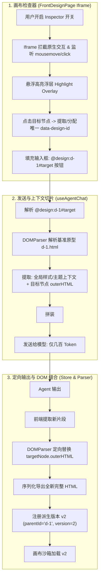

# 前端设计画布检查器与 DOM 节点定向子树替换方案设计

## 1. 背景与目标

在原有 `@design:{id}` 设计迭代功能中，Agent 每次修改都需要从头重新输出完整的 HTML 页面代码。对于包含数百甚至上千行的大型复杂原型，全量重写存在显著缺陷：
1. **生成延迟高**：微调一个按钮颜色或修改一段文案需耗时数十秒等待全文流式结束；
2. **Token 开销巨大**：输入与输出均全量重复携带无关节点，严重浪费模型配额；
3. **文本 Diff 脆弱**：在 HTML 树形结构上做正则或行级搜索替换（Search/Replace）极易因缩进和属性排序差异导致 patch 破损。

### 核心目标
1. **画布可视化点选（Visual Click-to-Inspect）**：
   在 `FrontDesignPage` 顶部工具栏提供【点选微调】开关（Inspect 模式）。激活后鼠标悬浮高亮 DOM 节点并浮动显示标签与尺寸；点击后自动生成唯一确定性锚点，并在输入框注入 `@design:{id}#{target} ({elementName}) `。
2. **分层切片上下文注入（Hierarchical Slicing）**：
   发送端解析到携带 `#{target}` 的引用时，提取全局设计规范（主题、body 样式类）与目标节点的 `outerHTML`，拒绝发送无关的数百行结构。
3. **DOM 节点级定向更新协议（`<front_design_update>`）**：
   Agent 仅需外科手术式输出目标节点的新 HTML 片段；客户端 DOM Parser 克隆基准原型并在内存树中定向替换 `outerHTML`，自动缝合生成完整且合法的 `v2` 快照。
4. **防御性容灾机制**：
   选择器未命中或 DOM 解析异常时严格阻断，弹出 Toast 告警并不污染设计库；向下无缝兼容全量 `<front_design parent_id="...">`。

---

## 2. 核心架构与数据结构



---

## 3. 协议契约定义

### 3.1 扩展引用语法
```text
@design:{id}#{selector} ({element_name})
```
* **全量原型引用**：`@design:design-1001 (登录页原型)`
* **局部节点引用**：`@design:design-1001#hero-cta (立即体验按钮)` 或 `@design:design-1001#[data-design-id='el-12'] (定价卡片)`
* **匹配正则**：
  ```typescript
  /@design:([a-zA-Z0-9_-]+)(?:#([^\s()]+))?(?:\s*\((.*?)\))?/g
  ```

### 3.2 局部上下文切片协议 (`<referenced_design>`)
当包含 target 时，前端向模型注入带有分层信息的引用块：
```xml
<referenced_design id="design-1001" target="#hero-cta" title="登录页原型" mode="tailwindcss">
<global_styling_context>
  <!-- 主题环境与基础样式，供模型保持配色体系一致 -->
  theme: dark; body_classes: "bg-slate-950 text-slate-100 font-sans min-h-screen";
</global_styling_context>
<target_element selector="#hero-cta">
  <button id="hero-cta" class="px-6 py-2.5 rounded-lg bg-blue-600 hover:bg-blue-500 text-white font-medium shadow-md">
    立即登录
  </button>
</target_element>
</referenced_design>
```

### 3.3 局部更新输出协议 (`<front_design_update>`)
Agent 针对定向节点的输出协议（严禁重写全量，仅输出该节点的替换代码）：
```xml
<front_design_update parent_id="design-1001" target="#hero-cta" title="更新行动按钮 (渐变紫)">
  <button id="hero-cta" class="px-6 py-2.5 rounded-lg bg-gradient-to-r from-purple-600 to-pink-600 hover:opacity-95 text-white font-semibold shadow-lg shadow-purple-500/25 transition-all">
    立即开始体验
  </button>
</front_design_update>
```

---

## 4. 核心模块实现细节

### 4.1 画布检查器 (Inspector Mode)
* **开关状态**：`FrontDesignPage` 内部维护 `isInspectorActive: boolean`，顶部工具栏放置 `MousePointerClick` 图标按钮。
* **DOM 拦截与高亮**：
  * 在 iframe 的 `contentDocument` 上挂载捕获阶段监听器：`mousemove`, `click`, `mouseout`。
  * `e.stopPropagation()`, `e.preventDefault()` 阻止原型自身的所有链接跳转或点击副作用。
  * 动态在 iframe 内（或外部画布覆盖层）绘制高亮框（`border-2 border-pink-500 bg-pink-500/10`）与信息标签（如 `button#hero-cta | 120×40`）。
* **锚点唯一性生成策略**：
  1. 若节点已有有效 `id`（且在当前 DOM 中唯一），直接选用 `#id`；
  2. 若已有语义 `data-section` 或 `data-slot`，选用 `[data-section="..."]`；
  3. 若无唯一标识，则自动为该元素追加 `data-design-id="el-${Math.random().toString(36).slice(2, 8)}"`, 确保后续 `querySelector` 100% 命中；同步将带有该属性的 HTML 刷回当前设计项以保持引用一致。
* **回填与跳转**：
  生成 Token 自动调用 `agentTabStore.insertPromptToActiveTab(mentionToken)` 并切换回聊天页。

### 4.2 发送端切片注入 (`useAgentChat.ts`)
* 识别 `@design:{id}#{target}`。
* 读取 `v1.html`，通过 `DOMParser` 查询目标节点。
* 若节点存在，组装 `<global_styling_context>` 与 `<target_element>` 发送；
* 若节点不存在，降级为全量代码注入。
* `cleanUserPrompt` 扩展：纯净剥离 `<referenced_design>`，用户气泡只显示纯文本。

### 4.3 客户端 DOM 树定向缝合器 (`synthesizeDesignUpdate`)
* 模块定位：`src/renderer/src/features/agent/utils/designSynthesizer.ts`。
* 纯函数：
  ```typescript
  export interface SynthesizeUpdateOptions {
    baseHtml: string
    targetSelector: string
    newFragmentHtml: string
  }

  export interface SynthesizeUpdateResult {
    ok: boolean
    synthesizedHtml?: string
    error?: string
  }
  ```
* 逻辑：
  1. `DOMParser` 解析 `baseHtml`；
  2. `doc.querySelector(targetSelector)` 查找目标；
  3. 若未找到，返回 `{ ok: false, error: "Target node not found" }`；
  4. 解析 `newFragmentHtml`，替换 `target.replaceWith(newNode)` 或 `target.outerHTML = newFragmentHtml`；
  5. 序列化 `doc.documentElement.outerHTML`，补齐 `<!DOCTYPE html>`；
  6. 返回 `{ ok: true, synthesizedHtml }`。

### 4.4 容灾与降级
1. 合成失败时：`useAgentChat` 弹出 `useLxAgentToast().warning(t("frontDesign.updateTargetNotFound"))`，放弃生成，不落库损坏版本；
2. 兼容性：若模型输出标准 `<front_design parent_id="...">`，保持既有全量派生链路畅通。
