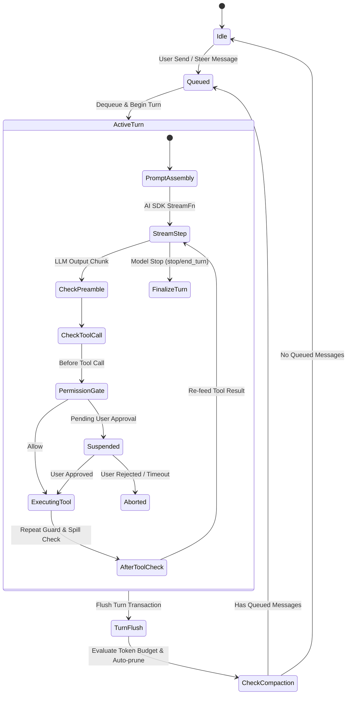

# Harness 架构设计规范

本文档定义 LX Agent 中对齐 OpenAI Codex 规范的完整 Harness 设计，涵盖系统提示词 Harness 引导层、Session/Turn 状态机架构、安全约束与执行环境切片。

---

## 1. 架构目标与设计原则

1. **结构化 Harness 引导**：将 Codex 的 Preamble、Planning、Ambition vs Precision、Git Worktree 约束、Review 规范及 Anti-AI-Slop 前端规范全量沉淀为模块化 System Prompt Sections。
2. **严密的 Session / Turn 状态机**：明确区分会话级生命周期（Session）与单次模型交互执行切片（TurnContext / ActiveTurn），确保输入队列排队（InputQueue）、中断（Abort）、恢复（Rollout Reconstruction）、权限门控（Permissions）在事务级闭环。
3. **数据结构优先与最小修改**：保持数据流清晰，杜绝多层冗余封装与空抽象；所有核心类型与契约保持单向流转。

---

## 2. 系统提示词 Harness 分层架构

基于 `SystemPromptManager` 的有序分层机制，标准 Harness 包含以下有序 Section：

```text
[-100] PROMPT_ORDERS.IDENTITY      : 基础身份（You are LX Agent...）
[-50]  PROMPT_ORDERS.BEHAVIOR      : 核心行为准则（对齐 Codex Harness）
       ├─ Preamble 规范            : 调用有副作用工具前必须输出 1-2 句意图说明
       ├─ Planning 规范            : >=2 步或复杂任务必须通过 todowrite 跟踪状态并实时更新
       ├─ Ambition vs Precision    : 新任务敢于构想，现有代码库手术刀般精准；禁止无端修改风格
       ├─ Task Execution & Editing : Root-cause 修复、默认 ASCII、禁止在未要求时添加无意义注释
       ├─ Verification Philosophy  : 改后精准验证（针对受影响文件），最多迭代 3 次格式化，不顺手修无关测试
       ├─ Safety & Dirty Worktrees : 禁止擅自撤销非本次变更、严禁破坏性 git 命令（git reset --hard 等）
       ├─ Response Guidelines      : 极简输出、禁止嵌套列表、使用 file_path:line 引用
       ├─ Code Review Mindset      : 优先枚举 Bug、风险与行为回归，明确指出残留风险
       └─ Frontend Anti-AI-Slop    : 拒绝模板化平庸 UI，注重字体、色彩与意图动效
[0]    PROMPT_ORDERS.PERSONA       : 动态人格指导与基础操作环境规则
[100]  PROMPT_ORDERS.SKILLS        : 激活的 Skills 描述注入（动态根据 activeSkills）
[200]  PROMPT_ORDERS.INSTRUCTIONS  : 项目与用户指令文件（AGENTS.md / CLAUDE.md 注入）
[350]  PROMPT_ORDERS.ENVIRONMENT   : 运行时环境块（<env> 标签，注入 cwd、repo_root、branch、date 等）
```

---

## 3. Session & Turn 状态机模型



### 3.1 核心数据结构

- **`SessionState`**：
  - `sessionId`: string (UUID)
  - `binding`: `{ projectId?: string, cwd: string, branch?: string }`
  - `status`: `'idle' | 'running' | 'paused' | 'aborted'`
  - `inputQueue`: 消息排队缓冲区（支持 steer 与 followUp 模式）
  - `activeTurn`: 当前正在执行的 `TurnContext` 句柄
- **`TurnContext`**：
  - `turnId`: string
  - `abortController`: 单 Turn 的中止控制器
  - `pendingToolCalls`: 正在执行中的工具集合
  - `permissionApprovals`: 本 Turn 产生的会话级或临时授权缓存
  - `accumulatedUsage`: Token 使用量统计
  - `messages`: 本 Turn 生成的消息切片（UserMessage、AssistantMessage、ToolResult）

---

## 4. 边界与安全约束

1. **Git & Worktree 安全边界**：
   - 任务默认在 `.worktrees/` 独立目录中创建 Git 工作区进行开发；
   - 严禁在主工作区未经用户许可执行破坏性重置操作；
   - 任务完成后必须通过用户确认后才执行 Merge / Squash 操作。
2. **工具权限分级与拦截**：
   - 只读工具（`read`, `grep`, `find`, `ls` 等）：默认放行；
   - 副作用工具（`write`, `edit`, `apply_patch`, `bash` 等）：受 `permissionManager` 与 `repeatToolGuard` 监管。
