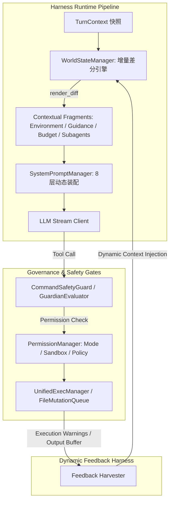

# LX Agent Harness 与提示词增强设计方案 (对齐 Codex 架构)

本文档基于对 `codex-main`（Codex CLI / Harness Rust 核心）与当前 `lx-agent`（Electron Main 架构）的系统性差异分析，提出一套完整对齐 Codex 工业级标准的 Harness 运行时、动态上下文流与提示词治理增强设计方案。

---

## 1. 现状与差距分析 (Codex vs LX Agent)

| 核心领域 | Codex Harness (codex-rs) | 当前 LX Agent | 差距与对齐目标 |
| :--- | :--- | :--- | :--- |
| **Harness 上下文注入** | `WorldState` 细粒度增量差分机制（`render_diff` 只在状态变化时注入），覆盖 Environment, Guidance, Token Budget, Subagents | 静态/单次全量组装，缺乏 Turn 间的增量感知和精细化差异追踪 | 引入 `WorldStateSnapshot` 差分渲染，只重发变动块，节省上下文预算 |
| **上下文窗口动态引导** | `ContextWindowGuidance`：根据当前剩余 Token 动态注入警告与压缩/截断指引 | 仅在触发硬阈值时被动调用 `ContextCompactor` | 引入主动式 `ContextWindowGuidance` 动态提示词与自适应压缩 |
| **提示词分层与结构** | 严格区隔 Developer (System) / WorldState / User Context / Instructions，内建 Preamble 意图广播与 Plan 模版规范 | 具备 8 层 `SystemPromptManager`，但缺少交互前置 Preamble 状态联动与严格的 Plan 模版约定 | 对齐 Codex 的 3 阶段 Plan 规范与 Preamble 声明机制 |
| **多 Agent 状态与通信** | `inter_agent_message` / `subagent_notification` / `multi_agent_usage_hint` 结构化通信注入 | `SubagentPool` + `ReviewAgent` 已有雏形，但上下文回灌与进度通知较松散 | 规范化 Subagent 通信协议与父子上下文感知通道 |
| **运行时守卫与执行反馈** | `LegacyApplyPatchWarning`, `UnifiedExecProcessLimitWarning`, `NodeReplPolicy` 等精准执行纠偏反馈 | 已有 `RepeatToolGuard` 与 `CommandSafetyGuard`，缺少执行后异常模式的动态 Prompt 纠偏 | 增加执行器状态反馈通道（如长输出、进程上限、命令格式告警） |

---

## 2. 核心系统架构设计

### 2.1 运行时 WorldState 增量差分系统 (`WorldStateManager`)
在每次进入 LLM Turn 时，计算当前环境和会话状态与上一 Turn 的快照差异：
1. **Environment State**：CWD、Git 分支、Worktree 状态、系统平台与日期。
2. **Context Window Guidance**：当前会话 Token 消耗比例（< 50% 正常；50%~80% 提醒精简；> 80% 强制启动压缩建议）。
3. **Subagent Active Status**：活跃子代理任务列表与执行心跳。
4. **Approval & Policy Changes**：用户临时授权/降级沙箱策略变更。

### 2.2 提示词治理与规范增强 (`SystemPromptManager`)
1. **三阶段 Plan 协作模式 (Plan Mode 3.0)**：
   - 阶段 1：**Exploration & Grounding**（只读探测、代码关系梳理）。
   - 阶段 2：**Clarify & Refine**（使用 `question` 质问/确认隐含需求）。
   - 阶段 3：**Specification & Exit**（输出 `<proposed_plan>` 并自动调用 `switch_mode` 切回 `default`）。
2. **Preamble 意图机制**：
   - 强调在多步操作前发出 1-2 句高信息量意图声明（“已探索路由，下一步创建控制器并编写单测”）。
3. **精准 Reviewer 规范**：
   - 规范化 `ReviewAgent` 的 4 维评估（功能缺陷、安全风险、回归隐患、单测缺失）。

### 2.3 动态执行反馈与自愈 Harness
1. **Process Limit & Long Running Warning**：当并发后台作业过多或耗时过长时，在 Next Turn Context 注入进程治理指引。
2. **Patch Validation Self-Correction**：当 `apply_patch` 或 `edit` 失败时，格式化返回标准 AST 差异上下文与错误定位，阻断死循环。

---

## 4. 进阶 Harness 与新能力扩展 (基于 Codex 深度挖掘)

基于对 `codex-main` 源码库的进一步深度分析，以下功能和 Harness 机制可作为后续迭代的扩展设计：

### 4.1 内存级单轮 Diff 追踪引擎 (`TurnDiffTracker`)
* **参考实现**: `codex-rs/core/src/turn_diff_tracker.rs`
* **设计目标**: 
  - 维护当前 Turn 内通过 `apply_patch` / `edit` / `write` 修改的所有文件版本历史。
  - 在无需重复扫描磁盘的前提下，实时生成 Turn 内的聚合 Unified Diff。
  - 支持向用户端（Renderer）或 ReviewAgent 极速推送本次 Turn 产生的确切改动范围，规避大文件 Git Diff 开销。

### 4.2 AGENTS.md 层次化发现与动态失效缓存 (`AgentsMdManager`)
* **参考实现**: `codex-rs/core/src/agents_md_manager.rs`
* **设计目标**:
  - 当前 `lx-agent` 在每个目录单次读取 `AGENTS.md`。
  - 引入树状继承解析与缓存层（根据工作区选择、项目信任级别和子目录路径哈希建立快照）。
  - 支持跨层级 `AGENTS.md` 的增量级联叠加，当子目录切换或环境变更时自动触发局部失效与刷新。

### 4.3 优雅会话挂起与恢复机制 (`TurnSuspension`)
* **参考实现**: `codex-rs/core/src/session/turn_suspension.rs`
* **设计目标**:
  - 当用户在 Agent 执行复杂多步任务（或子代理树并行）中途切换窗口、暂停或退出时，执行安全的中断协议。
  - 持久化当前 Turn 的断点快照（包括已消费的工具输出、待处理的任务栈与未提交的文件 Patch）。
  - 下次唤醒或恢复时，自动重建上下文并以非破坏性方式继续运行。

### 4.4 结构化跨 Agent 通信与遥测总线 (`AgentCommunicationBus`)
* **参考实现**: `codex-rs/core/src/agent_communication.rs`
* **设计目标**:
  - 建立统一的跨 Agent 事件总线，涵盖 `spawn`（派生）、`message`（双向通信）、`followup`（追问）与 `result`（成果交付）。
  - 每一条通信消息均携带 `communication_id`、`sender_thread_id` 与 `receiver_thread_id`，并与系统级的 OpenTelemetry/日志系统联动，实现多 Agent 调度的全局可视化。
