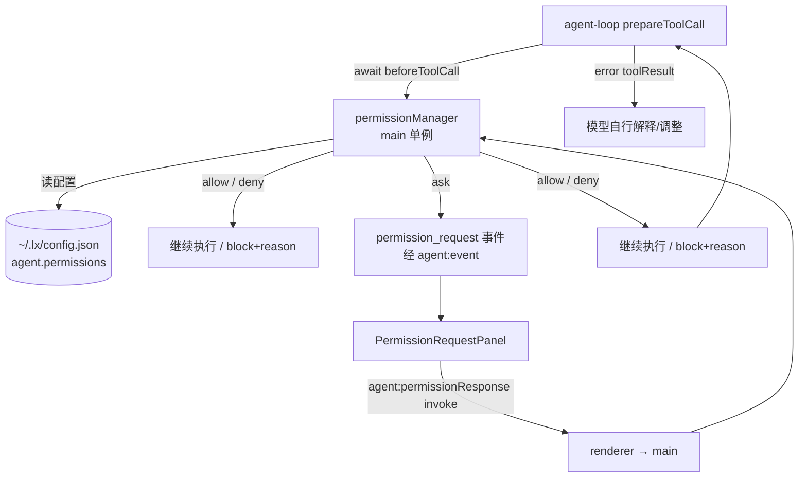

# Harness 演进路线与信任模型

本文说明 LX Agent Agent 能力相对 pi durable harness 的取舍、已落地能力、留口位点与演进路线，并定义**工具执行权限体系（信任模型）**。pi 的 harness（`packages/agent/src/harness/`）是万行级 durable 系统，与"简单实现"矛盾；本项目只移植 agent-core，harness 以概念映射 + 代码位点预留方式演进。

会话持久化的落地详细设计见 [database.md](./database.md)；Agent 核心架构见 [design.md](./design.md)；工具/MCP/Skill 扩展见 [extensions.md](./extensions.md)。

## 1. 概念映射（pi harness → 本项目现状）

| pi 概念 | 含义 | 本项目对应 | 状态 |
|---------|------|------------|------|
| Session | 持久化对话日志（树 + 编排历史） | `agent_session` + `agent_session_entry`（SQLite）+ main runner 会话上下文 | **已实现** |
| Harness | 驱动 run、队列、恢复的唯一写入者 | `agentRunner.ts`（会话级单例）+ `Agent` 状态机 | 已实现 |
| Ref | 分支指针 + 串行化工作 | 无（单会话模型） | 不做 |
| Operation / Step | 一次接受 → 自动连续 | `agent.prompt()` / `continue()` | 已具备 |
| Checkpoint | 步骤间安全点（队列消费、延迟写） | 无（单写者事务落盘） | 不做 |
| 事件 / Hook | 被动观察 / 主动拦截 | `AgentEvent` + `AgentLoopConfig` hooks（见 §5） | 已具备 |
| Snapshot | 原子状态捕获 | IPC 事件驱动 + `active_capabilities` entry 快照 | 已具备（能力快照） |
| 持久化后端 | SQLite / JSONL | SQLite（`agentSessionService`） | **已实现** |
| 恢复 / 崩溃续跑 | 从日志恢复挂起的 run | 无 | 不做 |

## 2. 已落地能力（相对早期路线图的推进）

- **Session 持久化（原 v2）**：SQLite 三表 + `agentRunner.flushTurn()` 事务落盘已实现，会话恢复（`restoreSession`）按当前配置重载 MCP/skill，快照仅展示/校验。详见 [database.md](./database.md)。
- **权限信任模型**：`permissionManager.gate` 挂 `beforeToolCall`，模式 + 规则 + 逐次确认已落地（见 §3）。
- **权限收尾（G5/G6）**：面板新增"永久允许 / 永久拒绝"，精确参数写回 `allow[]`/`deny[]`；`bypassPermissions` 与会话级 `allowAll` 下 deny 规则仍生效（保护敏感路径）。
- **会话分支（fork）**：从任意用户轮切割复制历史到新会话，自动切换，共享 cwd / 文件状态（快照可回滚）；详见 [TASKS-v3.md](./TASKS-v3.md) §2。
- **MCP 状态推送**：`mcp_status_changed` 事件 + `agent:getMcpStatus` 已实现。
- **任务清单（todo）**：`todowrite` 工具（整表替换）+ `todo` entry 落库 + `todo_updated` 事件 + 恢复携带 `todos` + transformContext 注入 `[任务清单]` + 输入框上方 TodoDock（折叠一行当前项/点击展开）已实现；详见 [TASKS-v4.md](./TASKS-v4.md) §2。
- **调用记录收尾（kind/provenance）**：`agent_call.kind` 四分类（mcp/subagent/skill/builtin）+ `mcp_server` 反查 + 子代理内部调用以 `parent_call_id` 指向父 task 调用行落库已实现；详见 [TASKS-v4.md](./TASKS-v4.md) §3/§4。
- **steer / followUp 队列**：`Agent` 已具备（`PendingMessageQueue`），但 IPC/UI 未暴露——后续按需接线。

## 3. 信任模型（权限确认）

工具执行权限体系：**模式（mode）+ 规则（rule）+ 逐次确认（prompt）**，对齐 Claude Code 的 `permissions` 体系与 pi coding-agent 的 `beforeToolCall` 门控，落地于 `src/main/agent/permissions/`。

### 3.1 决策记录

| # | 决策 | 结论 |
|---|------|------|
| 1 | 模式集 | **三态**：`default`（按规则逐次询问）/ `acceptEdits`（write/edit 自动允许）/ `bypassPermissions`（全部放行）。不做 `plan` |
| 2 | 门控工具 | **`bash` / `write` / `edit` / `task` / `webfetch` + 全部 MCP 工具**（有副作用或可外发数据）；豁免集 `read` / `ls` / `grep` / `find` / `time` / `read_skill` / `web_search` / `question` / `lsp` 永不询问 |
| 3 | 配置位置 | `~/.lx/config.json` 的 **`agent.permissions`** 节点；设置页"权限"分区读写 |
| 4 | 规则语法 | 对齐 CC：`ToolName(arg)`，参数支持 glob；优先级 **deny > ask > allow > 模式默认值** |
| 5 | 评估执行位置 | main 进程 `permissionManager` 单例，挂 **`beforeToolCall` 钩子**（agent-loop 已 `await`，返回 `{ block, reason }` 即阻止） |
| 6 | 会话内记忆 | 面板"允许本次会话 / 允许全部"仅为**内存态**，随会话切换重置；**"永久允许 / 永久拒绝"精确参数写回配置 `allow[]`/`deny[]`** |
| 7 | 拒绝语义 | `block + reason` → error toolResult 回灌模型，模型自行解释/调整，不中断 run |
| 8 | 配置生效时机 | 每次会话装配（`ensureReady`）刷新：`permissionManager.load()` + `setMcpTools(this.activeMcp)`；设置页保存或永久决策写回后 reload 自然生效 |

### 3.2 配置 schema

```jsonc
// ~/.lx/config.json
{
  "ai": { /* 模型 provider 配置不变 */ },
  "agent": {
    "mcp": { /* MCP 配置不变 */ },
    "permissions": {
      "defaultMode": "default",      // "default" | "acceptEdits" | "bypassPermissions"
      "allow": [                     // 命中即放行
        "Bash(git status)",
        "Edit(src/**)",
        "Write(test/**)",
        "codegraph_codegraph_search()"
      ],
      "deny": [                      // 命中即拒绝（不弹窗）
        "Bash(rm -rf *)",
        "Edit(.env)"
      ],
      "ask": [                       // 命中即弹窗询问（即使 defaultMode=acceptEdits）
        "Bash(docker *)"
      ]
    }
  }
}
```

- `defaultMode` 决定未命中规则时的门控工具默认行为；`allow[]`/`deny[]`/`ask[]` 非法条目跳过并记警告。
- 缺失节点视为 `{ defaultMode: "default", allow: [], deny: [], ask: [] }`（默认安全）。

### 3.3 模式语义

| 模式 | write / edit | bash | MCP 工具 |
|------|--------------|------|----------|
| `default` | 命中规则或询问 | 命中规则或询问 | 命中规则或询问 |
| `acceptEdits` | **自动允许**（仍受 deny 约束） | 命中规则或询问 | 命中规则或询问 |
| `bypassPermissions` | **放行**（deny 除外） | **放行**（deny 除外） | **放行**（deny 除外） |

- `bypassPermissions` 跳过 allow/ask 规则与弹窗，但 **deny 规则仍生效**（保护 `.env` 等敏感路径）；会话级"允许全部"（`allowAll`）同样先查 deny（见 §3.4）。
- `ask` 规则在 `default` / `acceptEdits` 下强制弹窗（覆盖 allow 或 acceptEdits 的自动放行）。

### 3.4 规则引擎

**工具名匹配**：内置工具按名匹配（`Bash`/`Write`/`Edit`，大小写不敏感，实际调用名为小写）；MCP 工具名 = `sanitize(server)_sanitize(tool)` 全名；参数为空 `Tool()` = 全部调用命中。

**参数匹配**：

| 工具 | 匹配语义 |
|------|---------|
| `Bash(arg)` | **命令前缀匹配**（CC 语义）：`Bash(git status)` 命中 `git status --short`；含 `*` 时命令 glob 全匹配（`*` → `.*`，跨斜杠——命令非路径）；空参命中全部 |
| `Write(path)` / `Edit(path)` | **路径 glob 匹配**（相对会话 cwd，复用 `globToRegExp`）：`Write(src/**)` 命中 `src/a.ts`；`*` 不跨 `/`、`**` 跨目录、`?` 单字符；空参命中全部 |
| `WebFetch(url)` | **URL 前缀匹配**（同 bash 前缀语义）：`WebFetch(https://api.example.com)` 命中该前缀下任意路径；含 `*` 时 URL glob 全匹配；空参命中全部 |
| `web_search` | 不参与评估（豁免） |
| MCP 工具 | 参数 `JSON.stringify` 后**子串匹配**（宽松）；空参命中全部 |

> 与 Claude Code 对齐但简化：CC 的路径规则可用 `~`/绝对路径，本项目仅支持相对 cwd 的 glob（工具本身也只在 cwd 内执行）。

**判定顺序**（`permissionManager.evaluate`）：

```
if matchRule(deny):                                  return deny    # deny 先于一切（含 bypass）
mode = defaultMode
if mode == bypassPermissions:                        return allow    # 仅 allow 语义跳过（deny 仍生效）
if tool in EXEMPT_TOOLS:                             return allow    # 豁免集，永不询问
if tool not in GATED_BUILTIN_TOOLS and not mcp:      return allow    # 未知/未来内置工具默认放行
kind = matchRule(ask) ? ask : matchRule(allow) ? allow : null
if kind:                                             return kind     # 同类规则取参数最长者
if mode == acceptEdits and tool in { write, edit }:  return allow
return ask
```

- **deny 优先于一切**：deny 规则在 `bypassPermissions` 与会话级 allowAll 下仍生效（保护敏感路径）；对豁免集 / 未知工具同样生效（deny 是硬拦截）。
- **未知工具默认**：非门控集且非豁免集的工具（如未来新增内置工具）默认放行——仅放行本地只读类；若未来新增有副作用内置工具，需在门控集显式登记。
- **会话级"允许全部"（allowAll）**：在 `gate` 入口、`evaluate` 之前短路——`sessionAllowAll.has(sessionId)` 时**先查 deny**（命中直接 block），否则放行，跳过其余规则与弹窗；仅内存态，随会话切换重置。
- 全部匹配在 main 进程同步完成（规则量小，无性能问题）。

### 3.5 架构与数据流



数据流（一次被门控的工具调用）：

1. agent-loop 校验参数后调用 `beforeToolCall(ctx, signal)` → `permissionManager.gate(context, sessionId, signal)`。
2. `gate` 短路判定（会话 allowAll / evaluate）：`allow` → 返回 undefined 继续；`deny` → 返回 `{ block: true, reason }`；`ask` → 进入确认流。
3. `ask`：main 生成 `requestId`（`sessionId:toolCallId:代数`）挂起 Promise，经 `agent:event` 推送 `permission_request`；renderer 弹出权限命令面板（`PermissionRequestPanel`，位于输入框上方）。
4. 用户选择后 `agent:permissionResponse` 回传（`requestId` 匹配挂起 Promise）；`respond()` 处理未知/过期请求返回 `{ ok: false }`。
5. 挂起期间 run 暂停；用户 `agent:abort` / 关窗 / 超时 → 挂起请求按**拒绝**处理（fail-safe），run 随 abort 结束、面板关闭。

### 3.6 权限命令面板（renderer）

- `PermissionRequestPanel`：复用命令面板定位渲染于 `AgentInput` 输入框上方；折叠态仅一行权限图标浮层（右对齐）。
- 展示：工具名 badge、参数摘要（`summary`）、模式、风险文案。
- 交互：键盘（↑↓ 循环选择、Enter 选中、Esc 拒绝）由 `AgentInput` 接管；鼠标支持悬停切换高亮与点击选中。面板打开期间独占键盘，`/` `@` `/model` 面板隐藏，Enter 不发送消息。
- **选择态选项**：允许（默认高亮）/ 允许本次会话（`rememberForSession`）/ **永久允许**（写回 `allow[]`）/ 拒绝 / **永久拒绝**（写回 `deny[]`）/ 允许全部（`allowAll`）。
- **允许全部二次确认**：选中后面板切换确认态（"确认允许全部 / 返回"，默认停"返回"）防误触；永久允许/永久拒绝**直接发送**（写回配置，无二次确认，区别于 allowAll）。
- 关闭时机：`agent_end`（含中止）自动关闭；`Escape` 按拒绝处理（fail-safe）。

### 3.7 持久化与装配

- `permissionManager`：`load()` 读配置并解析规则、`setMcpTools(names)` 注入 MCP 门控集、`evaluate(toolName, args)`、`gate`、`respond`（含**永久决策写回分支**：`persistRule` 追加精确参数规则 + `savePermissionSettings` + 重载）、`rememberForSession(sessionId, toolName)`、`clearSession(sessionId)`（清理内存态 + 挂起请求按拒绝）。
- `rule.ts`：`parseRule(str)` / `matchRule(rules, toolName, args)`，`GATED_BUILTIN_TOOLS` / `EXEMPT_TOOLS` 常量。
- 装配：`agentRunner.ensureReady()` 创建 Agent 时传 `beforeToolCall: (ctx, signal) => permissionManager.gate(ctx, this.currentSessionId, signal)`；`setSessionId` 切换时 `clearSession(旧 id)`。
- 持久化写入：`settingsService` 的 `getPermissionSettings()` / `savePermissionSettings()`——`readRawConfig` → 合并 `agent.permissions` → tmp + rename 原子写，**保留 `agent.mcp`**。

### 3.8 错误处理

| 场景 | 行为 |
|------|------|
| 用户拒绝 | `beforeToolCall` 返回 `{ block: true, reason }` → error toolResult 回灌模型，不中断 run |
| 无推送目标 / 弹窗超时 / 用户关闭 | 按**拒绝**处理（fail-safe）；`pending` 过期清理 |
| 用户中止 run | `signal.abort()` → 挂起请求按拒绝处理，run 结束，面板自动关闭 |
| 配置损坏 | 非法条目跳过并记警告；`defaultMode` 非法回退 `default`；不抛错 |
| 未知 requestId | `{ ok: false }`，忽略 |
| `bypassPermissions` | 不产生挂起请求、不弹窗；会话内记忆不写入；**deny 规则仍拦截命中命令** |

## 4. 明确不做（及理由）

- **run 恢复（resume）**：进程崩溃后恢复进行中的 run 需要操作日志（harness entries），复杂且低频。
- **refs 多分支树 / 跨分支并行**：fork 已提供"从一个会话长出多个分支"能力（见 §2 已落地），但分支可视化 / 跨分支对比 / 并行 UI 不做。
- **compaction / 上下文窗口管理**：首版全量上下文续接；超长上下文压缩（summary）属 harness 编排职责。
- **`plan` 模式**（只读模式）：桌面 Agent 无手工阶段，不做。
- **工具级 `beforeToolCall` 用户自定义钩子**：首版只挂内置 permissionManager，自定义钩子后续接入。
- **MCP remote / OAuth、跨进程/多窗口权限共享**：均留口，不做。

## 5. 留口位点（代码级）

首版实现保留以下扩展锚点，后续 harness 演进不破坏现有接口：

1. **会话上下文边界**：`agentRunner` 的"当前会话上下文"（messages + cwd + 模型）是**可替换对象**，接口为 `restoreMessages(messages)` / `getMessages()` / `restoreSession(sessionId)` —— 未来换存储实现时 runner 只换数据来源。
2. **消息模型可持久化**：`AgentMessage` 保持纯 JSON 可序列化（无函数、无 class 实例），`agent_session_entry.payload` 直接落 JSON。
3. **事件订阅已有**：`Agent.subscribe()` 即 pi harness 事件的前身；IPC 透传不改负载形状，harness 阶段新增事件类型不影响 renderer 订阅契约（renderer 按 type 分发，未知类型忽略）。
4. **hooks 位点已具备**：`AgentLoopConfig` 全量 hooks（见 [extensions.md](./extensions.md) §8）——`beforeToolCall` / `afterToolCall` / `transformContext` / `shouldStopAfterTurn` / `prepareNextTurn` / `prepareNextTurnWithContext` / `getSteeringMessages` / `getFollowUpMessages`——权限控制、上下文注入、延迟写都挂在这些位点上。
5. **工具执行与循环解耦**：`agent-loop` 执行工具（`executeToolCalls`），AI SDK 只做生成；harness 的 durable 工具记录（tool_started/resultEntryId）未来可包裹 `execute` 而不改 loop 结构。
6. **cwd/权限模型**：工具创建时注入 cwd，路径类工具统一经 `tools/path-utils.ts` 的 `resolveToCwd` 解析，相对路径优先以当前目录 cwd 展开，不限制在项目目录内；信任模型（逐次确认）已挂 `beforeToolCall`。

## 6. 演进路线

**v3 — 操作日志与恢复（未做）**
- 引入 harness entries（`operation_started` / `generation_started` / `tool_started` 意图记录），挂载点：`agent.prompt()` 入口、streamFn 调用前、工具执行前。
- `agentRunner` 增加恢复逻辑：检测未完成操作 → 重试或取消。

**v4 — refs / 多会话并行 / compaction（未做）**
- 按 pi 语义引入 Ref 与 Checkpoint；compaction 复用 `transformContext` 位点实现上下文截断 + summary 生成。

## 7. 验收标准（演进触发条件）

- v3：有"断电续跑"真实场景（如长任务执行中断）时启动。
- v4：出现多分支需求（如 Slack/邮件多线程挂接）时启动。
- 信任模型验收：三态模式 + 规则 + 会话记忆 + fail-safe 均生效；`web_search` 与本地只读工具从不弹窗；`bypassPermissions` 无任何确认。
