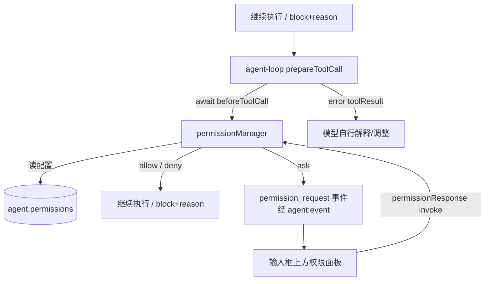

# 权限信任模型

工具执行权限体系：**模式（mode）+ 规则（rule）+ 逐次确认（prompt）**，对齐 Claude Code `permissions` 体系与 pi coding-agent 的 `beforeToolCall` 门控，落地于 `src/main/agent/permissions/`（`permissionManager.ts` + `rule.ts`）。

相关文档：工具门控/豁免集见 [tools.md](./tools.md)；权限事件与 IPC 见 [architecture.md](./architecture.md)。

## 1. 决策记录

| # | 决策 | 结论 |
|---|------|------|
| 1 | 模式集 | 三态：`default`（按规则逐次询问）/ `acceptEdits`（write/edit 自动允许）/ `bypassPermissions`（全部放行）。不做 plan 模式 |
| 2 | 门控集 | `bash` / `write` / `edit` / `task` / `webfetch` + **全部 MCP 工具**（有副作用或可外发数据） |
| 3 | 豁免集 | `read` / `ls` / `grep` / `find` / `time` / `read_skill` / `question` / `lsp` / `web_search` 及 todowrite/job 管理类纯会话或本地治理工具，永不询问 |
| 4 | 配置位置 | `~/.lx/config.json` 的 `agent.permissions` 节点；设置页"权限"分区读写 |
| 5 | 规则语法 | 对齐 CC：`ToolName(arg)`；优先级 **deny > ask > allow > 模式默认值** |
| 6 | 评估位置 | main 进程 `permissionManager` 单例，挂 `beforeToolCall` 钩子（loop 已 await，返回 `{ block, reason }` 即阻止） |
| 7 | 会话内记忆 | "允许本次会话"仅为内存态随会话切换重置；"永久允许/永久拒绝"精确参数写回配置 |
| 8 | 生效时机 | 每次 `ensureReady` 装配刷新：`load()` + `setMcpTools()`；写回后 reload 自然生效 |

## 2. 配置 schema

```jsonc
// ~/.lx/config.json
{
  "ai": { /* provider 与 webSearch 配置 */ },
  "agent": {
    "mcp": { /* 见 tools.md §7 */ },
    "permissions": {
      "defaultMode": "default",      // "default" | "acceptEdits" | "bypassPermissions"
      "allow": [                     // 命中即放行
        "Bash(git status)",
        "Edit(src/**)",
        "Write(test/**)",
        "codegraph_codegraph_search()"
      ],
      "deny": [                      // 命中即拒绝（不弹窗）
        "Bash(rm -rf *)",
        "Edit(.env)"
      ],
      "ask": [                       // 命中即弹窗（即使 acceptEdits）
        "Bash(docker *)"
      ]
    }
  }
}
```

- 缺失节点视为 `{ defaultMode: "default", allow: [], deny: [], ask: [] }`（默认安全）；非法条目跳过并记警告。

## 3. 模式语义

| 模式 | write / edit | bash | MCP 工具 |
|------|--------------|------|----------|
| `default` | 命中规则或询问 | 命中规则或询问 | 命中规则或询问 |
| `acceptEdits` | 自动允许（仍受 deny 约束） | 命中规则或询问 | 命中规则或询问 |
| `bypassPermissions` | 放行（deny 除外） | 放行（deny 除外） | 放行（deny 除外） |

- `ask` 规则在 `default` / `acceptEdits` 下强制弹窗，覆盖 allow 或 acceptEdits 的自动放行。
- 会话级「允许全部」（allowAll）同样先查 deny 再放行。

## 4. 规则引擎

**匹配语义**：

| 规则 | 匹配方式 |
|------|----------|
| `Bash(arg)` | 命令前缀匹配（`Bash(git status)` 命中 `git status --short`）；含 `*` 时 glob 全匹配；空参命中全部 |
| `Write/Edit(path)` | 路径 glob（相对会话 cwd）：`*` 不跨 `/`、`**` 跨目录、`?` 单字符 |
| `WebFetch(url)` | URL 前缀匹配；含 `*` 时 glob 全匹配 |
| MCP 工具 | 参数 JSON 序列化后子串匹配（宽松）；空参命中全部 |
| 工具名 | 内置按名匹配（大小写不敏感）；MCP 为前缀化全名 |

**判定顺序**（`permissionManager.evaluate`）：

```text
if matchRule(deny):                                  return deny    # deny 先于一切（含 bypass）
if mode == bypassPermissions:                        return allow    # 仅跳过 allow 语义，deny 仍生效
if tool in EXEMPT_TOOLS:                             return allow    # 豁免集永不询问
if tool not in GATED_BUILTIN_TOOLS and not mcp:      return allow    # 未知工具默认放行（新增副作用工具须显式登记门控）
kind = matchRule(ask) ? ask : matchRule(allow) ? allow : null       # 同类取参数最长者
if kind:                                             return kind
if mode == acceptEdits and tool in { write, edit }:  return allow
return ask
```

会话级 allowAll 在 gate 入口短路：先查 deny（命中即 block），否则放行并跳过其余规则与弹窗。全部匹配在 main 同步完成。

## 5. 确认流数据



1. `gate(context, sessionId, signal)` 短路判定；`ask` 时生成 `requestId` 挂起 Promise 并推 `permission_request`。
2. renderer 权限面板（复用命令面板定位，渲染于 AgentInput 上方）展示工具 badge、参数摘要、模式与风险文案；面板打开期间独占键盘。
3. 用户选择后 `agent:permissionResponse` 回传；未知/过期 requestId 返回 `{ ok: false }`。
4. 面板选项：**允许 / 允许本次会话（内存态）/ 永久允许（精确参数追加 allow[]）/ 拒绝 / 永久拒绝（追加 deny[]）/ 允许全部（二次确认防误触）**；永久决策直接发送、无二次确认。
5. 写回经 settingsService 原子写（tmp + rename），保留其余配置节，随后 `load()` 重载。

## 6. 错误处理

| 场景 | 行为 |
|------|------|
| 用户拒绝 | `{ block, reason }` → error toolResult 回灌模型，不中断 run |
| 弹窗超时 / 关闭 / 无推送目标 | 按**拒绝**处理（fail-safe）；挂起请求过期清理 |
| 用户中止 run | signal abort → 挂起请求按拒绝，run 结束，面板自动关闭 |
| 配置损坏 | 非法条目跳过记警告；非法 defaultMode 回退 default；不抛错 |
| bypassPermissions | 不产生挂起请求不弹窗；deny 规则仍拦截 |

## 7. 演进路线

| 方向 | 触发条件 | 留口位点 |
|------|----------|----------|
| 工具级自定义 beforeToolCall 钩子 | 出现第三方扩展诉求 | hooks 位点支持多钩子串联 |
| MCP 细粒度参数规则 | MCP 工具滥用场景增多 | rule.ts 匹配器可插拔 |
