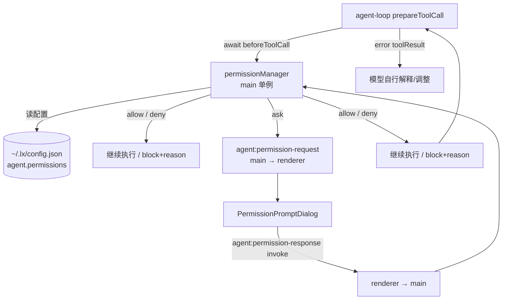

# 权限确认与信任模型

本文定义 LX Agent 的工具执行权限体系：**模式（mode）+ 规则（rule）+ 逐次确认（prompt）**，对齐 Claude Code 的 `permissions` 体系与 pi coding-agent 的 `beforeToolCall` 门控，落地于本项目的 Agent 运行时。

- **模式**：`default` / `acceptEdits` / `bypassPermissions` 三态（用户已确认，不做 `plan`）。
- **门控工具**：`bash` / `write` / `edit` + 全部 MCP 工具；`web_search` 豁免自动放行（用户已确认），本地只读工具（`read` / `ls` / `grep` / `find` / `time`）永不询问。
- **配置**：`~/.lx/config.json` 的 `agent.permissions` 节点，设置页新增"权限"分区管理。

## 1. 决策记录

| # | 决策 | 结论 |
|---|------|------|
| 1 | 模式集 | **三态**：`default`（按规则逐次询问）/ `acceptEdits`（write/edit 自动允许）/ `bypassPermissions`（全部放行）。不做 `plan`（桌面 Agent 工具全自动执行，无只读手工阶段） |
| 2 | 门控工具 | **`bash` / `write` / `edit` + 全部 MCP 工具**（有副作用或可外发数据）；`web_search` 豁免（纯公开检索）、本地只读工具永不询问 |
| 3 | 配置位置 | `~/.lx/config.json` 的 **`agent.permissions`** 节点（与 `agent.mcp` 并列，Agent 能力内聚）；设置页"权限"分区读写 |
| 4 | 规则语法 | 对齐 CC：`ToolName(arg)`，参数支持 glob；优先级 **deny > ask > allow > 模式默认值** |
| 5 | 评估执行位置 | main 进程 `permissionManager` 单例，挂 **`beforeToolCall` 钩子**（agent-loop 已 `await`，返回 `{ block, reason }` 即阻止） |
| 6 | 会话内记忆 | 面板"允许本次会话 / 允许全部"仅为**内存态**，随会话切换重置；**不写回配置**（避免决策悄悄改动用户配置） |
| 7 | 拒绝语义 | `block + reason` → error toolResult 回灌模型，模型自行解释/调整，不中断 run |
| 8 | 配置生效时机 | 启动时读取；运行中改配置需重建会话装配（`ensureReady` 能力指纹变化）才生效；设置页保存后 reload 页面自然触发 |

## 2. 配置 schema

```jsonc
// ~/.lx/config.json
{
  "ai": { /* 模型 provider 配置不变 */ },
  "agent": {
    "mcp": { /* 现有 MCP 配置不变 */ },
    "permissions": {
      "defaultMode": "default",      // "default" | "acceptEdits" | "bypassPermissions"
      "allow": [                     // 命中即放行（最高优先级低于 deny/ask）
        "Bash(git status)",
        "Edit(src/**)",
        "Write(test/**)",
        "codegraph_codegraph_search()"
      ],
      "deny": [                      // 命中即拒绝（不弹窗）
        "Bash(rm -rf *)",
        "Edit(.env)"
      ],
      "ask": [                       // 命中即弹窗询问（即使 defaultMode=acceptEdits）
        "Bash(docker *)"
      ]
    }
  }
}
```

字段对齐 Claude Code `permissions`：

- `defaultMode`：三态模式，决定未命中任何规则时的门控工具默认行为。
- `allow[]` / `deny[]` / `ask[]`：规则列表，每条形如 `ToolName(arg)`。非法条目**跳过并记警告**（不阻塞其他规则），与 `agent.mcp` 的降级语义一致。
- 缺失节点视为 `{ defaultMode: "default", allow: [], deny: [], ask: [] }`（默认安全）。

## 3. 模式语义

| 模式 | write / edit | bash | MCP 工具 |
|------|--------------|------|----------|
| `default` | 命中规则或询问 | 命中规则或询问 | 命中规则或询问 |
| `acceptEdits` | **自动允许**（仍受 deny 约束） | 命中规则或询问 | 命中规则或询问 |
| `bypassPermissions` | **全部放行** | **全部放行** | **全部放行** |

- `deny` 规则在所有模式下优先（`bypassPermissions` 也尊重 `deny`？——见 §4 优先级，**不**，`bypassPermissions` 忽略全部规则，一律放行；CC 语义为完全跳过权限检查）。
- `ask` 规则在 `default` / `acceptEdits` 下强制弹窗（用于覆盖 allow 或 acceptEdits 的自动放行）。

## 4. 规则引擎

### 4.1 工具名匹配

- 内置工具按名匹配：`Bash` / `Write` / `Edit`（MCP 工具名前缀 `server_tool`，见下）。
- MCP 工具名 = `sanitize(server)_sanitize(tool)`（`sanitize = value.replace(/[^a-zA-Z0-9_-]/g, "_")`），如 `codegraph_codegraph_search`。规则里写全名。
- 参数为空 `Tool()` = 该工具**全部调用**均命中。
- **大小写不敏感**：规则按 CC 惯例写 `Bash` / `Write` / `Edit`（首字母大写），而实际注册工具名小写（`bash` / `write` / `edit`），工具名比较统一转小写。

### 4.2 参数匹配

| 工具 | 参数匹配语义 |
|------|--------------|
| `Bash(arg)` | **命令前缀匹配**（CC 语义）：`Bash(git status)` 命中 `git status --short`；支持 `*` 通配（`Bash(npm *)`）；空参 `Bash()` 命中全部命令。**命令 glob 的 `*` 跨斜杠**（命令非路径，`rm -rf *` 命中 `rm -rf /tmp/x`） |
| `Write(path)` / `Edit(path)` | **路径 glob 匹配**（相对会话 cwd）：`Write(src/**)` 命中 `src/a.ts`；支持 `*` / `**` / `?`；空参命中全部路径 |
| `web_search(...)` | 不参与评估（豁免） |
| `mcp__server__tool(arg)` | 参数 `JSON.stringify` 后**子串匹配**（宽松）；空参命中全部调用 |

> 与 Claude Code 对齐但简化：CC 的路径规则可用 `~`、绝对路径，本项目仅支持相对 cwd 的 glob（工具本身也只在 cwd 内执行，见 path-utils）。

### 4.3 优先级与判定顺序

```
permissionManager.evaluate(tool, args):
  mode = defaultMode
  if mode == bypassPermissions:  return allow            # 完全跳过规则与弹窗
  if tool in { read, ls, grep, find, time, web_search }:  return allow   # 豁免集，永不询问
  if tool not in { bash, write, edit } and not mcp:      return allow   # 未知/未来内置工具默认放行？
  rule = matchRule(tool, args)                            # 最具体命中（deny/ask/allow 逐类检查）
  if rule == deny:   return deny(reason)
  if rule == ask:    return ask
  if rule == allow:  return allow
  # 未命中规则 → 按模式默认
  if mode == acceptEdits and tool in { write, edit }:  return allow
  return ask
```

> **未知工具默认**：非门控集且非豁免集的工具（如未来新增内置工具）默认放行——仅放行本地只读类；若未来新增有副作用内置工具，需在门控集显式登记。此条为安全默认与演进成本的折中。

> **会话级"允许全部"（allowAll）**：在 `gate` 入口、`evaluate` 之前短路——`sessionAllowAll.has(sessionId)` 直接放行，跳过所有规则（含 deny）与弹窗，等同会话级 `bypassPermissions`；仅内存态，随会话切换重置。

> **`bypassPermissions` 与 deny**：CC 的 `bypassPermissions` 完全跳过权限系统（含 deny）。本项目跟随：全放行。若未来需要"即使全放行也保护 `.env`"，可在 deny 语义上加特例——首版不做，文档留口。

### 4.4 glob 与正则

- 路径 glob：`*` 不跨 `/`、`**` 跨目录、`?` 单字符。复用 `tools/search.ts` 的 `globToRegExp`（已存在）。
- bash 前缀 + `*`：先做前缀匹配，再对含 `*` 的规则做命令 glob 全匹配（`*` → `.*`，可跨斜杠）。
- 全部匹配在 main 进程同步完成（规则量小，无性能问题）。

## 5. 架构与数据流



数据流（一次被门控的工具调用）：

1. agent-loop 校验参数后调用 `config.beforeToolCall(ctx, signal)`。
2. `permissionManager.evaluate(tool, args)` 判定：`allow` → 返回 undefined 继续；`deny` → 返回 `{ block: true, reason }`；`ask` → 进入确认流。
3. `ask`：main 经 event 通道推送 `permission_request` 事件；renderer `AgentInput` 弹出权限命令面板展示工具名、参数摘要、风险文案。
4. 用户选择后 `ipcRenderer.invoke(AGENT_CHANNELS.permissionResponse, { requestId, decision, rememberForSession, allowAll })` 回传；main 用 `requestId` 匹配挂起的 Promise。
5. 挂起期间 run 暂停（工具行保持"运行中"状态）；用户中止 run（`agent:abort`）时挂起 Promise 按拒绝处理并随 run 结束。

## 6. IPC 契约

```ts
// shared/ipc/agentChannels.ts 新增
AGENT_CHANNELS.permissionResponse = "agent:permissionResponse"  // renderer → main (invoke)
// 权限请求（main → renderer）不单独占 channel：作为 permission_request 事件经 agent:event 推送。

// shared/contracts/agent.ts 新增
interface PermissionRequest {
  requestId: string        // main 生成（会话 id + 工具调用 id + 代数）
  toolName: string         // "bash" | "write" | "edit" | "codegraph_codegraph_search" ...
  args: unknown            // 校验后的参数
  summary: string          // 单行展示摘要（工具实现提供，如命令 / 路径）
  mode: PermissionMode     // 当前 defaultMode（UI 展示用）
  sessionId: string | null
}

type PermissionDecision = { decision: "allow" | "deny"; rememberForSession?: boolean }

interface PermissionResponse {
  requestId: string
  decision: PermissionDecision["decision"]
  rememberForSession?: boolean
}
```

- `permissionRequest` 事件加入 `AgentEvent` 联合类型（renderer 按 type 分发；未知类型已忽略，向后兼容）。
- `permissionResponse` handler 校验 `requestId` 存在（未知/过期请求返回 `{ ok: false }`）。
- 请求在 `attachEventSink` 同路径推送（与 `agent:event` 一致，绑定发起窗口 webContents）。

## 7. UI 契约

### 7.1 设置页"权限"分区

- `SETTINGS_SECTIONS` 新增 `{ id: "permissions", label: "权限", icon: Shield }`（`lucide-react`）。
- `settings/index.tsx` 分区描述映射补 `permissions: "配置 Agent 工具执行权限与确认模式"`。
- 新组件 `PermissionSettings`（`src/renderer/src/features/settings/components/`）：
  - **模式**：三选一 `LxSelect`（`default` / `acceptEdits` / `bypassPermissions`），附中文说明。
  - **规则列表**：`allow` / `deny` / `ask` 三组，每组一个可增删的规则行编辑器（输入 `ToolName(arg)`，删除按钮；非法格式红色校验提示）。
  - 保存走现有 `saveSettings` 流程，但写入 `agent.permissions`（见 §8 持久化）。
- 只读提示：`bypassPermissions` 下工具不弹窗确认。

### 7.2 权限确认命令面板（PermissionRequestPanel）

- `src/renderer/src/features/agent/components/PermissionRequestPanel.tsx`，复用命令面板定位（`getAgentPanelPosition`）渲染于 `AgentInput` 输入框上方，替代弹窗。
- 展示：工具名 badge、参数摘要（`summary`）、模式、风险提示文案（"该操作将修改文件 / 执行命令 / 调用外部服务"）。
- 交互：键盘（↑↓ 循环选择、Enter 选中、Esc 拒绝关闭）由 `AgentInput` 接管；鼠标支持悬停切换高亮与点击选中。面板打开期间独占键盘，`/` `@` `/model` 面板隐藏，Enter 不发送消息。
- **选择态选项**：
  - **允许**（默认高亮）——本次放行该操作
  - **允许本次会话**——`rememberForSession: true`，会话内不再询问同类操作
  - **拒绝**——拒绝原因以固定文案回灌模型
  - **允许全部**——会话级放行全部工具与 MCP，**跳过 deny 规则**（等同会话级 `bypassPermissions`）
- **允许全部二次确认**：选中后面板切换确认态（"确认允许全部 / 返回"，默认停在"返回"），防误触；确认后 main 记录 `sessionAllowAll`，新建会话自动失效。
- 关闭时机：`agent_end`（含中止）自动关闭；`Escape` 按拒绝处理（fail-safe）。

### 7.3 消息流中的呈现

- 挂起期间：对应 `toolCall` 行状态显示"等待权限确认"（复用现有 toolCall 折叠行的运行中态，可加一个 `permission_pending` 事件或复用 `tool_execution_start` 前状态）。
- 被拒绝：error toolResult 行展示"已拒绝" + reason（现有 error 态）。

## 8. 持久化与装配

- 新增 `src/main/agent/permissions/permissionManager.ts`（单例）：
  - `load()`：读 `agent.permissions`，校验 `defaultMode` 枚举与规则格式，非法条目降级。
  - `evaluate(toolName, args): "allow" | "deny" | "ask"`。
  - `rememberForSession(sessionId, toolName)` / `clearSession(sessionId)`。
  - `pending()`：挂起的 requestId → resolve 函数。
- 新增 `src/main/agent/permissions/rule.ts`：`parseRule(str)` / `matchRule(rules, toolName, args)`（glob 复用 `tools/search.ts`）。
- 装配：`agentRunner.ensureReady()` 创建 Agent 时传 `beforeToolCall: (ctx) => permissionManager.gate(ctx, this.sessionId)`；`send()` 处 MCP/能力冻结不变。
- 会话边界：`agentRunner` 的 `currentSessionId` 变化时 `clearSession(旧 id)`（内存态随会话生命周期）。
- 持久化写入：`settingsService` 新增 `getPermissionSettings()` / `savePermissionSettings()`，与 `saveModelProviderSettings` 同模式——`readRawConfig` → 合并 `agent.permissions` → tmp + rename 原子写，**保留 `agent.mcp`**。

## 9. 错误处理

| 场景 | 行为 |
|------|------|
| 用户拒绝 | `beforeToolCall` 返回 `{ block: true, reason: "用户已拒绝该操作" }` → error toolResult 回灌模型，模型解释/调整，不中断 run |
| 弹窗超时 / 用户关闭 | 按**拒绝**处理（fail-safe）；`pending` 过期清理 |
| 用户中止 run | `signal.abort()` → 挂起请求按拒绝处理，run 结束，弹窗自动关闭 |
| 配置损坏（defaultMode 非法 / 规则格式错误） | 非法条目跳过并记警告；`defaultMode` 非法回退 `default`；不抛错 |
| 未知 requestId 的响应 | `{ ok: false }`，忽略 |
| `bypassPermissions` | 不产生挂起请求、不弹窗；会话内记忆不写入 |

## 10. 验收

- [ ] `agent.permissions` 配置后，`bash` / `write` / `edit` / MCP 工具按规则 + 模式判定；`web_search` 与本地只读工具从不弹窗。
- [ ] `defaultMode: "bypassPermissions"` 下所有门控工具直接执行，无任何确认弹窗。
- [ ] `defaultMode: "acceptEdits"` 下 write/edit 自动执行，bash/MCP 仍询问。
- [ ] 弹窗"允许，本次会话内不再询问"后，同会话同类调用不再弹窗；新建会话后恢复询问。
- [ ] `deny` 规则直接拒绝（不弹窗），模型收到 error toolResult 并给出解释。
- [ ] 运行中用户 `agent:abort`，挂起弹窗关闭、无残留请求、run 干净结束。
- [ ] 设置页"权限"分区可编辑模式 + 三组规则并保存；保存后 `~/.lx/config.json` 出现 `agent.permissions`，`agent.mcp` 原样保留。
- [ ] 无遗留旧导入 / 重复 channel；`pnpm typecheck` + 受影响文件 Biome。

## 11. 测试

- `test/main/agent/permissions/rule.test.ts`：`parseRule` / `matchRule`（bash 前缀、路径 glob、空参、MCP 子串、deny>ask>allow 优先级）。
- `test/main/agent/permissions/permissionManager.test.ts`：三态判定、豁免集、会话内记忆、挂起请求匹配与过期。
- `test/main/agent/agentRunner.permission.test.ts`：`beforeToolCall` 接线、拒绝 → error toolResult、abort 清理。
- `test/main/services/settingsService.permission.test.ts`：保存合并保留 `agent.mcp`、损坏配置降级。
- `test/renderer/features/settings/PermissionSettings.test.tsx`：模式选择、规则增删、保存调用。
- `test/renderer/features/agent/PermissionRequestPanel.test.tsx`：选择态/确认态渲染、鼠标悬停与点击、isOpen/position 控制。

## 12. 不做（留口）

- **`plan` 模式**（只读模式）：桌面 Agent 无手工阶段，不做。
- **永久允许/拒绝写回配置**：面板决策仅会话内记忆（`rememberForSession` / `allowAll`）；规则列表必须由设置页显式配置。
- **`bypassPermissions` / 会话级"允许全部"下的 deny 特例**（如保护 `.env`）：留口（§4.3 注），首版不做。
- **MCP remote / OAuth**：已有独立文档留口，不并入权限体系。
- **跨进程/多窗口权限共享**：权限状态绑定当前会话，单窗口模型不变。
- **工具级 `beforeToolCall` 用户自定义钩子**（pi 的扩展点）：首版只挂内置 permissionManager，自定义钩子后续接入。
