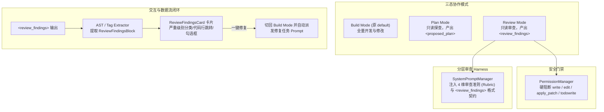

# Review Mode (<review_findings>) 协议与结构化审查闭环设计方案

## 1. 架构目标与背景

参考 OpenAI Codex (`codex-rs`) 的审查模式（`ReviewTask` / `ReviewFinding` / `review_format`）与多模式协作体系，在 LX Agent 中建立三态协作体系（`build` / `plan` / `review`）与专用的 **代码审查模式（Review Mode）**。彻底解决在审查场景中模型随意修改文件、缺乏结构化 Findings 产出、无法精准定位代码行与无法勾选一键修复的痛点。



---

## 2. 核心数据结构与类型定义

### 2.1 协作模式枚举统一重命名 (`src/shared/contracts/agent.ts`)
```typescript
// 协作模式三态定义
export type CollaborationMode = "build" | "plan" | "review"
```

### 2.2 Review Finding 结构化契约 (`src/shared/contracts/agent.ts` & `types.ts`)
```typescript
export type ReviewSeverity = "critical" | "high" | "medium" | "low"

export interface ReviewFindingLocation {
  filePath: string
  lineStart: number
  lineEnd?: number
}

export interface ReviewFindingItem {
  id: string
  title: string
  severity: ReviewSeverity
  location: ReviewFindingLocation
  description: string
  suggestion?: string
}

export interface ReviewFindingsData {
  summary: string
  findings: ReviewFindingItem[]
  raw: string
  isStreaming?: boolean
}
```

### 2.3 消息块与执行流扩展 (`src/renderer/src/features/agent/types.ts`)
```typescript
export type ChatBlock =
  | { kind: "text"; text: string; durationMs?: number }
  | { kind: "thinking"; text: string; durationMs?: number }
  | { kind: "proposedPlan"; plan: ProposedPlanData; durationMs?: number }
  | { kind: "reviewFindings"; findings: ReviewFindingsData; durationMs?: number }
  | { kind: "toolCall"; ... }
  | { kind: "toolResult"; ... }

export type ExecutionStepKind =
  | "system"
  | "user"
  | "thinking"
  | "tool"
  | "subagent"
  | "compaction"
  | "undo"
  | "assistant"
  | "modelSwitch"
  | "error"
  | "proposedPlan"
  | "reviewFindings"
```

---

## 3. 核心子系统设计

### 3.1 提示词分层规范与审查 Rubric (`src/main/agent/prompts/systemPromptManager.ts`)
在 `harness:collaboration-mode` 段中，针对 `mode === "review"` 注入 Codex 专用的 4 维审查标准与 XML 标签规范：
1. **Defects & Correctness**：逻辑缺陷、边界错误、竞态条件、未捕获异常。
2. **Security Vulnerabilities**：命令注入、路径穿越、凭据泄露、XSS/HTML 逃逸。
3. **Performance & Bottlenecks**：循环内的无效分配、内存泄露、阻塞同步调用。
4. **Taste & Minimalism**：过度设计、死代码、违背最小修改原则。
5. **Output Format**：强制包裹在 `<review_findings>` 与 `</review_findings>` 块中，并采用结构化 Finding 格式。

### 3.2 运行时安全门禁 (`src/main/agent/permissions/permissionManager.ts`)
在 `collaborationMode === "review"` 时：
- 硬阻断写文件工具：`write`、`edit`、`apply_patch` 直接返回 `deny`。
- 硬阻断任务工具：`todowrite` 直接返回 `deny`。
- `bash` 工具严格执行只读检测，任何副作用指令判定为 `deny`。

### 3.3 交互卡片组件 (`ReviewFindingsCard.tsx`)
- **视觉风格**：采用紫蓝/琥珀色高质感卡片与 `--color-theme-*` CSS Token。
- **状态统计**：展示问题总数、各级别分布徽标（Critical / High / Medium / Low）。
- **列表项交互**：
  - Checkbox 勾选框（默认全选或选中有明确修复项的 Finding）。
  - 点击 `filePath:line` 调用 `window.api.agent.openFileAt` 自动在本地 IDE 中定位。
  - 折叠展开修复建议。
- **底部动作**：
  - **[填入输入框]**：将选中的 Finding 格式化为 prompt 填入聊天底栏。
  - **[一键修复选中项]**：自动调用 `setCollaborationMode("build")` 并派发精准修复指令。

---

## 4. 国际化规范
所有文案均通过 `useTranslation` (`t`) 注入：
- `agent.collaborationModeBuild`: "构建模式" / "Build Mode"
- `agent.collaborationModeReview`: "审查模式" / "Review Mode"
- `agent.review.badge`: "代码审查报告" / "Code Review Report"
- `agent.review.applyFixes`: "采纳并修复选中项" / "Apply Selected Fixes"
- `agent.review.fillInput`: "填入输入框" / "Insert into Input"
- `agent.review.noFindings`: "未发现明显缺陷与安全漏洞" / "No significant issues found"
