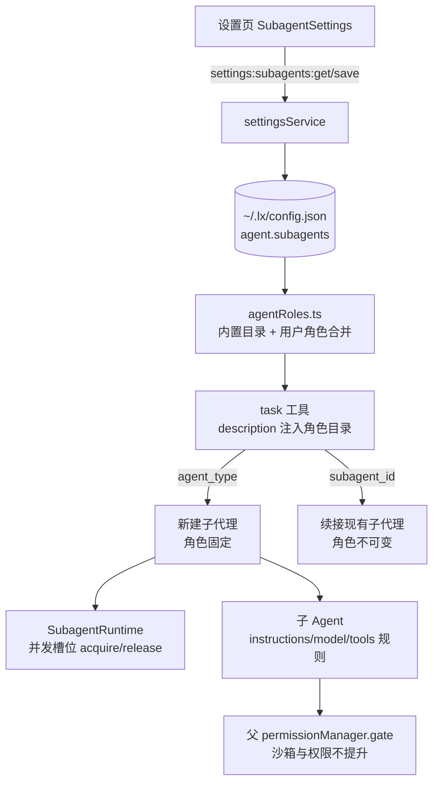

# 自定义子代理角色 Harness（Subagent Roles）设计方案

参考 `codex-main` 的角色体系实现（`core/src/agent/role.rs`、`core/src/config/agent_roles.rs`、`core/src/tools/handlers/multi_agents_spec.rs`、内置角色 `explorer` / `worker`、`[agents]` 全局治理项），在 LX Agent 现有 `task` 工具与 `SubagentPool` 基座上引入：

1. **角色目录**：内置角色（`review` / `explorer` / `worker`）+ 用户自定义角色（`~/.lx/config.json` → `agent.subagents.roles`）；
2. **派发选型**：`task` 工具新增 `agent_type` 参数，工具描述动态注入角色目录；
3. **能力收缩**：角色可覆盖指令、模型与工具白名单，但**永远不能提权**（不触碰沙箱与权限门控）；
4. **运行时治理**：会话级并发上限、嵌套深度上限、默认子代理模型；
5. **设置页**：新增「子代理」分区，可视化增删改角色与全局治理项。

---

## 1. 架构背景与设计目标

### 1.1 现状问题

- `src/main/agent/tools/task.ts` 只有一种通用子代理；`name` 含 `"review"` 时硬编码替换为 Review Rubric 提示词（`src/main/agent/subagent/reviewAgent.ts`），模型无从得知该魔法名，属于半死代码。
- 子代理强制继承父模型与父工具全集（仅剔除 `task`），无法按任务类型选择更便宜/更快的模型，也无法按角色收缩工具面。
- 无并发上限与深度配置；深度恒为 1 是「剔除 task 工具」的副作用而非显式治理。

### 1.2 目标与边界

- 对齐 Codex `agent_type` 语义：显式选型、未知角色报错、角色能力只能收缩。
- 对齐 Codex `[agents]` 治理项：`max_concurrent_threads_per_session`（本方案 `maxConcurrent`）、`max_depth`（本方案 `maxDepth`）、`default_subagent_model`（本方案 `defaultModel`）。
- 非目标：Codex 的插件/市场、`goals`、Code Mode、配置分层（managed/requirements）、角色级 skills/personality 覆盖、`awaiter` 内置角色（Codex-main 已停用）。



---

## 2. 数据模型与契约

### 2.1 `agent.subagents` schema（`~/.lx/config.json`）

```jsonc
{
  "agent": {
    "subagents": {
      // 可选；缺省不限。1–32 的整数。
      "maxConcurrent": 4,
      // 可选；缺省 1（现状）。1–5 的整数：子代理不可再派生。
      "maxDepth": 1,
      // 可选；缺省继承父会话模型。
      "defaultModel": { "provider": "anthropic", "model": "claude-sonnet-4-5", "variant": "high" },
      "roles": {
        "my-reviewer": {
          // 必填：注入 task 工具描述，模型据此选型。
          "description": "Strict review of a specific change set.",
          "instructions": "You are a strict reviewer...",
          "model": { "provider": "openai", "model": "gpt-5.1" },
          "tools": ["read", "grep", "find", "lsp"]
        }
      }
    }
  }
}
```

TypeScript 契约（`src/shared/settings.ts`）：

```typescript
export interface SubagentRoleConfig {
  description: string
  instructions?: string
  model?: ModelSelection
  tools?: string[] // 非空 = 白名单；空数组或缺失 = 继承父工具集
}

export interface SubagentSettings {
  roles: Record<string, SubagentRoleConfig>
  maxConcurrent?: number
  maxDepth?: number
  defaultModel?: ModelSelection
}

export const DEFAULT_SUBAGENT_SETTINGS: SubagentSettings = { roles: {}, maxDepth: 1 }
```

校验规则（`settingsService` 归一化，单点实现、主进程与设置页同源）：

| 字段 | 规则 | 非法处理 |
| :--- | :--- | :--- |
| 角色名 | `^[a-z][a-z0-9_-]{0,31}$`；不得命中内置保留名（`review` / `explorer` / `worker`） | 保存拒绝（设置页报错）；读配置时告警 + 忽略该条 |
| `description` | 去空白后非空 | 同上 |
| `instructions` | 字符串，可缺省 | 非字符串 → 告警 + 忽略 |
| `tools` | 字符串数组，逐项去空白、去重、丢弃空串；空数组归一为缺省（继承） | 非法项忽略并告警 |
| `maxDepth` | 整数 1–5 | 越界保存拒绝；读时回退 1 并告警 |
| `maxConcurrent` | 整数 1–32 | 越界保存拒绝；读时回退缺省（不限）并告警 |
| `defaultModel` | `ModelSelection`（provider/model 需存在于 provider 配置，由消费者降级） | 缺省即继承；非法仅在运行时告警降级 |

### 2.2 运行时角色模型（`src/main/agent/subagent/agentRoles.ts`）

```typescript
// 常量单一来源：src/shared/settings.ts（校验层与运行时共用）
export const SUBAGENT_ROLE_NAME_PATTERN: RegExp
export const RESERVED_SUBAGENT_ROLE_NAMES: readonly string[] // ["review", "explorer", "worker"]
export const SUBAGENT_MAX_DEPTH_LIMIT = 5
export const SUBAGENT_MAX_CONCURRENCY_LIMIT = 32

// 运行时角色模型：src/main/agent/subagent/agentRoles.ts
export interface ResolvedAgentRole {
  name: string
  description: string
  instructions?: string
  model?: ModelSelection
  tools?: string[]
  builtIn: boolean
}

export const BUILT_IN_AGENT_ROLES: Record<string, ResolvedAgentRole>

// 合并：内置目录 + 用户角色（用户不得占用保留名，解析层保证/校验层拒绝）
export const resolveAgentRoles = (settings: SubagentSettings): Map<string, ResolvedAgentRole>
export const buildAgentTypesDescription = (roles: Iterable<ResolvedAgentRole>): string
```

### 2.3 `task` 工具输入契约（`src/main/agent/tools/task.ts`）

```typescript
const TASK_INPUT_SCHEMA = z.object({
  description: z.string(), // 不变
  prompt: z.string(), // 不变
  agent_type: z.string().optional().describe("Agent role name from Available agent types"),
  name: z.string().optional(), // 仅池内寻址/展示，不再承担角色语义
  subagent_id: z.string().optional(), // 续接；角色不可变更
})
```

工具 description 装配（按会话 registry 装配时生成，`task.test.ts` 断言）：

```text
Delegate an independent sub-task ... (existing text)

Available agent types:
- review: <description>
- explorer: <description>
- worker: <description>
- <user-role>: <description>

Concurrency: at most N subagents may run at the same time. Reuse existing subagents or wait for their completion before spawning more.
```

`Concurrency:` 行仅在配置了 `maxConcurrent` 时输出；无用户角色时仍输出内置三条。

---

## 3. 内置角色

内置角色定义为代码常量，设置页只读展示，不可编辑/删除。

| 名称 | description（注入工具描述） | instructions | tools |
| :--- | :--- | :--- | :--- |
| `review` | Strict, uncompromising review of a given change set or proposal. | 现有 `REVIEW_AGENT_SYSTEM_PROMPT` 原文迁移（Rubric：缺陷/安全/性能/品味 + 结构化输出） | 缺省（继承现状） |
| `explorer` | Fast, authoritative answers to specific, well-scoped codebase questions. Use multiple explorers in parallel for independent questions. | 英文指令：只读探索、回答具体问题、不修改文件、trust 既有探索结果 | `read` / `ls` / `grep` / `find` / `lsp` / `web_search` / `webfetch` / `time` |
| `worker` | Execution and production work: implement part of a feature, fix tests or bugs, split large refactors into independent chunks. | 英文指令：明确任务所有权、不 revert 他人修改、完成后简述结果 | 缺省（继承父工具集，仅剔除 `task`） |

- `explorer` / `worker` 的 description 与行为规则移植自 Codex（`role.rs` built_in 模块与 `builtins/awaiter.toml` 风格），提示词一律为英文。
- `reviewAgent.ts` 保留为 `review` 内置角色的 instructions 来源，避免重复定义；其现有单测不变。

---

## 4. 运行时行为

### 4.1 每次 `task` 执行流程

1. **寻址**：`subagent_id` / `name` 命中 `SubagentPool` → 续接路径（见 4.5）；否则新建。
2. **角色解析（仅新建）**：
   - `agent_type` 命中角色目录 → 采用；
   - 未传 `agent_type` 且 `name` 含 `"review"`（大小写不敏感）→ 遗留别名映射到内置 `review`（仅新建生效）；
   - 未传 `agent_type` → 默认子代理（现状：父提示词 + 子代理后缀）；
   - `agent_type` 非空但未命中 → 返回 error ToolResult：`Unknown agent_type "<x>". Available: review, explorer, ...`（禁止静默回退）。
3. **系统提示词**：按 `父系统提示词 → SUBAGENT_PROMPT_SUFFIX → role.instructions` 顺序追加（`review` 同样追加角色指令，不再替换子代理后缀）。
4. **工具集**：以父激活集（assembly 已剔除 `task`）为基础：
   - `role.tools` 非空 → 与父激活集求交集（只读工具名未激活时静默缺失，永不新增能力）；
   - `role.tools` 缺省 → 继承父激活集；
   - 嵌套 `task` 注入规则见 4.2；角色白名单不含 `task` 时，其子代理不可再派生。
5. **模型**：`role.model` → `defaultModel` → 父会话模型（见 4.4）。
6. **并发**：启动子代理 turn 前 `runtime.tryAcquire()`，`finally` 中 `runtime.release()`（含异常/中止路径）。acquire 失败 → error ToolResult（见 4.3）。
7. **Hook**：`SubagentStart` / `SubagentStop` payload 的 `agent_type` 使用**解析后的角色名**（未命中角色时沿用现有 `name` 回退值），保持线协议字段不变。
8. **落池与快照**：`SubagentPool` 条目追加 `roleName` 字段（用于续接冲突判定）；`SubagentData` 同步携带 `roleName`，消息卡片与子代理面板据此标注角色（名称缺失时展示名回退角色名）。

### 4.2 深度与嵌套

- 根会话深度 0；子代理深度 = 父深度 + 1；`maxDepth` 为允许的最大深度，缺省 1。
- 子代理深度 `< maxDepth` 且角色工具白名单未显式排除时，其工具集注入一个绑定深度 `childDepth` 的 `task` 实例（通过 `TaskToolDeps.depth` 传递，`getTools` 返回子工具集数组，避免循环引用）；否则维持现状剔除。
- 深度只增不减；越界不会再嵌套，绝不 fallback 到父深度。

### 4.3 并发治理（`SubagentRuntime`）

- 单会话级实例（`sessionRunner` 构造，随 `taskDeps` 注入），跨嵌套深度共享同一计数。
- `maxConcurrent` 缺省 → `tryAcquire()` 恒成功，行为与现状一致。
- 达到上限 → 立即返回 error ToolResult：`Concurrency limit reached: N/N subagents running. Reuse an existing subagent (subagent_id) or wait for one to finish.` 不做排队（避免 `maxDepth > 1` + `maxConcurrent = 1` 时父子互等死锁）。
- 槽位持有者为「正在执行的 task 调用」，续接同样占用槽位；错误返回不占用。

### 4.4 模型优先级与降级

`role.model` → `defaultModel` → 父会话模型。任一级 provider/model 在设置中不存在 → `console.warn` 告警并降级到下一级；仅新建子代理时解析，续接沿用创建时模型。解析逻辑复用 `modelFactory` 的模型装配入口，不静默引入未配置 provider。

### 4.5 续接语义（角色不可变）

- 角色在首次创建时固定并写入 `SubagentPool`；续接未带 `agent_type` → 沿用原角色，指令/模型/工具集与创建时一致（复用池内 Agent 实例，现状不变）。
- 续接携带 `agent_type` 且与已固定角色不一致 → error ToolResult：`agent_type cannot be changed when resuming subagent "<id>" (role: <x>).`
- 携带相同 `agent_type` → 允许，等价于未携带。

### 4.6 配置生效时机

与 Hooks 一致：角色目录与治理项在**会话 registry 装配时快照**；设置页保存后仅对新会话生效，运行中会话沿用旧目录（避免 `task` 描述与实际可创建角色不一致）。

---

## 5. 设置页与 IPC 接线

| 层 | 文件 | 变更 |
| :--- | :--- | :--- |
| 契约 | `src/shared/settings.ts` | `SubagentRoleConfig` / `SubagentSettings` / `SubagentBuiltinRoleInfo` / 默认值；`SettingsApi` 增加三个方法（get/save/builtins） |
| Channel | `src/shared/ipc/settingsChannels.ts` | `getSubagentSettings: "settings:subagents:get"` / `saveSubagentSettings: "settings:subagents:save"` |
| Channel (只读) | `src/shared/ipc/settingsChannels.ts` | `getSubagentBuiltins: "settings:subagents:builtins"`（内置角色只读信息，供设置页展示） |
| Main | `src/main/services/settingsService.ts` | `getSubagentSettings` / `saveSubagentSettings`：归一化、校验、整树覆盖 `agent.subagents`、原子写盘、保留其他字段 |
| Main IPC | `src/main/ipc/settingsHandlers.ts` | 注册三个 handler（get/save/builtins） |
| Preload | `src/preload/index.ts` | 暴露三个方法（get/save/builtins） |
| Renderer API | `src/renderer/src/features/settings/api/settingsApi.ts` | 类型化封装 |
| 分区 | `src/renderer/src/features/settings/constants.ts` | 新增 `{ id: "subagents", labelKey: "settings.subagents", icon: Users }` |
| 页面 | `src/renderer/src/pages/settings/index.tsx` | `activeSection === "subagents"` 渲染新组件 |
| 组件 | `src/renderer/src/features/settings/components/SubagentSettings.tsx` | 新建（布局见下） |
| i18n | `src/renderer/src/i18n/locales/zh.ts` / `en.ts` | 全部文案接入 `settings.*`，零硬编码 |

组件布局（沿用 `HooksSettings` 的加载/保存/`SettingsActionBar` 模式）：

1. **全局治理卡片**：`defaultModel` 两级下拉（provider / model，含「继承当前会话模型」空选项，复用 `ModelSettings` 的选择器样式）、`maxConcurrent` 数字输入（空 = 不限）、`maxDepth` 数字输入（默认 1，范围 1–5）。
2. **内置角色列表**：只读卡片，展示名称、description、工具边界；标注「内置」。
3. **用户角色列表**：卡片列表 + `LxModal` 新增/编辑（名称、description、instructions 多行、model 两级下拉、tools 文本框逐行一个工具名），行内删除；名称实时校验（格式 + 保留名 + 重名），保存时主进程二次校验并返回错误。

### 5.1 输入框 `@` 子代理提及

- AgentInput `@` 提及面板新增「子代理」类目：内置角色在前、用户角色按配置顺序，展示 `@agent:<name>`、描述与专属 `Agent` 标签。
- 选定后插入专属 token `@agent:<name> `（镜像 `@design:` / `@claw:` 规范），编辑器内以独立高亮样式呈现（`cm-md-agent-mention`）。
- Backspace 在 token 末尾整块删除（`getAgentMentionDeletionRange`，与 `@design` / `@claw` 语义一致）；文件提及解析显式排除 `@agent:` 前缀避免误判。
- token 随用户消息原样进入模型上下文，作为委派意图提示；主进程不做强制路由。

---

## 6. 安全不变量

1. **只能收缩**：角色工具集 = 父激活集 ∩ 白名单，永远不新增工具；未激活的 MCP/内置工具不可被角色带入。
2. **权限不提升**：子代理继续复用父 `permissionManager.gate`，角色不能修改 `sandboxPolicy` / `PermissionMode` / 协作模式硬门禁。
3. **保留名不可占用**：`review` / `explorer` / `worker` 校验拦截，防止用户角色冒充内置语义。
4. **未知角色显式报错**，不静默回退，避免模型误以为已切换角色。
5. **角色不可中途替换**：续接冲突报错，防止同一上下文被换提示词产生不可预测行为。
6. **配置解析 fail-soft**：非法角色条目告警并忽略，绝不阻断会话启动（与 hooks 同哲学）；阻断只发生在设置页显式保存路径。

---

## 7. 文件与测试矩阵

实现文件：

- `src/shared/settings.ts`、`src/shared/ipc/settingsChannels.ts`
- `src/main/services/settingsService.ts`、`src/main/ipc/settingsHandlers.ts`
- `src/preload/index.ts`
- `src/main/agent/subagent/agentRoles.ts`（新增）、`src/main/agent/subagent/subagentRuntime.ts`（新增）、`src/main/agent/subagent/subagentPool.ts`、`src/main/agent/subagent/reviewAgent.ts`
- `src/main/agent/tools/task.ts`、`src/main/agent/assembly.ts`、`src/main/agent/sessionRunner.ts`
- `src/renderer/src/features/settings/**`、`src/renderer/src/pages/settings/index.tsx`、`src/renderer/src/i18n/locales/{zh,en}.ts`
- 文档：`docs/agent/tools.md`、`docs/agent/architecture.md`、`docs/agent/runtime.md`（§5 子代理小节）

测试矩阵（vitest）：

| 测试文件 | 覆盖 |
| :--- | :--- |
| `test/main/services/subagentSettingsService.test.ts`（新增） | 归一化、非法项忽略、保留名/格式/越界拒绝、写盘保留其他字段、读回一致 |
| `test/main/agent/subagent/agentRoles.test.ts`（新增） | 内置目录内容、用户角色合并、保留名屏蔽、工具描述生成、未知角色判定 |
| `test/main/agent/tools/task.test.ts`（扩展） | `agent_type` 命中/未知报错、指令追加、模型优先级与降级、工具交集不可新增、续接角色冲突、遗留 review 别名、description 注入 |
| `test/main/agent/subagent/subagentRuntime.test.ts`（新增） | 并发 acquire/release、上限拒绝、异常路径释放、缺省不限 |
| `test/main/agent/tools/task.nesting.test.ts`（新增，或并入 task.test.ts） | `maxDepth` 1/2 的子工具集差异、嵌套 task 深度绑定、白名单排除 task |
| `test/renderer/features/settings/SubagentSettings.test.tsx`（新增） | 列表渲染、新增/编辑/删除、内置只读、校验报错、保存载荷 |
