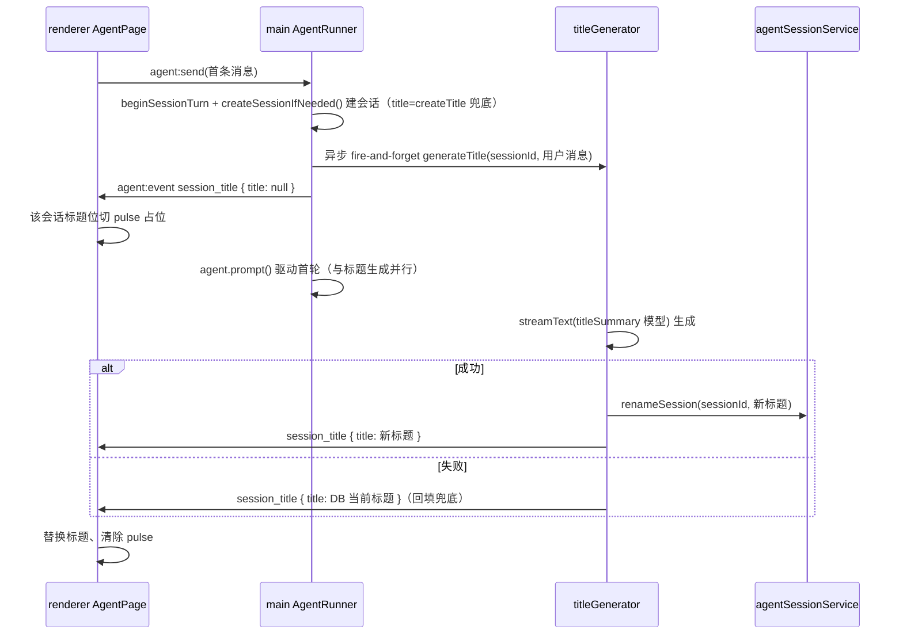

# 会话标题 AI 总结（title-summary）

本文定义 LX Agent 会话标题的 AI 总结功能：触发时机、模型装配、生成规则、事件回写与渲染占位。设计对齐参考项目 [opencode](https://github.com/sst/opencode) 的 `ensureTitle`（`packages/opencode/src/session/prompt.ts:193-253`）；pi-main 无标题生成逻辑，不参考。

## 1. 背景

现状：会话标题由 `createTitle(text)` 取**首条用户消息前 40 字符**生成（`src/main/agent/agentRunner.ts:112`），落库于 `agent_end` 的 `flushTurn`（`agentRunner.ts:596`）。标题质量差（长句截断、含换行/工具噪声），历史面板（`ChatHistoryPanel`）直接展示。

目标：首轮对话结束后，用 AI 模型将本轮对话**总结为简洁精炼的中文标题**，替换截断标题；异步进行、失败静默、不阻塞主流程。

## 2. 决策记录

| # | 决策 | 结论 |
|---|------|------|
| 1 | 触发时机 | **新建会话发送消息时**立即触发（`send()` 内建会话后 fire-and-forget），**不等一轮输出完成**、**仅一次**；第二轮及之后不触发 |
| 2 | 覆盖保护 | **不加列、无 `title_auto` 标记**。renderer 无手动改名入口，无覆盖竞态；loading 仅作异步窗口**纯视觉占位** |
| 3 | 生成模型 | 复用配置 **`ai.titleSummary`**（`getModelProviderSettings().titleSummary`，缺省回落 `defaultModel`），经 `resolveModelSelection` + `resolveLanguageModel` 装配 |
| 4 | 调用方式 | **裸 AI SDK `streamText`**：单次生成、无工具、不进 Agent 事件流、不污染 `agent.state.messages` |
| 5 | 生成输入 | 首轮 **user 消息文本**（跳过 assistant / thinking / toolResult / image），直接作为生成输入 |
| 6 | prompt | 简体中文、一句话概括主题、**不超过 20 字**、无标点结尾 |
| 7 | 清理规则 | 去 `<think>...</think>` → 取第一行非空 → 超 40 字符截断兜底（对齐 `createTitle`） |
| 8 | 失败语义 | 静默：保留 `createTitle` 兜底标题；仍发 done 事件回填，清除 pulse，不重试 |
| 9 | 渲染通知 | 复用 `agent:event`，新增 `session_title` 事件两态：`title: null`（pending → pulse 占位）/ `title: string`（done → 替换真实标题） |
| 10 | 并发竞态 | 写库前校验 `this.currentSessionId === sessionId` 且会话存在；删除/新建/切会话时校验不通过则丢弃 |

## 3. 数据流



## 4. 实现细节

### 4.1 main 侧生成器（新增 `src/main/agent/titleGenerator.ts`）

```ts
// 生成标题；成功返回标题，失败返回 null（不抛错）。
async function generateSessionTitle(
  sessionId: string,
  firstTurn: AgentMessage[],   // 首轮 user + assistant 消息
): Promise<string | null>
```

- 装配：`resolveModelSelection(getModelProviderSettings().titleSummary)` → `resolveLanguageModel`；无可用模型/无 key 返回 `null`。
- 输入：遍历 `firstTurn`，取全部 `role === "user"` 消息的文本（跳过 assistant / toolResult / thinking），拼为一个字符串。
- prompt：

```
请用简体中文为本轮对话生成一个简洁精炼的会话标题。
要求：一句话概括对话主题，不超过 20 字，不加标点结尾。
对话内容：
<user 消息>
```

- 调用：`streamText({ model, messages: [{ role: "user", content: prompt }] })`，`text` 聚合。
- 清理：去 `<think>` → 取第一行非空 → `slice(0, 40)` 兜底；空结果返回 `null`。
- 超时兜底：`AbortSignal.timeout(10_000)`，超时/抛错返回 `null`。

### 4.2 AgentRunner 触发与回写（`agentRunner.ts`）

- `send()` 内，`beginSessionTurn` 后、`agent.prompt` 前：若为新建会话（`bindingChanged`，即 `isNewSession`），先 `createSessionIfNeeded()` 建会话行（事务），随后立即 `generateTitle(sessionId, text)` **fire-and-forget**——不 await、不阻塞、不等一轮输出完成。
- `generateTitle`：
  - 先发 `eventSink({ type: "session_title", sessionId, title: null })`（pending）。
  - `void generateSessionTitle([{ role: "user", content: text }])` 异步生成；`then` 内校验 `this.currentSessionId === sessionId` 且会话存在，通过则 `agentSessionService.renameSession(sessionId, title)`，最后发 done 事件（`title` 为最终落库值）。
- 失败清理：`agent.prompt` 抛错且该新建会话无任何消息落库时，删除空会话（`hasSessionMessages` 判定），避免残留空行。
- `flushTurn()` 复用 `createSessionIfNeeded()`（已存在会话则跳过创建），只追加消息 entries 与调用记录。
- 失败路径：`generateSessionTitle` 返回 null → `renameSession` 不调用（标题仍是兜底），done 事件 `title` 用 `agentSessionService.getSession(sessionId)?.title` 回填。

### 4.3 AgentEvent 类型扩展（`src/shared/contracts/agent.ts`）

`AgentEvent` 联合类型新增：

```ts
| { type: "session_title"; sessionId: string; title: string | null }
```

- `title: null` = 生成中（pending）；`title: string` = 完成（真实或兜底标题）。
- 该事件独立于对话流，renderer 的 `message_*` 逻辑不受影响。

### 4.4 renderer 通知与渲染

- `useAgentChat.dispatchEvent` 新增 `case "session_title"` 分支：
  - `title === null` → `sessionListStore.setSessionTitlePending(sessionId)`
  - `title !== null` → `sessionListStore.updateSessionTitle(sessionId, title)`
- `sessionListStore`（`hooks/sessionListStore.ts`）：
  - 新增 `pendingSessionIds: Set<string>` 状态 + `setSessionTitlePending(id)`；`updateSessionTitle` 时同时从 `pendingSessionIds` 移除。
  - 现有 `updateSessionTitle(id, title)` 签名不变，新增 pending 方法。
- `ChatHistoryPanel`：订阅 `sessionListStore`，渲染 `session.title` 时若 `session.id` 在 pending 集合，该标题位展示 pulse 占位块（`animate-pulse rounded-[3px] bg-white/[0.08]`，参考 `AgentMessageListSkeleton` 的 `SkeletonBlock` 风格），否则展示标题文本。

## 5. 改动文件清单

| 文件 | 改动 |
|------|------|
| `src/main/agent/titleGenerator.ts` | **新增**：`generateSessionTitle` 生成器 |
| `src/main/agent/agentRunner.ts` | `send` 新建会话即触发标题生成 + `createSessionIfNeeded` 提取 + 空会话清理 |
| `src/shared/contracts/agent.ts` | `AgentEvent` 新增 `session_title` 变体 |
| `src/renderer/src/features/agent/hooks/useAgentChat.ts` | `dispatchEvent` 新增 `session_title` 分支 |
| `src/renderer/src/features/agent/hooks/sessionListStore.ts` | 新增 `pendingSessionIds` + `setSessionTitlePending` |
| `src/renderer/src/features/agent/components/ChatHistoryPanel.tsx` | 标题位 pulse 占位渲染 |
| `src/renderer/src/components/layout/RightSidebar.tsx` | 当前会话标题生成中（pending）展示 pulse 占位，暂不可编辑 |

不改：`agentChannels.ts` / `preload` / `agentApi`（复用 `agent:event` 与 `updateSessionTitle`）。

## 6. 验收

- [ ] 新建会话发送首条消息，对话结束后若干秒内，历史面板该会话标题由截断文本更新为 AI 总结的中文短标题（≤20 字）。
- [ ] 标题生成期间（pending），该会话标题位显示 pulse 占位；完成后替换为真实标题。
- [ ] 标题生成失败（无 key / 网络错 / 空结果）：不报错，标题保持 `createTitle` 兜底值，pulse 正常清除。
- [ ] 同一会话第二轮及之后发送**不**再次触发标题生成。
- [ ] 生成期间删除该会话 / 新建会话 / 切到其他会话：不产生脏写（校验当前会话不通过则丢弃）。
- [ ] 已有手动重命名链路（`renameSession` IPC）不受影响。
- [ ] `pnpm typecheck` + 受影响文件 Biome。

## 7. 测试建议

- `test/main/agent/titleGenerator.test.ts`：输入提取（user+assistant 文本、跳过 thinking/toolResult）、prompt 组装、清理规则（去 think / 首行非空 / 40 字符截断）、失败返回 null、超时。
- `test/main/agent/agentRunner.title.test.ts`：首轮触发、第二轮不触发、成功写库 rename、失败回填兜底、删除/切会话竞态丢弃。
- `test/renderer/features/agent/`：`sessionListStore` pending 状态增删；`ChatHistoryPanel` pending 时 pulse 占位、done 后标题替换。

## 8. 设计参考

- opencode `ensureTitle`：`packages/opencode/src/session/prompt.ts:193-253`（仅首条真实 user、small model、后台 fork、清理去 think + 首行 + 100 字符截断、失败静默）。
- 本项目的 `titleSummary` 配置：`src/main/services/settingsService.ts` 已解析（缺省回落 defaultModel），无配置层改动。
- pulse 占位样式参考 `AgentMessageListSkeleton.tsx` 的 `SkeletonBlock`。
