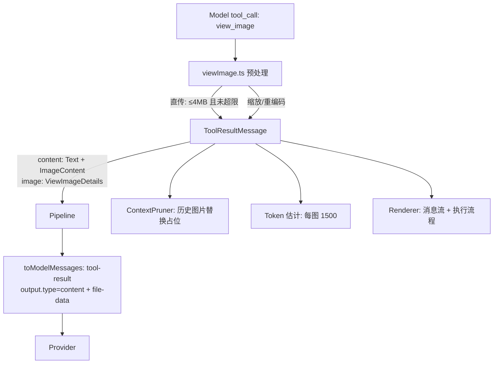

# View Image 图片查看能力设计

本文档定义 `view_image` 工具：让模型能够直接查看项目内的本地图片，并保证图片在消息管道、上下文治理与 UI 渲染中全程可用。设计对齐 Codex 的 `view_image` / `image_preparation`（`codex-rs/core/src/tools/handlers/view_image.rs`、`core/src/image_preparation.rs`）。

关联文档：[tools.md](./tools.md)（工具契约与装配）、[runtime.md](./runtime.md)（上下文治理）、[permissions.md](./permissions.md)（豁免工具）、[architecture.md](./architecture.md)（消息模型）。

---

## 1. 背景与目标

现状：

- `read` 工具拒绝二进制文件（`read.ts` 的 `isBinaryBuffer` 分支），模型无法读取任何图片。
- `ToolResultMessage.content` 类型上支持 `ImageContent`，但 `toModelMessages.ts` 把工具结果中的图片块降级为 `[image: <mimeType>]` 文本，模型实际看不到图。
- 用户附件（`AgentUserMessage.files`）已有图片压缩管线（`nativeImage` 缩放 + JPEG 编码），但只覆盖用户主动附图。

目标：模型可主动查看本地图片，覆盖 Front Design 产出审查、报错截图定位、设计稿/图表解读三类场景。

非目标：不做截图采集（无屏幕捕获）、不做 OCR、不做图片编辑、不引入新依赖（复用 Electron `nativeImage`）。

---

## 2. 数据流



---

## 3. 工具契约

`src/main/agent/tools/viewImage.ts`：

| 项 | 值 |
| :--- | :--- |
| `name` | `view_image` |
| `label` | `View image` |
| `executionMode` | `parallel`（纯只读，无副作用） |
| 参数 | `{ path: string; detail?: "high" \| "original" }` |
| 返回 content | `[{ type: "text", text: 摘要 }, { type: "image", mimeType, data: base64 }]` |
| 返回 details | `{ image: ViewImageDetails }` |

- 路径解析复用 `resolveToCwd(path, cwd)`，与 read/edit 等文件工具完全一致。
- 摘要文本（英文）包含：绝对路径、`detail`、原图尺寸、发送尺寸、是否重编码，供通用渲染器与模型自述。
- 错误语义：文件不存在 / 非文件 / 无法解码 / 超过硬上限 / 非视觉模型，均 `throw new Error(英文消息)`，由 agent-loop 统一封装为 `isError: true` 的工具结果回灌（与 `webfetch` 一致）。

`ViewImageDetails`（`src/shared/contracts/agent.ts`）：

```typescript
export interface ViewImageDetails {
  path: string          // 绝对路径（UI 经 lx-image://local 渲染）
  mimeType: string      // 实际发送给模型的 MIME
  detail: "high" | "original"
  width: number         // 发送尺寸
  height: number
  sourceWidth: number   // 原图尺寸
  sourceHeight: number
  resized: boolean      // 是否发生缩放/重编码
  sizeBytes: number     // 实际发送字节数
}
```

---

## 4. 视觉能力门控

判定函数 `modelSupportsImageInput(provider, modelId)`（`src/main/agent/stream/modelCapabilities.ts`）：

1. 优先读 `getModelProviderSettings()` 中该模型 `modalities.input` 是否包含 `"image"`；
2. 配置缺失时回退关键词启发式（对齐 `AgentPage.tsx` 的 `supportsImages`）：`gpt-4o` / `claude-3` / `gemini`。

双层门控：

- **装配时过滤**：`sessionRunner.ensureReady` 调用 `createRegistry` 时传入门控结果（`SessionToolDeps.supportsImages`），不支持图片的模型不注册、不激活 `view_image`。模型切换会触发 registry 重建（`sessionRunner.ts` 的模型标识比对），门控随之更新。
- **执行兜底**：工具 deps 注入 `supportsImages: () => boolean`，为 `false` 时抛 `view_image is not allowed because the current model does not support image inputs`（防装配缝隙）。

---

## 5. 图片预处理

### 5.1 格式探测与支持集

按魔数（magic bytes）探测，不信任扩展名。支持集为 **PNG / JPEG**（Electron `nativeImage` 在 macOS 仅稳定解码这两种格式，已实测 GIF/BMP/WebP/AVIF 解码为空）：

| 格式 | 魔数 | 编码策略（需重编码时） |
| :--- | :--- | :--- |
| PNG | `89 50 4E 47` | PNG（无损） |
| JPEG | `FF D8 FF` | JPEG q85 |

GIF / BMP / WebP / AVIF / SVG 及其他格式：直接抛错，消息明确列出支持格式（`supported: PNG, JPEG`）。

### 5.2 双路径策略

常量：

```text
MAX_DIMENSION_HIGH     = 2048   // detail=high 长边上限
MAX_DIMENSION_ORIGINAL = 6000   // detail=original 长边上限
MAX_PASSTHROUGH_BYTES  = 4 MiB  // 原字节直传上限
MAX_SOURCE_BYTES       = 20 MiB // 硬拒绝上限
JPEG_QUALITY           = 85
```

1. **直传路径**：文件 ≤ 4 MiB 且长边 ≤ 对应上限 → 原字节原样发送（`resized: false`，零重编码，保文字清晰度）；
2. **重编码路径**：需缩放或超过 4 MiB → `nativeImage` 解码、等比缩放到长边上限（`quality: "better"`）、按 5.1 表编码（`resized: true`）；
3. 文件 > 20 MiB 或解码失败 → 抛错。

`nativeImage` 仅在 main 进程可用；单测通过 `vi.mock("electron")` 注入（先例：`test/main/agent/toModelMessages.test.ts`）。

---

## 6. 消息管道

### 6.1 契约扩展

`ToolResultMessage` 新增可选字段 `image?: ViewImageDetails`（与 `diff` / `subagent` / `lsp` 同级）。`agent-loop.ts` 的 `createToolResultMessage` 从工具 details 提取并挂载，随 entry 完整落库（会话真相源，恢复无损）。

### 6.2 模型侧映射

`toModelMessages.ts` 的 `toolResult` 分支：

- 工具结果一律以 `output: { type: "text", value }` 投递；
- 结果含图片块时，在**整段连续工具结果之后**追加一条合并的 user 图片消息（`{ type: "image", image: dataURL }`），每张图片前带来源标签 `Image from tool "<name>" (<path>):`。并行工具调用会产生多条连续 tool 消息，必须全部输出完再追加图片消息（Provider 要求同一 assistant 消息的全部 tool 结果连续，否则报 `Tool result is missing for tool call ...`，已在会话实测复现）。

原因：AI SDK 对 `output.type === "content"` 的多模态工具结果，在 `openai`（Chat Completions）与 `openai-compatible` 路径会被 `JSON.stringify` 成纯文本（实测图片丢失、模型只能读到摘要并产生幻觉），tool 消息的数组 content 也会被网关拒绝。user 图片消息是各 Provider 一致支持的通路（含 Anthropic / OpenAI / Google / OpenAI-compatible），且不进入应用会话历史，仅作用于每次请求的消息投影。

---

## 7. 上下文治理

### 7.1 ContextPruner 图片修剪

- `view_image` 加入 `DEFAULT_PRUNABLE_TOOLS`；
- 修剪逻辑扩展：prunable 工具结果中的 `image` 块，在尾部豁免窗口（默认 6 条消息）之外统一替换为文本占位：

  ```text
  [Image omitted from historical context: <path>]
  ```

- 仅作用于投喂模型的内存副本，持久化数据与 UI 不受影响（既有语义）。

### 7.2 Token 估计

`compaction.ts` 的 `messageCharCount` 对 `image` 块改用固定等价字符数（`1500 tokens × 4 = 6000`），替换现有 `[image]` 的 7 字符低估；user 与 toolResult 两类消息统一处理，保证容量指示与压缩触发不失真。

---

## 8. 权限

`view_image` 为只读工具，加入 `EXEMPT_TOOLS`（`permissions/rule.ts`），永不触发审批，与 `read` / `lsp` 同级。

---

## 9. UI 渲染

- **消息流**：`AgentToolCallBlock` 新增 `toolName === "view_image"` 分支，渲染新组件 `AgentViewImageBlock`：缩略图（`lx-image://local` + `details.path`）+ 悬浮大图预览 + 文件名/尺寸/`detail` 标签；错误态回退文本。
- **执行流程**：新增 `FlowToolViewImage`，由 `FlowItemToolContent` 按工具名分派；图片数据经 `executionFlow.ts` 从配对 toolResult 透传。
- **数据透传链**：`ToolResultMessage.image` → `ChatBlock.toolResult.image`（`types.ts`）→ `utils.ts` 两处映射 → 上列两个渲染位点；`executionFlow.ts` 同步透传。
- **i18n**：新增文案键（缩略图标签、detail 标签、尺寸/路径提示）同时写入 `zh.ts` / `en.ts`，全部经 `useTranslation`。
- 样式沿用现有 Token 与暗色体系，不引入硬编码主题色。

---

## 10. 测试与验收

测试范围与步骤见 [view-image-tasks.md](./view-image-tasks.md) §7。核心验收：

1. 模型（视觉模型）调用 `view_image` 后收到真实图片（`file-data`），非视觉模型工具不可见且兜底报错；
2. 直传/重编码两条路径与 `high` / `original` 上限行为正确；
3. 历史图片被修剪为占位、UI 仍可见；token 估计含图片成本；
4. detail/toolResult 契约、UI 组件、门控均有测试覆盖，`pnpm typecheck` 与定向 vitest 全绿。

---

## 11. 风险

| 风险 | 说明 | 缓解 |
| :--- | :--- | :--- |
| Provider 兼容性 | `openai`（Chat Completions）与 `openai-compatible` 会把多模态 tool result 序列化为纯文本，图片丢失（已实测） | 图片统一改写为工具结果后的 user 图片消息投递，兼容全部 Provider（见 §6.2） |
| 数据库体积 | 图片 base64 随 entry 落库 | 发送尺寸上限 2048/6000 + 重编码压缩约束单图体积 |
| 格式差异 | `nativeImage` 各平台解码能力不同（macOS 实测仅 PNG/JPEG 可解码） | 支持集收敛为 PNG/JPEG + 魔数探测 + 其他格式显式报错，不做静默降级 |
| 图片 token 估算 | 固定 1500/张为启发式 | 仅影响容量指示与压缩触发时机；usage 锚点修正后自然收敛 |
